# RabbitMQ

### 一、RabbitMQ介绍

#### 1.1 现存问题

- 服务调用：两个服务调用时，我们可以通过传统的HTTP方式，让服务A直接去调用服务B的接口，但是这种方式是同步的方式，虽然可以采用SpringBoot提供的@Async注解实现异步调用，但是这种方式无法确保请求一定回访问到服务B的接口。[那如何保证服务A的请求信息一定能送达到服务B去完成一些业务操作呢?如何实现异步调用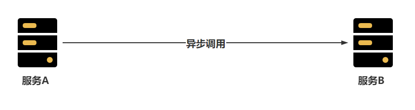
- 海量请求：在我们在做一些秒杀业务时，可能会在某个时间点突然出现大量的并发请求，这可能已经远远超过服务器的并发瓶颈，这时我们需要做一些削峰的操作，也就是将大量的请求缓冲到一个队列中，然后慢慢的消费掉。[如何提供一个可以存储千万级别请求的队列呢？]()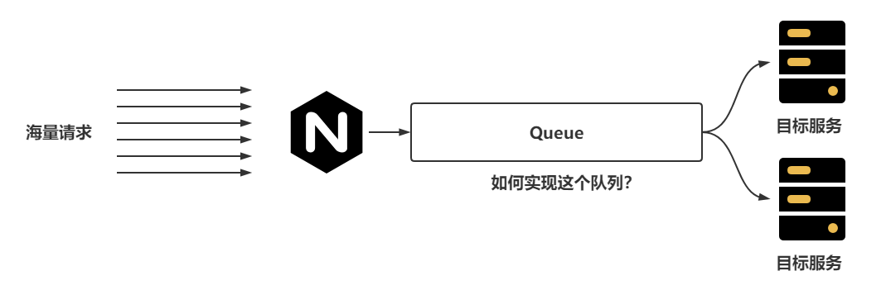
- 在微服务架构下，可能一个业务会出现同时调用多个其他服务的场景，而且这些服务之间一般会用到Feign的方式进行轻量级的通讯，如果存在一个业务，用户创建订单成功后，还需要去给用户添加积分、通知商家、通知物流系统、扣减商品库存，而在执行这个操作时，如果任意一个服务出现了问题，都会导致整体的下单业务失败，并且会导致给用户反馈的时间延长。这时就造成了服务之间存在一个较高的耦合性的问题。[如何可以降低服务之间的耦合性呢？]()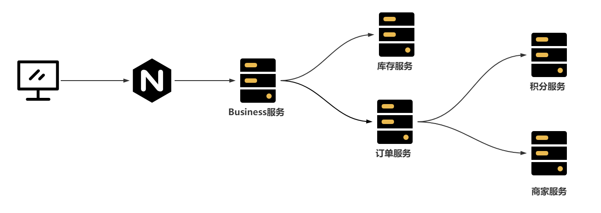

#### 1.2 处理问题

RabbitMQ就可以解决上述的全部问题

- 服务之间如何想实现可靠的异步调用，可以通过RabbitMQ的方式实现，服务A只需要保证可以把消息发送到RabbitMQ的队列中，服务B就一定会消费到队列中的消息只不过会存在一定的延时。|                                                               异步访问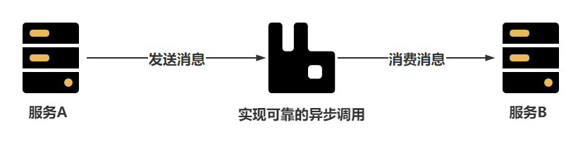
- 忽然的海量请求可以存储在RabbitMQ的队列中，然后由消费者慢慢消费掉，RabbitMQ的队列本身就可以存储上千万条消息                                                                                  
- 在调用其他服务时，如果允许延迟效果的出现，可以将消息发送到RabbitMQ中，再由消费者慢慢消费|                                                               服务解耦
  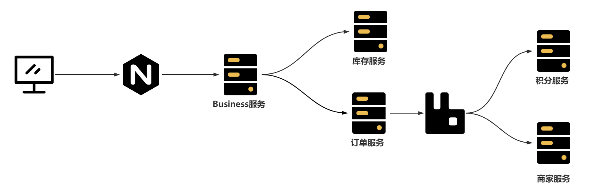

#### 1.3 RabbitMQ介绍

百度百科：

&#x3e; **RabbitMQ**是实现了高级消息队列协议（AMQP）的开源消息代理软件（亦称面向消息的中间件）。RabbitMQ服务器是用[Erlang](https://baike.baidu.com/item/Erlang)语言编写的，而集群和故障转移是构建在[开放电信平台](https://baike.baidu.com/item/开放电信平台)框架上的。所有主要的[编程语言](https://baike.baidu.com/item/编程语言/9845131)均有与代理接口通讯的[客户端](https://baike.baidu.com/item/客户端/101081)库。

首先RabbitMQ基于AMQP协议开发，所以很多基于AMQP协议的功能RabbitMQ都是支持的，比如SpringCloud中的消息总线bus

其次RabbitMQ是基于Erlang编写，这是也是RabbitMQ天生的优势，Erlang被称为面向并发编程的语言，并发能力极强，在众多的MQ中，RabbitMQ的延迟特别低，在微秒级别，所以一般的业务处理RabbitMQ比Kafka和RocketMQ更有优势。

最后RabbitMQ提供自带了图形化界面，操作方便，还自带了多种集群模式，可以保证RabbitMQ的高可用，并且SpringBoot默认就整合RabbitMQ，使用简单方便。

### 二、RabbitMQ安装

---

**方式一**

```
docker run -it --rm --name rabbitmq -p 5672:5672 -p 15672:15672 rabbitmq:4.0-management
```

- `docker run`：这是 Docker 的命令，用来运行容器。
- `-it`：为交互式模式。`-i` 保持容器的标准输入打开，而 `-t` 则为容器分配一个伪终端。
- `--rm`：在容器停止后自动删除容器。这可以确保不需要的容器不会堆积，适合短期测试。
- `--name rabbitmq`：设置容器的名称为 `rabbitmq`，便于识别和管理。
- `-p 5672:5672`：将宿主机的 5672 端口映射到容器的 5672 端口，这是 RabbitMQ 的 AMQP（Advanced Message Queuing Protocol） 端口，用于应用程序连接和发送消息。
- `-p 15672:15672`：将宿主机的 15672 端口映射到容器的 15672 端口，这是 RabbitMQ 管理界面的 Web 端口，用于通过浏览器访问和管理 RabbitMQ 实例。
- `rabbitmq:4.0-management`：这是所使用的 Docker 镜像名称及标签。`4.0-management` 表示运行的是 RabbitMQ 4.0 版本，并包含管理插件以启用 Web UI 界面。

运行此命令后，你可以访问：

- **RabbitMQ 管理界面**：在浏览器中访问 `http://localhost:15672`。
- **RabbitMQ 连接端口**：应用程序可以通过 `localhost:5672` 连接 RabbitMQ 进行消息发送和接收。


**方式二**

#### 2.1 安装RabbitMQ

这里推荐搭建采用Docker的方式在Linux中安装RabbitMQ

直接使用docker-compose.yml文件即可安装RabbitMQ服务

```yml
version: '3.1'
services:
  rabbitmq:
    restart: always
    image: daocloud.io/library/rabbitmq:3.8.8
    volumes:
      - ./data/:/var/lib/rabbitmq/
      - ./log/:/var/log/rabbitmq/log/
    ports:
      - 15672:15672
      - 5672:5672
```

执行 `docker-compose up -d`运行

测试效果：`curl localhost:5672`

|                           查看效果                           |
| :----------------------------------------------------------: |
| 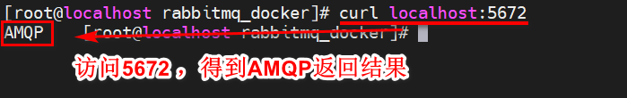 |

#### 2.2 开启图形化界面

默认情况下，当前镜像的图形化界面默认没有开启，需要进入到容器内部开启图形化管理界面

|                      启动图形化界面插件                      |
| :----------------------------------------------------------: |
| 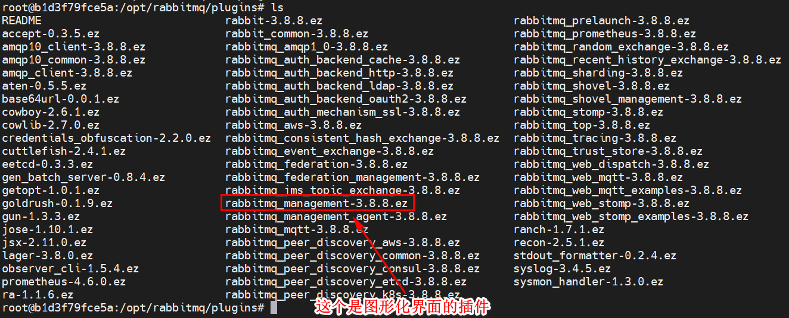 |
| 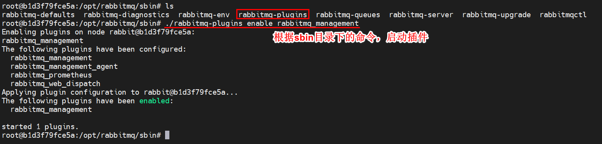 |


通过浏览器访问15672，查看图形化界面

|                         查看登录页面                         |
| :----------------------------------------------------------: |
| 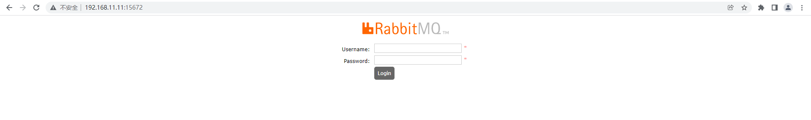 |

默认用户和密码均为：guest，查看首页

|                           查看首页                           |
| :----------------------------------------------------------: |
| 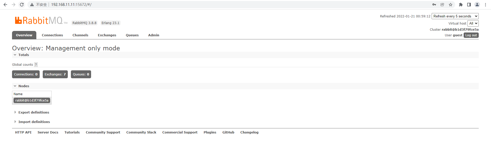 |

### 三、RabbitMQ构架

RabbitMQ的架构可以查看官方地址：https://rabbitmq.com/tutorials/amqp-concepts.html

|                         官方简单架构                         |
| :----------------------------------------------------------: |
| 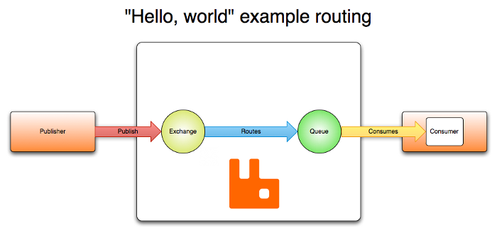 |

可以看出RabbitMQ中主要分为三个角色：

- Publisher：消息的发布者，将消息发布到RabbitMQ中的Exchange
- RabbitMQ服务：Exchange接收Publisher的消息，并且根据Routes策略将消息转发到Queue中
- Consumer：消息的消费者，监听Queue中的消息并进行消费

官方提供的架构图相对简洁，我们可以自己画一份相对完整一些的架构图：

|                        RabbitMQ架构图                        |
| :----------------------------------------------------------: |
| 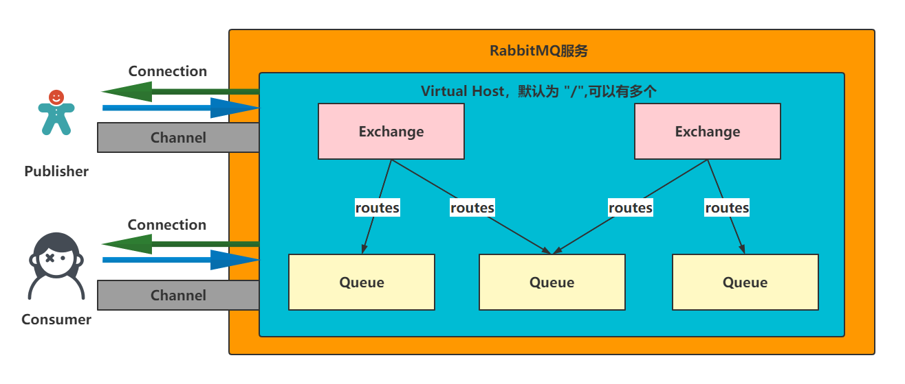 |

可以看出Publisher和Consumer都是单独和RabbitMQ服务中某一个Virtual Host建立Connection的客户端

后续通过Connection可以构建Channel通道，用来发布、接收消息

一个Virtual Host中可以有多个Exchange和Queue，Exchange可以同时绑定多个Queue

在基于架构图查看图形化界面，会更加清晰

|                        图形化界面信息                        |
| :----------------------------------------------------------: |
| 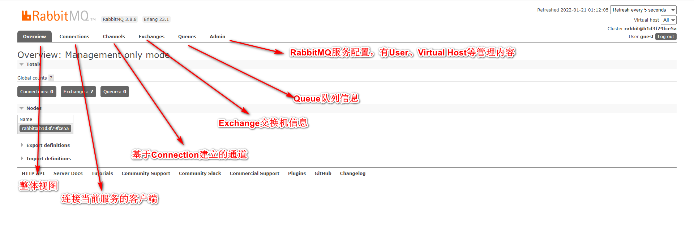 |

### 四、RabbitMQ通讯方式

---

RabbitMQ提供了很多中通讯方式，依然可以去官方查看：https://rabbitmq.com/getstarted.html

|                         七种通讯方式                         |
| :----------------------------------------------------------: |
| 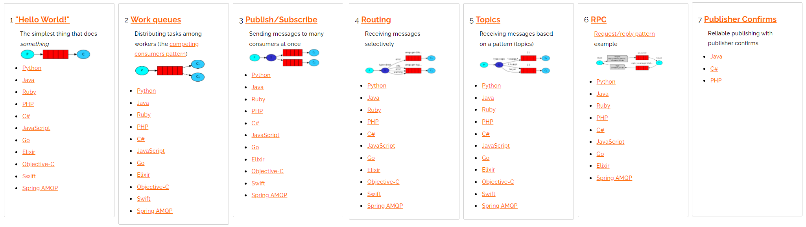 |

#### 4.1 RabbitMQ提供的通讯方式

- [Hello World!](https://rabbitmq.com/tutorials/tutorial-one-python.html)：为了入门操作！
- [Work queues](https://rabbitmq.com/tutorials/tutorial-two-python.html)：一个队列被多个消费者消费
- [Publish/Subscribe](https://rabbitmq.com/tutorials/tutorial-three-python.html)：手动创建Exchange（FANOUT）
- [Routing](https://rabbitmq.com/tutorials/tutorial-four-python.html)：手动创建Exchange（DIRECT）
- [Topics](https://rabbitmq.com/tutorials/tutorial-five-python.html)：手动创建Exchange（TOPIC）
- [RPC](https://rabbitmq.com/tutorials/tutorial-six-python.html)：RPC方式
- [Publisher Confirms](https://rabbitmq.com/tutorials/tutorial-seven-java.html)：保证消息可靠性

#### 4.2 构建Connection工具类

- 导入依赖：amqp-client，junit

  ```xml
  <dependencies>
      <dependency>
          <groupId>com.rabbitmq</groupId>
          <artifactId>amqp-client</artifactId>
          <version>5.9.0</version>
      </dependency>
      <dependency>
          <groupId>junit</groupId>
          <artifactId>junit</artifactId>
          <version>4.12</version>
      </dependency>
  </dependencies>
  ```
- 构建工具类：

  ```java
  package com.zzq.rabbitma.util;
  
  import com.rabbitmq.client.Connection;
  import com.rabbitmq.client.ConnectionFactory;
  
  import java.io.IOException;
  import java.util.concurrent.TimeoutException;
  
  /**
   * @author zzq
   * @description
   */
  public class RabbitMQConnectionUtil {
  
      public static final String RABBITMQ_HOST = "192.168.10.121";
  
      public static final int RABBITMQ_PORT = 5672;
  
      public static final String RABBITMQ_USERNAME = "guest";
  
      public static final String RABBITMQ_PASSWORD = "guest";
  
      public static final String RABBITMQ_VIRTUAL_HOST = "/";
  
      /**
       * 构建RabbitMQ的连接对象
       * @return
       */
      public static Connection getConnection() throws Exception {
          //1. 创建Connection工厂
          ConnectionFactory factory = new ConnectionFactory();
  
          //2. 设置RabbitMQ的连接信息
          factory.setHost(RABBITMQ_HOST);
          factory.setPort(RABBITMQ_PORT);
          factory.setUsername(RABBITMQ_USERNAME);
          factory.setPassword(RABBITMQ_PASSWORD);
          factory.setVirtualHost(RABBITMQ_VIRTUAL_HOST);
  
          //3. 返回连接对象
          Connection connection = factory.newConnection();
          return connection;
      }
  
  }
  ```

#### 4.3 Hello World

|                         通讯方式                          |
| :-------------------------------------------------------: |
| 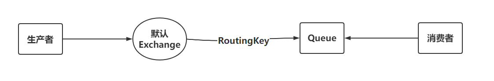 |

生产者：

```java
package com.zzq.rabbitma.producer;

import com.rabbitmq.client.Channel;
import com.rabbitmq.client.Connection;
import com.zzq.rabbitma.util.RabbitMQConnectionUtil;
import org.junit.Test;

/**
 * @author zzq
 * @description
 * @date 2022/1/24 22:54
 */
public class Publisher {

    public static final String QUEUE_NAME = "hello";

    @Test
    public void publish() throws Exception {
        //1. 获取连接对象
        Connection connection = RabbitMQConnectionUtil.getConnection();

        //2. 构建Channel
        Channel channel = connection.createChannel();

        //3. 构建队列

        /**
         * queue：队列的名称（字符串）。指定队列名称，如果名称为空字符串，将创建一个随机命名的队列。
         *
         * durable：是否持久化队列（布尔值）。设置为 true 表示该队列是持久化的，服务器重启后队列仍然存在；设置为 false 表示非持久化队列，服务器重启后该队列将被删除。
         *
         * exclusive：是否独占队列（布尔值）。设置为 true 表示该队列仅供当前连接使用，其他连接无法访问，且连接关闭时队列自动删除；设置为 false 表示该队列可以被多个连接访问。
         *
         * autoDelete：是否自动删除队列（布尔值）。设置为 true 表示队列在不再使用时自动删除（当没有消费者时）；设置为 false 表示不自动删除队列。
         *
         * arguments：队列的其他属性（Map<String, Object> 类型）。可以设置额外的队列参数，例如消息过期时间、队列最大长度等。
         */
        channel.queueDeclare(QUEUE_NAME,false,false,false,null);

        //4. 发布消息

        /**
         * exchange：交换机的名称（字符串）。指定消息要发布到的交换机。若该交换机不存在，会触发通道级别的协议异常，导致通道关闭。
         *
         * routingKey：路由键（字符串）。用于指定消息的路由路径。RabbitMQ 使用 routingKey 来决定消息应该发送到哪些队列。在不同类型的交换机中，routingKey 的作用可能有所不同。
         *
         * props：消息的其他属性（BasicProperties 类型）。用于设置消息的属性，如消息的优先级、持久性、内容类型等，还可以包含路由头信息。
         *
         * body：消息内容（byte[] 类型）。表示消息的实际内容，以字节数组的形式传递。
         */
        String message = "Hello World!";
        channel.basicPublish("",QUEUE_NAME,null,message.getBytes());
        System.out.println("消息发送成功！");


    }
}
```

消费者：

```java
package com.zzq.rabbitma.comsumer;

import com.rabbitmq.client.*;
import com.zzq.rabbitma.producer.Publisher;
import com.zzq.rabbitma.util.RabbitMQConnectionUtil;
import org.junit.Test;

import java.io.IOException;

/**
 * @author zzq
 * @description
 * @date 2022/1/24 23:02
 */
public class Consumer {

    @Test
    public void consume() throws Exception {
        //1. 获取连接对象
        Connection connection = RabbitMQConnectionUtil.getConnection();

        //2. 构建Channel
        Channel channel = connection.createChannel();

        //3. 构建队列
        channel.queueDeclare(Publisher.QUEUE_NAME,false,false,false,null);

        //4. 监听消息
        DefaultConsumer callback = new DefaultConsumer(channel){


            /**
             consumerTag（String 类型）：消费者标签，是 RabbitMQ 为每个消费者分配的一个唯一标识符。此标识符可以用于取消或标识某个特定的消费者。
             envelope（Envelope 类型）：消息的元数据。包含了路由信息，例如：
             envelope.getDeliveryTag()：消息的投递标签，可以用于确认消息。
             envelope.getExchange()：消息来自的交换机名称。
             envelope.getRoutingKey()：消息的路由键，用于路由消息到指定队列。
             properties（AMQP.BasicProperties 类型）：消息的属性，用于描述消息的其他属性信息。它可以包含消息的优先级、消息的持久性、内容类型、消息的标识符等。

             body（byte[] 类型）：消息的主体内容，以字节数组形式表示。通过 new String(body, "UTF-8") 可以将其转换为字符串格式，以便在控制台输出消息内容。
             */
            @Override
            public void handleDelivery(String consumerTag, Envelope envelope, AMQP.BasicProperties properties, byte[] body) throws IOException {
                System.out.println("消费者获取到消息：" + new String(body,"UTF-8"));
            }
        };
        channel.basicConsume(Publisher.QUEUE_NAME,true,callback);
        System.out.println("开始监听队列");

        System.in.read();
    }
}
```

#### 4.4 Work Queues

|                 WorkQueues需要学习的内容                  |
| :-------------------------------------------------------: |
| 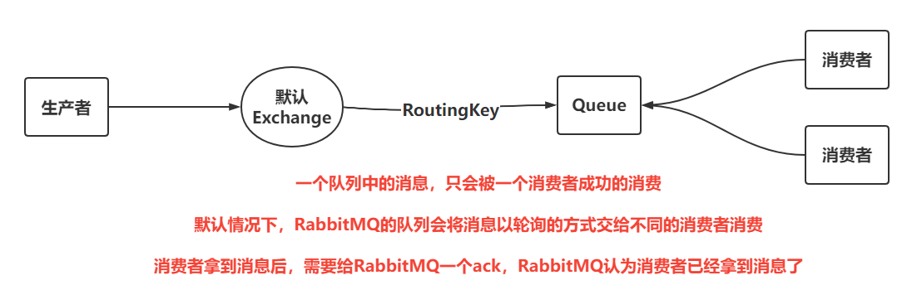 |

- 生产者：

  ```
  package com.zzq.rabbitma.workqueues.producer;
  
  import com.rabbitmq.client.Channel;
  import com.rabbitmq.client.Connection;
  import com.zzq.rabbitma.helloword.util.RabbitMQConnectionUtil;
  import org.junit.Test;
  
  /**
   * @author zzq
   * @description
   * @date 2022/1/24 22:54
   */
  public class Publisher {
  
      public static final String QUEUE_NAME = "work";
  
      @Test
      public void publish() throws Exception {
          //1. 获取连接对象
          Connection connection = RabbitMQConnectionUtil.getConnection();
  
          //2. 构建Channel
          Channel channel = connection.createChannel();
  
          //3. 构建队列
  
          /**
           * queue：队列的名称（字符串）。指定队列名称，如果名称为空字符串，将创建一个随机命名的队列。
           *
           * durable：是否持久化队列（布尔值）。设置为 true 表示该队列是持久化的，服务器重启后队列仍然存在；设置为 false 表示非持久化队列，服务器重启后该队列将被删除。
           *
           * exclusive：是否独占队列（布尔值）。设置为 true 表示该队列仅供当前连接使用，其他连接无法访问，且连接关闭时队列自动删除；设置为 false 表示该队列可以被多个连接访问。
           *
           * autoDelete：是否自动删除队列（布尔值）。设置为 true 表示队列在不再使用时自动删除（当没有消费者时）；设置为 false 表示不自动删除队列。
           *
           * arguments：队列的其他属性（Map<String, Object> 类型）。可以设置额外的队列参数，例如消息过期时间、队列最大长度等。
           */
          channel.queueDeclare(QUEUE_NAME,false,false,false,null);
  
          //4. 发布消息
  
          /**
           * exchange：交换机的名称（字符串）。指定消息要发布到的交换机。若该交换机不存在，会触发通道级别的协议异常，导致通道关闭。
           *
           * routingKey：路由键（字符串）。用于指定消息的路由路径。RabbitMQ 使用 routingKey 来决定消息应该发送到哪些队列。在不同类型的交换机中，routingKey 的作用可能有所不同。
           *
           * props：消息的其他属性（BasicProperties 类型）。用于设置消息的属性，如消息的优先级、持久性、内容类型等，还可以包含路由头信息。
           *
           * body：消息内容（byte[] 类型）。表示消息的实际内容，以字节数组的形式传递。
           */
  
          for (int i = 0; i < 10; i++) {
              String message = "Hello World!" + i;
              channel.basicPublish("",QUEUE_NAME,null,message.getBytes());
          }
  
  
          System.out.println("消息发送成功！");
  
  
      }
  }
  ```

  消费者：

  ```
  package com.zzq.rabbitma.workqueues.comsumer;
  
  import com.rabbitmq.client.*;
  import com.zzq.rabbitma.workqueues.producer.Publisher;
  import com.zzq.rabbitma.helloword.util.RabbitMQConnectionUtil;
  import org.junit.Test;
  
  import java.io.IOException;
  
  /**
   * @author zzq
   * @description
   * @date 2022/1/24 23:02
   */
  public class Consumer {
  
      @Test
      public void consume1() throws Exception {
          //1. 获取连接对象
          Connection connection = RabbitMQConnectionUtil.getConnection();
  
          //2. 构建Channel
          Channel channel = connection.createChannel();
  
          //3. 构建队列
          channel.queueDeclare(Publisher.QUEUE_NAME,false,false,false,null);
  
          //4. 监听消息
          DefaultConsumer callback = new DefaultConsumer(channel){
  
  
              /**
               consumerTag（String 类型）：消费者标签，是 RabbitMQ 为每个消费者分配的一个唯一标识符。此标识符可以用于取消或标识某个特定的消费者。
               envelope（Envelope 类型）：消息的元数据。包含了路由信息，例如：
               envelope.getDeliveryTag()：消息的投递标签，可以用于确认消息。
               envelope.getExchange()：消息来自的交换机名称。
               envelope.getRoutingKey()：消息的路由键，用于路由消息到指定队列。
               properties（AMQP.BasicProperties 类型）：消息的属性，用于描述消息的其他属性信息。它可以包含消息的优先级、消息的持久性、内容类型、消息的标识符等。
  
               body（byte[] 类型）：消息的主体内容，以字节数组形式表示。通过 new String(body, "UTF-8") 可以将其转换为字符串格式，以便在控制台输出消息内容。
               */
              @Override
              public void handleDelivery(String consumerTag, Envelope envelope, AMQP.BasicProperties properties, byte[] body) throws IOException {
  
                  try {
                      Thread.sleep(2000);
                  } catch (InterruptedException e) {
                      throw new RuntimeException(e);
                  }
  
                  System.out.println("消费者1获取到消息：" + new String(body,"UTF-8"));
              }
          };
          channel.basicConsume(Publisher.QUEUE_NAME,true,callback);
          System.out.println("开始监听队列");
  
          System.in.read();
      }
  
  
      @Test
      public void consume2() throws Exception {
          //1. 获取连接对象
          Connection connection = RabbitMQConnectionUtil.getConnection();
  
          //2. 构建Channel
          Channel channel = connection.createChannel();
  
          //3. 构建队列
          channel.queueDeclare(Publisher.QUEUE_NAME,false,false,false,null);
  
          //4. 监听消息
          DefaultConsumer callback = new DefaultConsumer(channel){
  
  
              /**
               consumerTag（String 类型）：消费者标签，是 RabbitMQ 为每个消费者分配的一个唯一标识符。此标识符可以用于取消或标识某个特定的消费者。
               envelope（Envelope 类型）：消息的元数据。包含了路由信息，例如：
               envelope.getDeliveryTag()：消息的投递标签，可以用于确认消息。
               envelope.getExchange()：消息来自的交换机名称。
               envelope.getRoutingKey()：消息的路由键，用于路由消息到指定队列。
               properties（AMQP.BasicProperties 类型）：消息的属性，用于描述消息的其他属性信息。它可以包含消息的优先级、消息的持久性、内容类型、消息的标识符等。
  
               body（byte[] 类型）：消息的主体内容，以字节数组形式表示。通过 new String(body, "UTF-8") 可以将其转换为字符串格式，以便在控制台输出消息内容。
               */
              @Override
              public void handleDelivery(String consumerTag, Envelope envelope, AMQP.BasicProperties properties, byte[] body) throws IOException {
  
                  try {
                      Thread.sleep(5000);
                  } catch (InterruptedException e) {
                      throw new RuntimeException(e);
                  }
                  System.out.println("消费者2获取到消息：" + new String(body,"UTF-8"));
              }
          };
          channel.basicConsume(Publisher.QUEUE_NAME,true,callback);
          System.out.println("开始监听队列");
  
          System.in.read();
      }
  }
  ```

注意：以上消费者默认轮训方式消费，如果需要实现消费者能者多劳，消费者需要修改如下：

 让消费者关闭自动ack，并且设置消息的流控，最终实现消费者可以尽可能去多消费消息

生产者：

- ```java
  package com.zzq.rabbitma.workqueues.producer;
  
  import com.rabbitmq.client.Channel;
  import com.rabbitmq.client.Connection;
  import com.zzq.rabbitma.helloword.util.RabbitMQConnectionUtil;
  import org.junit.Test;
  
  /**
   * @author zzq
   * @description
   * @date 2022/1/24 22:54
   */
  public class Publisher {
  
      public static final String QUEUE_NAME = "work";
  
      @Test
      public void publish() throws Exception {
          //1. 获取连接对象
          Connection connection = RabbitMQConnectionUtil.getConnection();
  
          //2. 构建Channel
          Channel channel = connection.createChannel();
  
          //3. 构建队列
  
          /**
           * queue：队列的名称（字符串）。指定队列名称，如果名称为空字符串，将创建一个随机命名的队列。
           *
           * durable：是否持久化队列（布尔值）。设置为 true 表示该队列是持久化的，服务器重启后队列仍然存在；设置为 false 表示非持久化队列，服务器重启后该队列将被删除。
           *
           * exclusive：是否独占队列（布尔值）。设置为 true 表示该队列仅供当前连接使用，其他连接无法访问，且连接关闭时队列自动删除；设置为 false 表示该队列可以被多个连接访问。
           *
           * autoDelete：是否自动删除队列（布尔值）。设置为 true 表示队列在不再使用时自动删除（当没有消费者时）；设置为 false 表示不自动删除队列。
           *
           * arguments：队列的其他属性（Map<String, Object> 类型）。可以设置额外的队列参数，例如消息过期时间、队列最大长度等。
           */
          channel.queueDeclare(QUEUE_NAME,false,false,false,null);
  
          //4. 发布消息
  
          /**
           * exchange：交换机的名称（字符串）。指定消息要发布到的交换机。若该交换机不存在，会触发通道级别的协议异常，导致通道关闭。
           *
           * routingKey：路由键（字符串）。用于指定消息的路由路径。RabbitMQ 使用 routingKey 来决定消息应该发送到哪些队列。在不同类型的交换机中，routingKey 的作用可能有所不同。
           *
           * props：消息的其他属性（BasicProperties 类型）。用于设置消息的属性，如消息的优先级、持久性、内容类型等，还可以包含路由头信息。
           *
           * body：消息内容（byte[] 类型）。表示消息的实际内容，以字节数组的形式传递。
           */
  
          for (int i = 0; i < 10; i++) {
              String message = "Hello World!" + i;
              System.out.println(message);
              channel.basicPublish("",QUEUE_NAME,null,message.getBytes());
          }
  
  
          System.out.println("消息发送成功！");
  
  
      }
  }
  ```

消费者：

```
package com.zzq.rabbitma.workqueues.comsumer;

import com.rabbitmq.client.*;
import com.zzq.rabbitma.helloword.util.RabbitMQConnectionUtil;
import com.zzq.rabbitma.workqueues.producer.Publisher;
import org.junit.Test;

import java.io.IOException;

/**
 * @author zzq
 * @description
 * @date 2022/1/24 23:02
 */
public class Consumer2 {

    @Test
    public void consume1() throws Exception {
        //1. 获取连接对象
        Connection connection = RabbitMQConnectionUtil.getConnection();

        //2. 构建Channel
        Channel channel = connection.createChannel();

        //3. 构建队列
        channel.queueDeclare(Publisher.QUEUE_NAME,false,false,false,null);

        //3.5 设置消息的流控
        channel.basicQos(3);

        //4. 监听消息
        DefaultConsumer callback = new DefaultConsumer(channel){


            /**
             consumerTag（String 类型）：消费者标签，是 RabbitMQ 为每个消费者分配的一个唯一标识符。此标识符可以用于取消或标识某个特定的消费者。
             envelope（Envelope 类型）：消息的元数据。包含了路由信息，例如：
             envelope.getDeliveryTag()：消息的投递标签，可以用于确认消息。
             envelope.getExchange()：消息来自的交换机名称。
             envelope.getRoutingKey()：消息的路由键，用于路由消息到指定队列。
             properties（AMQP.BasicProperties 类型）：消息的属性，用于描述消息的其他属性信息。它可以包含消息的优先级、消息的持久性、内容类型、消息的标识符等。

             body（byte[] 类型）：消息的主体内容，以字节数组形式表示。通过 new String(body, "UTF-8") 可以将其转换为字符串格式，以便在控制台输出消息内容。
             */
            @Override
            public void handleDelivery(String consumerTag, Envelope envelope, AMQP.BasicProperties properties, byte[] body) throws IOException {

                try {
                    Thread.sleep(100);
                } catch (InterruptedException e) {
                    throw new RuntimeException(e);
                }


                /**
                 * 确认消息的接收和处理
                 */
//                channel.basicAck(envelope.getDeliveryTag(),false);
                System.out.println("消费者1获取到消息：" + new String(body,"UTF-8"));
            }
        };
        channel.basicConsume(Publisher.QUEUE_NAME,false,callback);
        System.out.println("开始监听队列");

        System.in.read();
    }


    @Test
    public void consume2() throws Exception {
        //1. 获取连接对象
        Connection connection = RabbitMQConnectionUtil.getConnection();

        //2. 构建Channel
        Channel channel = connection.createChannel();

        //3. 构建队列
        channel.queueDeclare(Publisher.QUEUE_NAME,false,false,false,null);

        //3.5 设置消息的流控
        channel.basicQos(3);

        //4. 监听消息
        DefaultConsumer callback = new DefaultConsumer(channel){


            /**
             consumerTag（String 类型）：消费者标签，是 RabbitMQ 为每个消费者分配的一个唯一标识符。此标识符可以用于取消或标识某个特定的消费者。
             envelope（Envelope 类型）：消息的元数据。包含了路由信息，例如：
             envelope.getDeliveryTag()：消息的投递标签，可以用于确认消息。
             envelope.getExchange()：消息来自的交换机名称。
             envelope.getRoutingKey()：消息的路由键，用于路由消息到指定队列。
             properties（AMQP.BasicProperties 类型）：消息的属性，用于描述消息的其他属性信息。它可以包含消息的优先级、消息的持久性、内容类型、消息的标识符等。

             body（byte[] 类型）：消息的主体内容，以字节数组形式表示。通过 new String(body, "UTF-8") 可以将其转换为字符串格式，以便在控制台输出消息内容。
             */
            @Override
            public void handleDelivery(String consumerTag, Envelope envelope, AMQP.BasicProperties properties, byte[] body) throws IOException {

                try {
                    Thread.sleep(1000);
                } catch (InterruptedException e) {
                    throw new RuntimeException(e);
                }
                System.out.println("消费者2获取到消息：" + new String(body,"UTF-8"));

                /**
                 * 确认消息的接收和处理
                 */
                channel.basicAck(envelope.getDeliveryTag(),false);
            }
        };
        channel.basicConsume(Publisher.QUEUE_NAME,false,callback);
        System.out.println("开始监听队列");

        System.in.read();
    }
}
```


#### 4.5 Publish/Subscribe

|                                                            自定义一个交换机                                                            |
| :------------------------------------------------------------------------------------------------------------------------------------: |
|   |

生产者：自行构建Exchange并绑定指定队列[（FANOUT类型）]()

```java
package com.zzq.rabbitma.pubsub.producer;

import com.rabbitmq.client.BuiltinExchangeType;
import com.rabbitmq.client.Channel;
import com.rabbitmq.client.Connection;
import com.zzq.rabbitma.util.RabbitMQConnectionUtil;
import org.junit.Test;

/**
 * @author zzq
 * @description
 * @date 2022/1/25 20:08
 */
public class Publisher {

    public static final String EXCHANGE_NAME = "pubsub";
    public static final String QUEUE_NAME1 = "pubsub-one";
    public static final String QUEUE_NAME2 = "pubsub-two";
    @Test
    public void publish() throws Exception {
        //1. 获取连接对象
        Connection connection = RabbitMQConnectionUtil.getConnection();

        //2. 构建Channel
        Channel channel = connection.createChannel();

        //3. 构建交换机
        channel.exchangeDeclare(EXCHANGE_NAME, BuiltinExchangeType.FANOUT);

        //4. 构建队列
        channel.queueDeclare(QUEUE_NAME1,false,false,false,null);
        channel.queueDeclare(QUEUE_NAME2,false,false,false,null);

        //5. 绑定交换机和队列，使用的是FANOUT类型的交换机，绑定方式是直接绑定
        channel.queueBind(QUEUE_NAME1,EXCHANGE_NAME,"");
        channel.queueBind(QUEUE_NAME2,EXCHANGE_NAME,"");

        //6. 发消息到交换机
        channel.basicPublish(EXCHANGE_NAME,"45jk6h645jk",null,"publish/subscribe!".getBytes());
        System.out.println("消息成功发送！");
    }
}

```

消费者：

```java
package com.zzq.rabbitma.pubsub.comsumer;

import com.rabbitmq.client.*;
import com.zzq.rabbitma.pubsub.producer.Publisher;
import com.zzq.rabbitma.util.RabbitMQConnectionUtil;
import org.junit.Test;

import java.io.IOException;

/**
 * @author zzq
 * @description
 * @date 2022/1/24 23:02
 */
public class Consumer {

    @Test
    public void consume1() throws Exception {
        //1. 获取连接对象
        Connection connection = RabbitMQConnectionUtil.getConnection();

        //2. 构建Channel
        Channel channel = connection.createChannel();

        //3. 构建队列
        channel.queueDeclare(Publisher.QUEUE_NAME1,false,false,false,null);

        //4. 监听消息
        DefaultConsumer callback = new DefaultConsumer(channel){


            /**
             consumerTag（String 类型）：消费者标签，是 RabbitMQ 为每个消费者分配的一个唯一标识符。此标识符可以用于取消或标识某个特定的消费者。
             envelope（Envelope 类型）：消息的元数据。包含了路由信息，例如：
             envelope.getDeliveryTag()：消息的投递标签，可以用于确认消息。
             envelope.getExchange()：消息来自的交换机名称。
             envelope.getRoutingKey()：消息的路由键，用于路由消息到指定队列。
             properties（AMQP.BasicProperties 类型）：消息的属性，用于描述消息的其他属性信息。它可以包含消息的优先级、消息的持久性、内容类型、消息的标识符等。

             body（byte[] 类型）：消息的主体内容，以字节数组形式表示。通过 new String(body, "UTF-8") 可以将其转换为字符串格式，以便在控制台输出消息内容。
             */
            @Override
            public void handleDelivery(String consumerTag, Envelope envelope, AMQP.BasicProperties properties, byte[] body) throws IOException {

                try {
                    Thread.sleep(100);
                } catch (InterruptedException e) {
                    throw new RuntimeException(e);
                }

                System.out.println("消费者1获取到消息：" + new String(body,"UTF-8"));
            }
        };
        channel.basicConsume(Publisher.QUEUE_NAME1,true,callback);
        System.out.println("开始监听队列");

        System.in.read();
    }


    @Test
    public void consume2() throws Exception {
        //1. 获取连接对象
        Connection connection = RabbitMQConnectionUtil.getConnection();

        //2. 构建Channel
        Channel channel = connection.createChannel();

        //3. 构建队列
        channel.queueDeclare(Publisher.QUEUE_NAME2,false,false,false,null);

        //4. 监听消息
        DefaultConsumer callback = new DefaultConsumer(channel){


            /**
             consumerTag（String 类型）：消费者标签，是 RabbitMQ 为每个消费者分配的一个唯一标识符。此标识符可以用于取消或标识某个特定的消费者。
             envelope（Envelope 类型）：消息的元数据。包含了路由信息，例如：
             envelope.getDeliveryTag()：消息的投递标签，可以用于确认消息。
             envelope.getExchange()：消息来自的交换机名称。
             envelope.getRoutingKey()：消息的路由键，用于路由消息到指定队列。
             properties（AMQP.BasicProperties 类型）：消息的属性，用于描述消息的其他属性信息。它可以包含消息的优先级、消息的持久性、内容类型、消息的标识符等。

             body（byte[] 类型）：消息的主体内容，以字节数组形式表示。通过 new String(body, "UTF-8") 可以将其转换为字符串格式，以便在控制台输出消息内容。
             */
            @Override
            public void handleDelivery(String consumerTag, Envelope envelope, AMQP.BasicProperties properties, byte[] body) throws IOException {

                try {
                    Thread.sleep(1000);
                } catch (InterruptedException e) {
                    throw new RuntimeException(e);
                }
                System.out.println("消费者2获取到消息：" + new String(body,"UTF-8"));
            }
        };
        channel.basicConsume(Publisher.QUEUE_NAME2,true,callback);
        System.out.println("开始监听队列");

        System.in.read();
    }
}
```


#### 4.6 Routing

|                    DIRECT类型Exchange                     |
| :-------------------------------------------------------: |
| 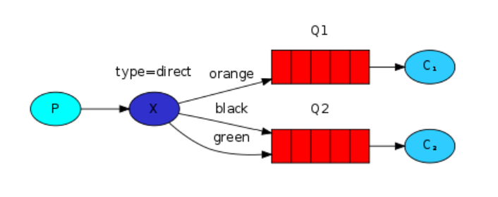 |

生产者：在绑定Exchange和Queue时，需要指定好routingKey，同时在发送消息时，也指定routingKey，只有routingKey一致时，才会把指定的消息路由到指定的Queue

```java
package com.zzq.rabbitma.routing.producer;

import com.rabbitmq.client.BuiltinExchangeType;
import com.rabbitmq.client.Channel;
import com.rabbitmq.client.Connection;
import com.zzq.rabbitma.util.RabbitMQConnectionUtil;
import org.junit.Test;

/**
 * @author zzq
 * @description
 * @date 2022/1/25 20:20
 */
public class Publisher {

    public static final String EXCHANGE_NAME = "routing-direct";
    public static final String QUEUE_NAME1 = "routing-one";
    public static final String QUEUE_NAME2 = "routing-two";
    @Test
    public void publish() throws Exception {
        //1. 获取连接对象
        Connection connection = RabbitMQConnectionUtil.getConnection();

        //2. 构建Channel
        Channel channel = connection.createChannel();

        //3. 构建交换机
        channel.exchangeDeclare(EXCHANGE_NAME, BuiltinExchangeType.DIRECT);

        //4. 构建队列
        channel.queueDeclare(QUEUE_NAME1,false,false,false,null);
        channel.queueDeclare(QUEUE_NAME2,false,false,false,null);

        //5. 绑定交换机和队列
        channel.queueBind(QUEUE_NAME1,EXCHANGE_NAME,"ORANGE");
        channel.queueBind(QUEUE_NAME2,EXCHANGE_NAME,"BLACK");
        channel.queueBind(QUEUE_NAME2,EXCHANGE_NAME,"GREEN");

        //6. 发消息到交换机
        channel.basicPublish(EXCHANGE_NAME,"ORANGE",null,"大橙子！".getBytes());
        channel.basicPublish(EXCHANGE_NAME,"BLACK",null,"黑布林大狸子".getBytes());
        channel.basicPublish(EXCHANGE_NAME,"GREEN",null,"小白兔！".getBytes());
        channel.basicPublish(EXCHANGE_NAME,"WHITE",null,"老夫子！".getBytes());
        System.out.println("消息成功发送！");


    }

}

```

消费者

```java
package com.zzq.rabbitma.routing.comsumer;

import com.rabbitmq.client.*;
import com.zzq.rabbitma.routing.producer.Publisher;
import com.zzq.rabbitma.util.RabbitMQConnectionUtil;
import org.junit.Test;

import java.io.IOException;

/**
 * @author zzq
 * @description
 * @date 2022/1/24 23:02
 */
public class Consumer {

    @Test
    public void consume1() throws Exception {
        //1. 获取连接对象
        Connection connection = RabbitMQConnectionUtil.getConnection();

        //2. 构建Channel
        Channel channel = connection.createChannel();


        //3. 构建队列
        channel.queueDeclare(Publisher.QUEUE_NAME1,false,false,false,null);

        //4. 监听消息
        DefaultConsumer callback = new DefaultConsumer(channel){


            /**
             consumerTag（String 类型）：消费者标签，是 RabbitMQ 为每个消费者分配的一个唯一标识符。此标识符可以用于取消或标识某个特定的消费者。
             envelope（Envelope 类型）：消息的元数据。包含了路由信息，例如：
             envelope.getDeliveryTag()：消息的投递标签，可以用于确认消息。
             envelope.getExchange()：消息来自的交换机名称。
             envelope.getRoutingKey()：消息的路由键，用于路由消息到指定队列。
             properties（AMQP.BasicProperties 类型）：消息的属性，用于描述消息的其他属性信息。它可以包含消息的优先级、消息的持久性、内容类型、消息的标识符等。

             body（byte[] 类型）：消息的主体内容，以字节数组形式表示。通过 new String(body, "UTF-8") 可以将其转换为字符串格式，以便在控制台输出消息内容。
             */
            @Override
            public void handleDelivery(String consumerTag, Envelope envelope, AMQP.BasicProperties properties, byte[] body) throws IOException {

                try {
                    Thread.sleep(100);
                } catch (InterruptedException e) {
                    throw new RuntimeException(e);
                }

                System.out.println("消费者1获取到消息：" + new String(body,"UTF-8"));
            }
        };
        channel.basicConsume(Publisher.QUEUE_NAME1,true,callback);
        System.out.println("开始监听队列1");

        System.in.read();
    }


    @Test
    public void consume2() throws Exception {
        //1. 获取连接对象
        Connection connection = RabbitMQConnectionUtil.getConnection();

        //2. 构建Channel
        Channel channel = connection.createChannel();

        //3. 构建队列
        channel.queueDeclare(Publisher.QUEUE_NAME2,false,false,false,null);

        //4. 监听消息
        DefaultConsumer callback = new DefaultConsumer(channel){


            /**
             consumerTag（String 类型）：消费者标签，是 RabbitMQ 为每个消费者分配的一个唯一标识符。此标识符可以用于取消或标识某个特定的消费者。
             envelope（Envelope 类型）：消息的元数据。包含了路由信息，例如：
             envelope.getDeliveryTag()：消息的投递标签，可以用于确认消息。
             envelope.getExchange()：消息来自的交换机名称。
             envelope.getRoutingKey()：消息的路由键，用于路由消息到指定队列。
             properties（AMQP.BasicProperties 类型）：消息的属性，用于描述消息的其他属性信息。它可以包含消息的优先级、消息的持久性、内容类型、消息的标识符等。

             body（byte[] 类型）：消息的主体内容，以字节数组形式表示。通过 new String(body, "UTF-8") 可以将其转换为字符串格式，以便在控制台输出消息内容。
             */
            @Override
            public void handleDelivery(String consumerTag, Envelope envelope, AMQP.BasicProperties properties, byte[] body) throws IOException {

                try {
                    Thread.sleep(1000);
                } catch (InterruptedException e) {
                    throw new RuntimeException(e);
                }
                System.out.println("消费者2获取到消息：" + new String(body,"UTF-8"));
            }
        };
        channel.basicConsume(Publisher.QUEUE_NAME2,true,callback);
        System.out.println("开始监听队列2");

        System.in.read();
    }
}
```


#### 4.7 Topic

|                                                               Topic模式                                                               |
| :------------------------------------------------------------------------------------------------------------------------------------: |
|   |

生产者：TOPIC类型可以编写带有特殊意义的routingKey的绑定方式

```java
package com.zzq.rabbitma.topic.producer;

import com.rabbitmq.client.BuiltinExchangeType;
import com.rabbitmq.client.Channel;
import com.rabbitmq.client.Connection;
import com.zzq.rabbitma.util.RabbitMQConnectionUtil;
import org.junit.Test;

/**
 * @author zzq
 * @description
 * @date 2022/1/25 20:28
 */
public class Publisher {

    public static final String EXCHANGE_NAME = "topic";
    public static final String QUEUE_NAME1 = "topic-one";
    public static final String QUEUE_NAME2 = "topic-two";
    @Test
    public void publish() throws Exception {
        //1. 获取连接对象
        Connection connection = RabbitMQConnectionUtil.getConnection();

        //2. 构建Channel
        Channel channel = connection.createChannel();

        //3. 构建交换机
        channel.exchangeDeclare(EXCHANGE_NAME, BuiltinExchangeType.TOPIC);

        //4. 构建队列
        channel.queueDeclare(QUEUE_NAME1,false,false,false,null);
        channel.queueDeclare(QUEUE_NAME2,false,false,false,null);

        //5. 绑定交换机和队列，
        // TOPIC类型的交换机在和队列绑定时，需要以aaa.bbb.ccc..方式编写routingkey
        // 其中有两个特殊字符：*（相当于占位符），#（相当通配符）
        channel.queueBind(QUEUE_NAME1,EXCHANGE_NAME,"*.orange.*");
        channel.queueBind(QUEUE_NAME2,EXCHANGE_NAME,"*.*.rabbit");
        channel.queueBind(QUEUE_NAME2,EXCHANGE_NAME,"lazy.#");

        //6. 发消息到交换机
        channel.basicPublish(EXCHANGE_NAME,"big.orange.rabbit",null,"大橙兔子！".getBytes());
        channel.basicPublish(EXCHANGE_NAME,"small.white.rabbit",null,"小白兔".getBytes());
        channel.basicPublish(EXCHANGE_NAME,"lazy.dog.dog.dog.dog.dog.dog",null,"懒狗狗狗狗狗狗".getBytes());
        System.out.println("消息成功发送！");

    }
}
```

消费者

```java
package com.zzq.rabbitma.topic.comsumer;

import com.rabbitmq.client.*;
import com.zzq.rabbitma.topic.producer.Publisher;
import com.zzq.rabbitma.util.RabbitMQConnectionUtil;
import org.junit.Test;

import java.io.IOException;

/**
 * @author zzq
 * @description
 * @date 2022/1/24 23:02
 */
public class Consumer {

    @Test
    public void consume1() throws Exception {
        //1. 获取连接对象
        Connection connection = RabbitMQConnectionUtil.getConnection();

        //2. 构建Channel
        Channel channel = connection.createChannel();


        //3. 构建队列
        channel.queueDeclare(Publisher.QUEUE_NAME1,false,false,false,null);

        //4. 监听消息
        DefaultConsumer callback = new DefaultConsumer(channel){


            /**
             consumerTag（String 类型）：消费者标签，是 RabbitMQ 为每个消费者分配的一个唯一标识符。此标识符可以用于取消或标识某个特定的消费者。
             envelope（Envelope 类型）：消息的元数据。包含了路由信息，例如：
             envelope.getDeliveryTag()：消息的投递标签，可以用于确认消息。
             envelope.getExchange()：消息来自的交换机名称。
             envelope.getRoutingKey()：消息的路由键，用于路由消息到指定队列。
             properties（AMQP.BasicProperties 类型）：消息的属性，用于描述消息的其他属性信息。它可以包含消息的优先级、消息的持久性、内容类型、消息的标识符等。

             body（byte[] 类型）：消息的主体内容，以字节数组形式表示。通过 new String(body, "UTF-8") 可以将其转换为字符串格式，以便在控制台输出消息内容。
             */
            @Override
            public void handleDelivery(String consumerTag, Envelope envelope, AMQP.BasicProperties properties, byte[] body) throws IOException {

                try {
                    Thread.sleep(100);
                } catch (InterruptedException e) {
                    throw new RuntimeException(e);
                }

                System.out.println("消费者1获取到消息：" + new String(body,"UTF-8"));
            }
        };


        channel.basicConsume(Publisher.QUEUE_NAME1,true,callback);
        System.out.println("开始监听队列1");

        System.in.read();
    }


    @Test
    public void consume2() throws Exception {
        //1. 获取连接对象
        Connection connection = RabbitMQConnectionUtil.getConnection();

        //2. 构建Channel
        Channel channel = connection.createChannel();

        //3. 构建队列
        channel.queueDeclare(Publisher.QUEUE_NAME2,false,false,false,null);

        //4. 监听消息
        DefaultConsumer callback = new DefaultConsumer(channel){


            /**
             consumerTag（String 类型）：消费者标签，是 RabbitMQ 为每个消费者分配的一个唯一标识符。此标识符可以用于取消或标识某个特定的消费者。
             envelope（Envelope 类型）：消息的元数据。包含了路由信息，例如：
             envelope.getDeliveryTag()：消息的投递标签，可以用于确认消息。
             envelope.getExchange()：消息来自的交换机名称。
             envelope.getRoutingKey()：消息的路由键，用于路由消息到指定队列。
             properties（AMQP.BasicProperties 类型）：消息的属性，用于描述消息的其他属性信息。它可以包含消息的优先级、消息的持久性、内容类型、消息的标识符等。

             body（byte[] 类型）：消息的主体内容，以字节数组形式表示。通过 new String(body, "UTF-8") 可以将其转换为字符串格式，以便在控制台输出消息内容。
             */
            @Override
            public void handleDelivery(String consumerTag, Envelope envelope, AMQP.BasicProperties properties, byte[] body) throws IOException {

                try {
                    Thread.sleep(1000);
                } catch (InterruptedException e) {
                    throw new RuntimeException(e);
                }
                System.out.println("消费者2获取到消息：" + new String(body,"UTF-8"));
            }
        };
        channel.basicConsume(Publisher.QUEUE_NAME2,true,callback);
        System.out.println("开始监听队列2");

        System.in.read();
    }
}
```


#### 4.8 RPC（了解）

> 因为两个服务在交互时，可以尽量做到Client和Server的解耦，通过RabbitMQ进行解耦操作
>
> 需要让Client发送消息时，携带两个属性：
>
> - replyTo告知Server将相应信息放到哪个队列
> - correlationId告知Server发送相应消息时，需要携带位置标示来告知Client响应的信息

|                                                                RPC方式                                                                |
| :------------------------------------------------------------------------------------------------------------------------------------: |
|   |

客户端：

```java
package com.mashibing.rpc;

import com.mashibing.util.RabbitMQConnectionUtil;
import com.rabbitmq.client.*;
import org.junit.Test;

import java.io.IOException;
import java.util.UUID;

/**
 * @author zzq
 * @description
 * @date 2022/2/8 20:03
 */
public class Publisher {

    public static final String QUEUE_PUBLISHER = "rpc_publisher";
    public static final String QUEUE_CONSUMER = "rpc_consumer";

    @Test
    public void publish() throws Exception {
        //1. 获取连接对象
        Connection connection = RabbitMQConnectionUtil.getConnection();

        //2. 构建Channel
        Channel channel = connection.createChannel();

        //3. 构建队列
        channel.queueDeclare(QUEUE_PUBLISHER,false,false,false,null);
        channel.queueDeclare(QUEUE_CONSUMER,false,false,false,null);

        //4. 发布消息
        String message = "Hello RPC!";
        String uuid = UUID.randomUUID().toString();
        AMQP.BasicProperties props = new AMQP.BasicProperties()
                .builder()
                .replyTo(QUEUE_CONSUMER)
                .correlationId(uuid)
                .build();
        channel.basicPublish("",QUEUE_PUBLISHER,props,message.getBytes());

        channel.basicConsume(QUEUE_CONSUMER,false,new DefaultConsumer(channel){
            @Override
            public void handleDelivery(String consumerTag, Envelope envelope, AMQP.BasicProperties properties, byte[] body) throws IOException {
                String id = properties.getCorrelationId();
                if(id != null && id.equalsIgnoreCase(uuid)){
                    System.out.println("接收到服务端的响应：" + new String(body,"UTF-8"));
                }
                channel.basicAck(envelope.getDeliveryTag(),false);
            }
        });
        System.out.println("消息发送成功！");

        System.in.read();
    }


}
```

服务端：

```java
package com.mashibing.rpc;

import com.mashibing.helloworld.Publisher;
import com.mashibing.util.RabbitMQConnectionUtil;
import com.rabbitmq.client.*;
import org.junit.Test;

import java.io.IOException;

/**
 * @author zzq
 * @description
 * @date 2022/1/24 23:02
 */
public class Consumer {

    public static final String QUEUE_PUBLISHER = "rpc_publisher";
    public static final String QUEUE_CONSUMER = "rpc_consumer";

    @Test
    public void consume() throws Exception {
        //1. 获取连接对象
        Connection connection = RabbitMQConnectionUtil.getConnection();

        //2. 构建Channel
        Channel channel = connection.createChannel();

        //3. 构建队列
        channel.queueDeclare(QUEUE_PUBLISHER,false,false,false,null);
        channel.queueDeclare(QUEUE_CONSUMER,false,false,false,null);


        //4. 监听消息
        DefaultConsumer callback = new DefaultConsumer(channel){
            @Override
            public void handleDelivery(String consumerTag, Envelope envelope, AMQP.BasicProperties properties, byte[] body) throws IOException {
                System.out.println("消费者获取到消息：" + new String(body,"UTF-8"));
                String resp = "获取到了client发出的请求，这里是响应的信息";
                String respQueueName = properties.getReplyTo();
                String uuid = properties.getCorrelationId();
                AMQP.BasicProperties props = new AMQP.BasicProperties()
                        .builder()
                        .correlationId(uuid)
                        .build();
                channel.basicPublish("",respQueueName,props,resp.getBytes());
                channel.basicAck(envelope.getDeliveryTag(),false);
            }
        };
        channel.basicConsume(QUEUE_PUBLISHER,false,callback);
        System.out.println("开始监听队列");

        System.in.read();
    }
}
```

​	

### 五、SpringBoot操作RabbitMQ

---

#### 5.1 SpringBoot声明信息

- 创建项目
- 导入依赖

  ```xml
  <dependency>
      <groupId>org.springframework.boot</groupId>
      <artifactId>spring-boot-starter-amqp</artifactId>
  </dependency>
  ```
- 配置RabbitMQ信息

  ```yml
  spring:
    rabbitmq:
      host: 127.0.0.1
      port: 5672
      username: guest
      password: guest
      virtual-host: /
  ```
- 声明交换机&队列


```java
package com.zzq.rabbitmq.rabbitmqspringboot.config;

import org.springframework.amqp.core.*;
import org.springframework.context.annotation.Bean;
import org.springframework.context.annotation.Configuration;

/**
 * @author zzq
 * @description
 * @date 2022/2/8 20:25
 */
@Configuration
public class RabbitMQConfig {

    public static final String EXCHANGE = "boot-exchange";
    public static final String QUEUE = "boot-queue";
    public static final String ROUTING_KEY = "*.black.*";


    @Bean
    public Exchange bootExchange(){
        // channel.DeclareExchange
        return ExchangeBuilder.topicExchange(EXCHANGE).build();
    }

    @Bean
    public Queue bootQueue(){
        return QueueBuilder.durable(QUEUE).build();
    }

    @Bean
    public Binding bootBinding(Exchange bootExchange,Queue bootQueue){
        return BindingBuilder.bind(bootQueue).to(bootExchange).with(ROUTING_KEY).noargs();
    }
}
```
####   5.2 生产者操作

  ```
package com.zzq.rabbitmq.rabbitmqspringboot.producer;

import com.zzq.rabbitmq.rabbitmqspringboot.config.RabbitMQConfig;
import org.junit.jupiter.api.Test;
import org.springframework.amqp.AmqpException;
import org.springframework.amqp.core.Message;
import org.springframework.amqp.core.MessagePostProcessor;
import org.springframework.amqp.rabbit.core.RabbitTemplate;
import org.springframework.beans.factory.annotation.Autowired;
import org.springframework.boot.test.context.SpringBootTest;

/**
 * @author zzq
 * @description
 * @date 2022/2/8 21:05
 */
@SpringBootTest
public class PublisherTest {

    @Autowired
    public RabbitTemplate rabbitTemplate;

    @Test
    public void publish(){
        rabbitTemplate.convertAndSend(RabbitMQConfig.EXCHANGE,"big.black.dog","message");
        System.out.println("消息发送成功");
    }


    @Test
    public void publishWithProps(){
        rabbitTemplate.convertAndSend(RabbitMQConfig.EXCHANGE, "big.black.dog", "messageWithProps", new MessagePostProcessor() {
            @Override
            public Message postProcessMessage(Message message) throws AmqpException {
                message.getMessageProperties().setCorrelationId("123");
                return message;
            }
        });
        System.out.println("消息发送成功");
    }
}
  ```

#### 5.3 消费者操作

```java
package com.zzq.rabbitmq.rabbitmqspringboot.comsumer;

import com.rabbitmq.client.Channel;
import com.zzq.rabbitmq.rabbitmqspringboot.config.RabbitMQConfig;
import org.springframework.amqp.core.Message;
import org.springframework.amqp.rabbit.annotation.RabbitListener;
import org.springframework.stereotype.Component;

import java.io.IOException;

/**
 * @author zzq
 * @description
 * @date 2022/2/8 21:11
 */
@Component
public class ConsumeListener {

    @RabbitListener(queues = RabbitMQConfig.QUEUE)
    public void consume(String msg, Channel channel, Message message) throws IOException {
        System.out.println("队列的消息为：" + msg);
        String correlationId = message.getMessageProperties().getCorrelationId();
        System.out.println("唯一标识为：" + correlationId);
        channel.basicAck(message.getMessageProperties().getDeliveryTag(),false);
    }
}
```

### 六、RabbitMQ保证消息可靠性

---

#### 6.1 保证消息一定送达到Exchange

Confirm机制

可以通过Confirm效果保证消息一定送达到Exchange，官方提供了三种方式，选择了对于效率影响最低的异步回调的效果

```java
//4. 开启confirms
channel.confirmSelect();

//5. 设置confirms的异步回调
channel.addConfirmListener(new ConfirmListener() {
    @Override
    public void handleAck(long deliveryTag, boolean multiple) throws IOException {
        System.out.println("消息成功的发送到Exchange！");
    }

    @Override
    public void handleNack(long deliveryTag, boolean multiple) throws IOException {
        System.out.println("消息没有发送到Exchange，尝试重试，或者保存到数据库做其他补偿操作！");
    }
});
```

#### 6.2 保证消息可以路由到Queue

Return机制

为了保证Exchange上的消息一定可以送达到Queue

```java
//6. 设置Return回调，确认消息是否路由到了Queue
channel.addReturnListener(new ReturnListener() {
    @Override
    public void handleReturn(int replyCode, String replyText, String exchange, String routingKey, AMQP.BasicProperties properties, byte[] body) throws IOException {
        System.out.println("消息没有路由到指定队列，做其他的补偿措施！！");
    }
});
//7. 在发送消息时，将basicPublish方法参数中的mandatory设置为true，即可开启Return机制，当消息没有路由到队列中时，就会执行return回调
```

#### 6.3 保证Queue可以持久化消息

DeliveryMode设置消息持久化

DeliveryMode设置为2代表持久化，如果设置为1，就代表不会持久化。

```java
//7. 设置消息持久化
AMQP.BasicProperties props = new AMQP.BasicProperties()
    .builder()
    .deliveryMode(2)
    .build();

//8. 发布消息
channel.basicPublish("","confirms",true,props,message.getBytes());
```

#### 6.4 保证消费者可以正常消费消息

`详情看WorkQueue模式`

#### 6.5 SpringBoot实现上述操作

##### 6.5.1 Confirm

- 编写配置文件开启Confirm机制

  ```yml
  spring:
    rabbitmq:
      publisher-confirm-type: correlated  # 新版本
      publisher-confirms: true  # 老版本 
  ```
- 在发送消息时，配置RabbitTemplate

  ```java
  @Test
  public void publishWithConfirms() throws IOException {
      rabbitTemplate.setConfirmCallback(new RabbitTemplate.ConfirmCallback() {
          @Override
          public void confirm(CorrelationData correlationData, boolean ack, String cause) {
              if(ack){
                  System.out.println("消息已经送达到交换机！！");
              }else{
                  System.out.println("消息没有送达到Exchange，需要做一些补偿操作！！retry！！！");
              }
          }
      });
      rabbitTemplate.convertAndSend(RabbitMQConfig.EXCHANGE,"big.black.dog","message");
      System.out.println("消息发送成功");
  
      System.in.read();
  }
  ```

##### 6.5.2 Return

- 编写配置文件开启Return机制

  ```yml
  spring:
    rabbitmq:
      publisher-returns: true # 开启Return机制
  ```
- 在发送消息时，配置RabbitTemplate

  ```java
  @Test
  public void publishWithReturn() throws IOException {
      // 新版本用 setReturnsCallback ，老版本用setReturnCallback
      rabbitTemplate.setReturnsCallback(new RabbitTemplate.ReturnsCallback() {
          @Override
          public void returnedMessage(ReturnedMessage returned) {
              String msg = new String(returned.getMessage().getBody());
              System.out.println("消息：" + msg + "路由队列失败！！做补救操作！！");
          }
      });
      rabbitTemplate.convertAndSend(RabbitMQConfig.EXCHANGE,"big.black.dog","message");
      System.out.println("消息发送成功");
  
      System.in.read();
  }
  ```

##### 6.5.3 消息持久化

```java
@Test
public void publishWithBasicProperties() throws IOException {
    rabbitTemplate.convertAndSend(RabbitMQConfig.EXCHANGE, "big.black.dog", "message", new MessagePostProcessor() {
        @Override
        public Message postProcessMessage(Message message) throws AmqpException {
            // 设置消息的持久化！
            message.getMessageProperties().setDeliveryMode(MessageDeliveryMode.PERSISTENT);
            return message;
        }
    });
    System.out.println("消息发送成功");
}
```

### 七、RabbitMQ死信队列&延迟交换机

#### 7.1 什么是死信

|                                                             死信&死信队列                                                             |
| :-----------------------------------------------------------------------------------------------------------------------------------: |
|  |

死信队列的应用：

- 基于死信队列在队列消息已满的情况下，消息也不会丢失
- 实现延迟消费的效果。比如：下订单时，有15分钟的付款时间

#### 7.2 实现死信队列

##### 7.2.1 准备Exchange&Queue

```java
package com.zzq.rabbitmq.rabbitmqspringboot.config;

import org.springframework.amqp.core.*;
import org.springframework.context.annotation.Bean;
import org.springframework.context.annotation.Configuration;

/**
 * @author zzq
 * @description
 * @date 2022/2/10 15:04
 */
@Configuration
public class DeadLetterConfig {

    public static final String NORMAL_EXCHANGE = "normal-exchange";
    public static final String NORMAL_QUEUE = "normal-queue";
    public static final String NORMAL_ROUTING_KEY = "normal.#";

    public static final String DEAD_EXCHANGE = "dead-exchange";
    public static final String DEAD_QUEUE = "dead-queue";
    public static final String DEAD_ROUTING_KEY = "dead.#";


    @Bean
    public Exchange normalExchange(){
        return ExchangeBuilder.topicExchange(NORMAL_EXCHANGE).build();
    }

    @Bean
    public Queue normalQueue(){
        return QueueBuilder.durable(NORMAL_QUEUE).deadLetterExchange(DEAD_EXCHANGE).deadLetterRoutingKey("dead.abc").build();
    }

    @Bean
    public Binding normalBinding(Queue normalQueue,Exchange normalExchange){
        return BindingBuilder.bind(normalQueue).to(normalExchange).with(NORMAL_ROUTING_KEY).noargs();
    }


    @Bean
    public Exchange deadExchange(){
        return ExchangeBuilder.topicExchange(DEAD_EXCHANGE).build();
    }

    @Bean
    public Queue deadQueue(){
        return QueueBuilder.durable(DEAD_QUEUE).build();
    }

    @Bean
    public Binding deadBinding(Queue deadQueue,Exchange deadExchange){
        return BindingBuilder.bind(deadQueue).to(deadExchange).with(DEAD_ROUTING_KEY).noargs();
    }

}
```

##### 7.2.2 实现效果

- 基于消费者进行reject或者nack实现死信效果

  ```java
  package com.zzq.rabbitmq.rabbitmqspringboot.comsumer;
  
  import com.rabbitmq.client.Channel;
  import com.zzq.rabbitmq.rabbitmqspringboot.config.DeadLetterConfig;
  import org.springframework.amqp.core.Message;
  import org.springframework.amqp.rabbit.annotation.RabbitListener;
  import org.springframework.stereotype.Component;
  
  import java.io.IOException;
  
  /**
   * @author zzq
   * @description
   * @date 2022/2/10 15:17
   */
  @Component
  public class DeadListener {
  
      @RabbitListener(queues = DeadLetterConfig.NORMAL_QUEUE)
      public void consume(String msg, Channel channel, Message message) throws IOException {
          System.out.println("接收到normal队列的消息：" + msg);
          //二选一
          channel.basicReject(message.getMessageProperties().getDeliveryTag(),false);
          channel.basicNack(message.getMessageProperties().getDeliveryTag(),false,false);
      }
  }
  ```
  
  发送消息：
  
  ```java
  package com.zzq.rabbitmq.rabbitmqspringboot.producer;
  
  import com.zzq.rabbitmq.rabbitmqspringboot.config.DeadLetterConfig;
  import com.zzq.rabbitmq.rabbitmqspringboot.config.RabbitMQConfig;
  import org.junit.jupiter.api.Test;
  import org.springframework.amqp.AmqpException;
  import org.springframework.amqp.core.Message;
  import org.springframework.amqp.core.MessageDeliveryMode;
  import org.springframework.amqp.core.MessagePostProcessor;
  import org.springframework.amqp.core.ReturnedMessage;
  import org.springframework.amqp.rabbit.connection.CorrelationData;
  import org.springframework.amqp.rabbit.core.RabbitTemplate;
  import org.springframework.beans.factory.annotation.Autowired;
  import org.springframework.boot.test.context.SpringBootTest;
  
  import java.io.IOException;
  
  /**
   * @author zzq
   * @description
   * @date 2022/2/8 21:05
   */
  @SpringBootTest
  public class deadPublisherTest {
  
      @Autowired
      public RabbitTemplate rabbitTemplate;
  
      @Test
      public void publish(){
          String msg = "dead letter";
          rabbitTemplate.convertAndSend(DeadLetterConfig.NORMAL_EXCHANGE,"normal.abc",msg);
          System.out.println("消息发送成功");
      }
  
  
  
  }
  ```
  
  
  
- 消息的生存时间

  - 给消息设置生存时间

    ```java
    @Test
    public void publishExpire(){
        String msg = "dead letter expire";
        rabbitTemplate.convertAndSend(DeadLetterConfig.NORMAL_EXCHANGE, "normal.abc", msg, new MessagePostProcessor() {
            @Override
            public Message postProcessMessage(Message message) throws AmqpException {
                message.getMessageProperties().setExpiration("5000");
                return message;
            }
        });
    }
    ```
  - 给队列设置消息的生存时间

    ```java
    @Bean
    public Queue normalQueue(){
        return QueueBuilder.durable(NORMAL_QUEUE)
                .deadLetterExchange(DEAD_EXCHANGE)
                .deadLetterRoutingKey("dead.abc")
                .ttl(10000) //设置队列中消息的生存时间
                .build();
    }
    ```
  
- 设置Queue中的消息最大长度

  ```java
  @Bean
  public Queue normalQueue(){
      return QueueBuilder.durable(NORMAL_QUEUE)
              .deadLetterExchange(DEAD_EXCHANGE)
              .deadLetterRoutingKey("dead.abc")
              .maxLength(1) //设置队列中可以存储的最大消息数量
              .build();
  }
  ```

  只要Queue中已经有一个消息，如果再次发送一个消息，这个消息会变为死信！

#### 7.3 延迟交换机

延迟交换机：https://github.com/rabbitmq/rabbitmq-delayed-message-exchange/releases

下载插件

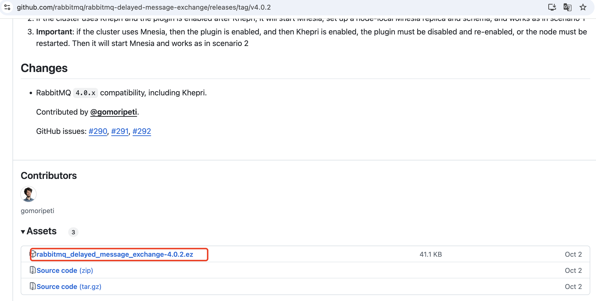

加载插件到容器，并且重新启动rabbitmq容器

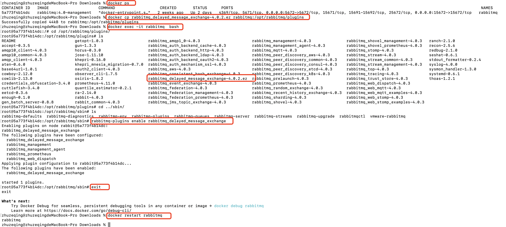

效果：


死信队列实现延迟消费时，如果延迟时间比较复杂，比较多，直接使用死信队列时，需要创建大量的队列还对应不同的时间，可以采用延迟交换机来解决这个问题。

- 构建延迟交换机

  ```java
  package com.zzq.rabbitmq.rabbitmqspringboot.comsumer;
  
  import org.springframework.amqp.core.*;
  import org.springframework.context.annotation.Bean;
  import org.springframework.context.annotation.Configuration;
  
  import java.util.HashMap;
  import java.util.Map;
  
  /**
   * @author zzq
   * @description
   */
  @Configuration
  public class DelayedConfig {
  
      public static final String DELAYED_EXCHANGE = "delayed-exchange";
      public static final String DELAYED_QUEUE = "delayed-queue";
      public static final String DELAYED_ROUTING_KEY = "delayed.#";
  
      @Bean
      public Exchange delayedExchange(){
          Map<String, Object> arguments = new HashMap<>();
          arguments.put("x-delayed-type","topic");
          Exchange exchange = new CustomExchange(DELAYED_EXCHANGE,"x-delayed-message",true,false,arguments);
          return exchange;
      }
  
      @Bean
      public Queue delayedQueue(){
          return QueueBuilder.durable(DELAYED_QUEUE).build();
      }
  
      @Bean
      public Binding delayedBinding(Queue delayedQueue,Exchange delayedExchange){
          return BindingBuilder.bind(delayedQueue).to(delayedExchange).with(DELAYED_ROUTING_KEY).noargs();
      }
  }
  ```
- 发送消息

  ```java
  package com.zzq.rabbitmq.rabbitmqspringboot.producer;
  
  import com.zzq.rabbitmq.rabbitmqspringboot.comsumer.DelayedConfig;
  import org.junit.jupiter.api.Test;
  import org.springframework.amqp.AmqpException;
  import org.springframework.amqp.core.Message;
  import org.springframework.amqp.core.MessagePostProcessor;
  import org.springframework.amqp.rabbit.core.RabbitTemplate;
  import org.springframework.beans.factory.annotation.Autowired;
  import org.springframework.boot.test.context.SpringBootTest;
  
  /**
   * @author zzq
   * @description
   */
  @SpringBootTest
  public class DelayedPublisherTest {
  
      @Autowired
      private RabbitTemplate rabbitTemplate;
  
      @Test
      public void publish(){
          rabbitTemplate.convertAndSend(DelayedConfig.DELAYED_EXCHANGE, "delayed.abc", "xxxx", new MessagePostProcessor() {
              @Override
              public Message postProcessMessage(Message message) throws AmqpException {
                  message.getMessageProperties().setDelayLong(5000L);
                  return message;
              }
          });
      }
  }
  ```

### 八、RabbitMQ的集群

RabbitMQ的镜像模式

|                                                            RabbitMQ的集群                                                            |
| :-----------------------------------------------------------------------------------------------------------------------------------: |
|  |

高可用

提升RabbitMQ的效率

**搭建RabbitMQ集群**

- 准备两台虚拟机（克隆）
- 准备RabbitMQ的yml文件

  rabbitmq1：

  ```yml
  version: '3.1'
  services:
    rabbitmq1:
      image: rabbitmq:3.8.5-management-alpine
      container_name: rabbitmq1
      hostname: rabbitmq1
      extra_hosts:
        - "rabbitmq1:192.168.11.32"
        - "rabbitmq2:192.168.11.33"
      environment: 
        - RABBITMQ_ERLANG_COOKIE=SDJHFGDFFS
      ports:
        - 5672:5672
        - 15672:15672
        - 4369:4369
        - 25672:25672
  ```

  rabbitmq2：

  ```yml
  version: '3.1'
  services:
    rabbitmq2:
      image: rabbitmq:3.8.5-management-alpine
      container_name: rabbitmq2
      hostname: rabbitmq2
      extra_hosts:
        - "rabbitmq1:192.168.11.32"
        - "rabbitmq2:192.168.11.33"
      environment: 
        - RABBITMQ_ERLANG_COOKIE=SDJHFGDFFS
      ports:
        - 5672:5672
        - 15672:15672
        - 4369:4369
        - 25672:25672
  ```

  准备完毕之后，启动两台RabbitMQ

  |                                                               启动效果                                                               |
  | :-----------------------------------------------------------------------------------------------------------------------------------: |
  |  |
- 让RabbitMQ服务实现join操作

  需要四个命令完成join操作

  让rabbitmq2   join  rabbitmq1，需要进入到rabbitmq2的容器内部，去执行下述命令

  ```sh
  rabbitmqctl stop_app
  rabbitmqctl reset 
  rabbitmqctl join_cluster rabbit@rabbitmq1
  rabbitmqctl start_app
  ```

  执行成功后：

  |                                                              执行成功后                                                              |
  | :-----------------------------------------------------------------------------------------------------------------------------------: |
  |  |
- 设置镜像模式

  在指定的RabbitMQ服务中设置好镜像策略即可

  |                                                               镜像模式                                                               |
  | :-----------------------------------------------------------------------------------------------------------------------------------: |
  |  |

### 九、RabbitMQ其他内容

#### 9.1 Headers类型Exchange

headers就是一个基于key-value的方式，让Exchange和Queue绑定的到一起的一种规则

相比Topic形式，可以采用的类型更丰富。

|                                                            headers绑定方式                                                            |
| :-----------------------------------------------------------------------------------------------------------------------------------: |
|  |

具体实现方式

```java
package com.mashibing.headers;

import com.mashibing.util.RabbitMQConnectionUtil;
import com.rabbitmq.client.AMQP;
import com.rabbitmq.client.BuiltinExchangeType;
import com.rabbitmq.client.Channel;
import com.rabbitmq.client.Connection;
import org.junit.Test;

import java.util.HashMap;
import java.util.Map;

/**
 * @author zjw
 * @description
 */
public class Publisher {

    public static final String HEADER_EXCHANGE = "header_exchange";
    public static final String HEADER_QUEUE = "header_queue";


    @Test
    public void publish()throws  Exception{
        //1. 获取连接对象
        Connection connection = RabbitMQConnectionUtil.getConnection();

        //2. 构建Channel
        Channel channel = connection.createChannel();


        //3. 构建交换机和队列并基于header的方式绑定
        channel.exchangeDeclare(HEADER_EXCHANGE, BuiltinExchangeType.HEADERS);
        channel.queueDeclare(HEADER_QUEUE,true,false,false,null);
        Map<String,Object> args = new HashMap<>();
        // 多个header的key-value只要可以匹配上一个就可以
        // args.put("x-match","any");
        // 多个header的key-value要求全部匹配上！
        args.put("x-match","all");
        args.put("name","jack");
        args.put("age","23");
        channel.queueBind(HEADER_QUEUE,HEADER_EXCHANGE,"",args);

        //4. 发送消息
        String msg = "header测试消息！";
        Map<String, Object> headers = new HashMap<>();
        headers.put("name","jac");
        headers.put("age","2");
        AMQP.BasicProperties props = new AMQP.BasicProperties()
                .builder()
                .headers(headers)
                .build();

        channel.basicPublish(HEADER_EXCHANGE,"",props,msg.getBytes());

        System.out.println("发送消息成功，header = " + headers);

    }
}
```
