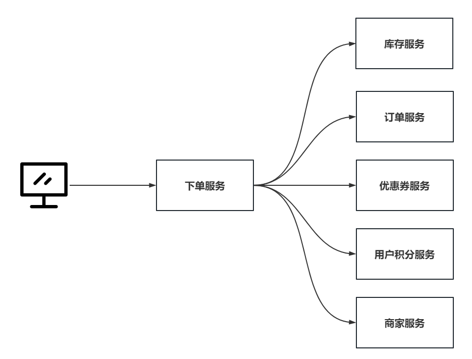
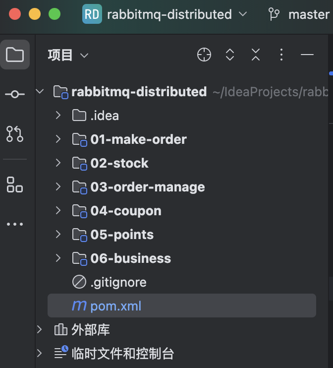
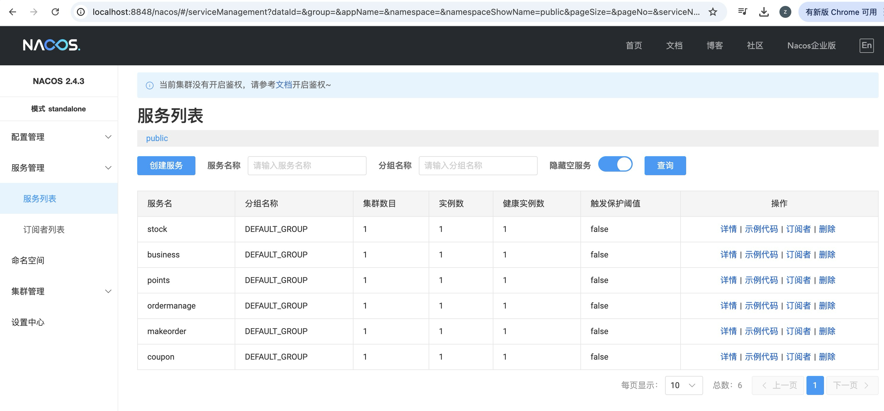
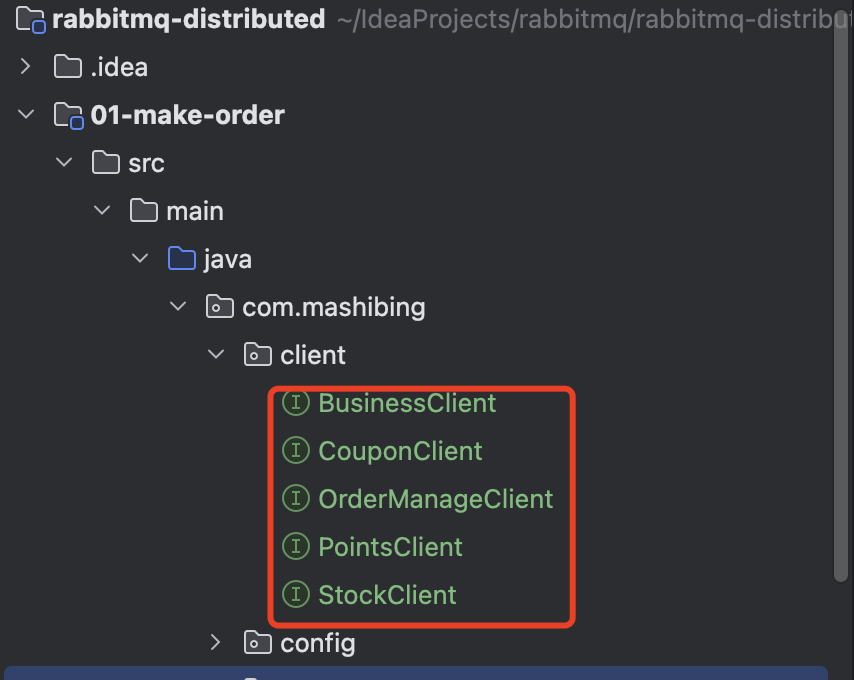
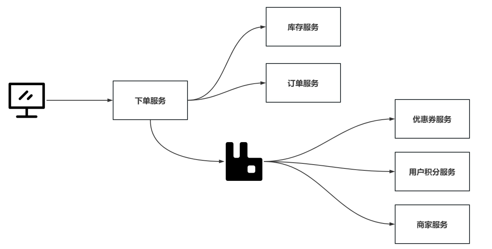

### 十、RabbitMQ实战

在掌握了SpringCloudAlibaba的应用后，再来玩！！

为了更好的理解RabbitMQ在项目中的作用，来一套实战操作。

#### 10.1 RabbitMQ实战场景

首先模拟一个场景，电商中对应的处理方案。

模拟一个用户在电商平台下单：

* 需要调用库存服务，扣除商品库存，扣除成功后，才可以继续往下走业务
* 需要调用订单服务，创建订单（待支付）。
* 还需要很多后续的处理
  * 下单时，会使用优惠券，预扣除当前用户使用的优惠券
  * 下单时，会使用用户积分顶金额，预扣除当前用户的积分
  * 创建成功后，需要通知商家，有用户下单。
  * ………………



#### 10.2 RabbitMQ实战场景搭建

版本信息  https://github.com/alibaba/spring-cloud-alibaba/wiki/%E7%89%88%E6%9C%AC%E8%AF%B4%E6%98%8E


因为场景设计到了服务之间的调用。

这里需要大家提前掌握一些知识：Nacos，OpenFeign的应用层面。

##### 1、构建聚合工程，作为父工程管理所有的模块

准备好pom.xml文件

```xml
<parent>
    <groupId>org.springframework.boot</groupId>
    <artifactId>spring-boot-starter-parent</artifactId>
    <version>2.3.12.RELEASE</version>
    <relativePath />
</parent>

<groupId>com.mashibing</groupId>
<artifactId>rabbitmq</artifactId>
<version>1.0-SNAPSHOT</version>
<packaging>pom</packaging>

<properties>
    <spring.cloud-version>Hoxton.SR12</spring.cloud-version>
    <spring.cloud.alibaba-version>2.2.7.RELEASE</spring.cloud.alibaba-version>
</properties>
<dependencyManagement>
    <dependencies>
        <dependency>
            <groupId>org.springframework.cloud</groupId>
            <artifactId>spring-cloud-dependencies</artifactId>
            <version>${spring.cloud-version}</version>
            <type>pom</type>
            <scope>import</scope>
        </dependency>
        <dependency>
            <groupId>com.alibaba.cloud</groupId>
            <artifactId>spring-cloud-alibaba-dependencies</artifactId>
            <version>${spring.cloud.alibaba-version}</version>
            <type>pom</type>
            <scope>import</scope>
        </dependency>
    </dependencies>
</dependencyManagement>
```


##### 2、构建其他六个子服务




安装nacos

```
docker run -d \
  --name nacos \
  -e MODE=standalone \
  -e NACOS_PORT=8848 \
  -p 8848:8848 \
  nacos/nacos-server

```


##### 3、从下单服务开始一次完成配置以及接口的提供

下单服务：

* 导入依赖
  ```
  <dependencies>
      <dependency>
          <groupId>org.springframework.boot</groupId>
          <artifactId>spring-boot-starter-web</artifactId>
      </dependency>
      <dependency>
          <groupId>com.alibaba.cloud</groupId>
          <artifactId>spring-cloud-starter-alibaba-nacos-discovery</artifactId>
      </dependency>
      <dependency>
          <groupId>org.springframework.cloud</groupId>
          <artifactId>spring-cloud-starter-openfeign</artifactId>
      </dependency>
  </dependencies>
  ```
  
* 构建启动类
  ```
  @SpringBootApplication
  @EnableDiscoveryClient
  public class PlaceOrderStarterApp {
  
      public static void main(String[] args) {
          SpringApplication.run(PlaceOrderStarterApp.class,args);
      }
  }
  ```
  
* 编写配置文件
  ```
  server:
    port: 80
  
  spring:
    application:
      name: makeorder
    cloud:
      nacos:
        discovery:
          server-addr: localhost:8848
  ```
  
* 处理问题：启动后发现，无法正常的注册到Nacos上，需要将Alibaba的版本降到2.2.6.RELEASE

每个模块启动，注册到nacos




##### 4、完成整个下单的流程

* 下单服务接口（前置操作）
  ```
  @RestController
  public class MakeOrderController {
  
      /**
       * 模拟用户下单操作
       * @return
       */
      @GetMapping("/po")
      public String po(){
          //1、调用库存服务扣除商品库存
  
          //2、调用订单服务，创建订单
  
          //3、调用优惠券服务，预扣除使用的优惠券
  
          //4、调用用户积分服务，预扣除用户使用的积分
  
          //5、调用商家服务，通知商家用户已下单
  
          return "place order is ok!";
      }
  
  }
  ```
* 库存服务接口
  ```
  @RestController
  public class StockController {
  
      private static int stock = 10;
  
      @GetMapping("/decr")
      public void decr() throws InterruptedException {
          Thread.sleep(400);
          stock--;
          if(stock < 0){
              throw new RuntimeException("商品库存不足！");
          }
          System.out.println("扣减库存成功！");
      }
  }
  ```
* 订单服务接口
  ```
  @RestController
  public class OrderManageController {
  
      @GetMapping("create")
      public void create() throws InterruptedException {
          Thread.sleep(400);
          System.out.println("创建订单成功！");
      }
  
  }
  ```
* 优惠券服务接口
  ```
  @RestController
  public class CouponController {
  
      @GetMapping("/coupon")
      public void coupon() throws InterruptedException {
          Thread.sleep(400);
          System.out.println("优惠券预扣除成功！");
      }
  
  }
  ```
* 用户积分服务接口
  ```
  @RestController
  public class PointsController {
  
      @GetMapping("/up")
      public void up() throws InterruptedException {
          Thread.sleep(400);
          System.out.println("扣除用户积分成功！！");
      }
  
  }
  ```
* 商家服务接口
  ```
  @RestController
  public class BusinessController {
  
      @GetMapping("/notify")
      public void notifyBusiness() throws InterruptedException {
          Thread.sleep(400);
          System.out.println("通知商家成功！！");
      }
  
  }
  ```

##### 5、完善下单接口服务调用

* 先给启动类添加OpenFeign注解

  ```
  @EnableFeignClients
  ```
  
* 给5个服务提供对应的OpenFeign接口

  

```java
package com.mashibing.client;

import org.springframework.cloud.openfeign.FeignClient;
import org.springframework.web.bind.annotation.GetMapping;

@FeignClient(value = "business")
public interface BusinessClient {

    @GetMapping("notifyBusiness")
    public void notifyBusiness();
}

```

```java
package com.mashibing.client;

import org.springframework.cloud.openfeign.FeignClient;
import org.springframework.web.bind.annotation.GetMapping;

@FeignClient(value = "coupon")
public interface CouponClient {

    @GetMapping("coupon")
    public void coupon();
}

```

```java
package com.mashibing.client;

import org.springframework.cloud.openfeign.FeignClient;
import org.springframework.web.bind.annotation.GetMapping;

@FeignClient(value = "ordermanage")
public interface OrderManageClient {

    @GetMapping("create")
    public void create();
}

```

```java
package com.mashibing.client;

import org.springframework.cloud.openfeign.FeignClient;
import org.springframework.web.bind.annotation.GetMapping;

@FeignClient(value = "points")
public interface PointsClient {

    @GetMapping("up")
    public void up();
}

```

```java
package com.mashibing.client;

import org.springframework.cloud.openfeign.FeignClient;
import org.springframework.web.bind.annotation.GetMapping;

@FeignClient(value = "stock")
public interface StockClient {

    @GetMapping("decr")
    public void decr();
}

```


* 在下单服务的Controller中实现服务的调用


      /**
       * 模拟用户下单操作
       * @return
       */
      @GetMapping("/po")
      public String po(){
          long start = System.currentTimeMillis();
          //1、调用库存服务扣除商品库存
          itemStockClient.decr();
          //2、调用订单服务，创建订单
          orderManageClient.create();
          //3、调用优惠券服务，预扣除使用的优惠券
          couponClient.coupon();
          //4、调用用户积分服务，预扣除用户使用的积分
          userPointsClient.up();
          //5、调用商家服务，通知商家用户已下单
          businessClient.notifyBusiness();
    
          long end = System.currentTimeMillis();
          System.out.println(end - start);
          return "place order is ok!";
      }

###  10.3 完成异步调用

##### 1、 下单服务

  ```

因为下单功能，核心就在于扣除库存成功，以及创建订单成功。只要这两个操作么得问题，直接就可以让后续的优惠券，用户积分，通知商家等等操作实现一个异步的效果。而且基于RabbitMQ做异步之后，还可以让下单服务与其他服务做到解耦。

异步：可以让整个业务的处理速度更快，从而更快的给用户一个响应，下单是成功还是失败。

解耦：优惠券，用户积分，商家服务，无论哪个服务宕机，都不影响正常的下单流程。
 
  ```


**导入依赖**

```xml
 <dependency>
      <groupId>org.springframework.boot</groupId>
      <artifactId>spring-boot-starter-amqp</artifactId>
  </dependency>
```

**编写配置文件链接RabbitMQ**

  ```yml
 spring:
    rabbitmq:
      host: localhost
      port: 5672
      username: rabbitmq
      password: rabbitmq
      virtual-host: rabbitmq
  ```
**构建交换机&队列**


```java
package com.mashibing.config;

import org.springframework.amqp.core.*;
import org.springframework.context.annotation.Bean;
import org.springframework.context.annotation.Configuration;

@Configuration
public class RabbitMQConfig {

    // 下单服务的交换机
    public static final String PLACE_ORDER_EXCHANGE = "place_order_exchange";
    // 三个服务的Queue
    public static final String COUPON_QUEUE = "coupon_queue";
    public static final String USER_POINTS_QUEUE = "user_points_queue";
    public static final String BUSINESS_QUEUE = "business_queue";


    @Bean
    public Exchange placeOrderExchange(){
        return ExchangeBuilder.fanoutExchange(PLACE_ORDER_EXCHANGE).build();
    }

    @Bean
    public Queue couponQueue(){
        return QueueBuilder.durable(COUPON_QUEUE).build();
    }
    @Bean
    public Queue userPointsQueue(){
        return QueueBuilder.durable(USER_POINTS_QUEUE).build();
    }
    @Bean
    public Queue businessQueue(){
        return QueueBuilder.durable(BUSINESS_QUEUE).build();
    }

    @Bean
    public Binding couponBinding(Exchange placeOrderExchange,Queue couponQueue){
        return BindingBuilder.bind(couponQueue).to(placeOrderExchange).with("").noargs();
    }
    @Bean
    public Binding userPointsBinding(Exchange placeOrderExchange,Queue userPointsQueue){
        return BindingBuilder.bind(userPointsQueue).to(placeOrderExchange).with("").noargs();
    }
    @Bean
    public Binding businessBinding(Exchange placeOrderExchange,Queue businessQueue){
        return BindingBuilder.bind(businessQueue).to(placeOrderExchange).with("").noargs();
    }


}
```
**修改下单接口Controller**

  @RestController
  public class PlaceOrderController {

```java
package com.mashibing.controller;

import com.mashibing.client.*;
import com.mashibing.config.RabbitMQConfig;
import org.springframework.amqp.rabbit.core.RabbitTemplate;
import org.springframework.beans.factory.annotation.Autowired;
import org.springframework.web.bind.annotation.GetMapping;
import org.springframework.web.bind.annotation.RestController;

@RestController
public class MakeOrderController {

    @Autowired
    private StockClient itemStockClient;
    @Autowired
    private OrderManageClient orderManageClient;
    @Autowired
    private CouponClient couponClient;
    @Autowired
    private PointsClient pointsClient;
    @Autowired
    private BusinessClient businessClient;
    @Autowired
    private RabbitTemplate rabbitTemplate;

    /**
     * 模拟用户下单操作
     * @return
     */
    @GetMapping("/po")
    public String po(){
        long start = System.currentTimeMillis();
        //1、调用库存服务扣除商品库存
        itemStockClient.decr();
        //2、调用订单服务，创建订单
        orderManageClient.create();
        //3、调用优惠券服务，预扣除使用的优惠券
        couponClient.coupon();
        //4、调用用户积分服务，预扣除用户使用的积分
        pointsClient.up();
        //5、调用商家服务，通知商家用户已下单
        businessClient.notifyBusiness();

        long end = System.currentTimeMillis();
        System.out.println("==========>"+(end - start));
        return "place order is ok!";
    }

    @GetMapping("/rabbitmq")
    public String rabbitmq(){
        long start = System.currentTimeMillis();
        //1、调用库存服务扣除商品库存
        itemStockClient.decr();
        //2、调用订单服务，创建订单
        orderManageClient.create();
//        //3、调用优惠券服务，预扣除使用的优惠券
//        couponClient.coupon();
//        //4、调用用户积分服务，预扣除用户使用的积分
//        pointsClient.up();
//        //5、调用商家服务，通知商家用户已下单
//        businessClient.notifyBusiness();

        String userAndOrderInfo = "用户信息&订单信息&优惠券信息等等…………";
        // 将同步方式修改为基于RabbitMQ的异步方式
        rabbitTemplate.convertAndSend(RabbitMQConfig.PLACE_ORDER_EXCHANGE,"",userAndOrderInfo);


        long end = System.currentTimeMillis();
        System.out.println("==========>"+(end - start));
        return "place order is ok!";
    }


}
```

#####   **2、优惠券服务**

**导入依赖**

  ```yml
  <dependency>
      <groupId>org.springframework.boot</groupId>
      <artifactId>spring-boot-starter-amqp</artifactId>
  </dependency>
  ```
 **COPY配置文件**

```yml
spring:
    rabbitmq:
      host: localhost
      port: 5672
      username: rabbitmq
      password: rabbitmq
      virtual-host: rabbitmq
      listener:
        simple:
          acknowledge-mode: manual
```

* COPY配置类： **复制的下单服务的RabbitMQConfig**
* 编写消费者，实现预扣除优惠券

  ```java
package com.mashibing.listener;

import com.mashibing.config.RabbitMQConfig;
import com.rabbitmq.client.Channel;
import org.springframework.amqp.core.Message;
import org.springframework.amqp.rabbit.annotation.RabbitListener;
import org.springframework.stereotype.Component;


@Component
public class CouponListener {


    @RabbitListener(queues = {RabbitMQConfig.COUPON_QUEUE})
    public void consume(String msg, Channel channel, Message message) throws Exception {
        // 预扣除优惠券
        Thread.sleep(400);
        System.out.println("优惠券预扣除成功！" + msg);
        // 手动ACK
        channel.basicAck(message.getMessageProperties().getDeliveryTag(), false);

    }

}
  ```
##### 3、用户积分服务

类似优惠券服务操作！

##### 4、商家服务

类似优惠券服务操作！

### 10.4 下单服务保证消息的可靠性

下单服务需要保证消息一定可以发送到RabbitMQ服务中，如果发送失败。

如果消息没有发送到Exchange或者是消息没有从Exchange路由到指定队列。

* 可以将消息存储到数据库，基于定时任务的方式重新发送。
* 可以直接在confirm中做重试。
* 或者是记录error日志，通过日志的形式做重新发送。
* …………

开始完成当前操作

##### 1、修改配置文件

```yml
spring:
  rabbitmq:
    publisher-confirm-type: correlated #发送失败消息标识
    publisher-returns: true  #return机制开启
```

##### 2、重新配置RabbitTemplate对象，指定confirm和return的回调处理

```java
package com.mashibing.config;


import org.springframework.amqp.core.Message;
import org.springframework.amqp.rabbit.connection.ConnectionFactory;
import org.springframework.amqp.rabbit.connection.CorrelationData;
import org.springframework.amqp.rabbit.core.RabbitTemplate;
import org.springframework.context.annotation.Bean;
import org.springframework.context.annotation.Configuration;

@Configuration
public class RabbitTemplateConfig {

    @Bean
    public RabbitTemplate rabbitTemplate(ConnectionFactory connectionFactory){
        //1、new出RabbitTemplate对象
        RabbitTemplate rabbitTemplate = new RabbitTemplate();
        //2、将connectionFactory设置到RabbitTemplate对象中
        rabbitTemplate.setConnectionFactory(connectionFactory);
        //3、设置confirm回调
        rabbitTemplate.setConfirmCallback(confirmCallback());
        //4、设置return回调
        rabbitTemplate.setReturnCallback(returnCallback());
        //5、设置mandatory为true
        rabbitTemplate.setMandatory(true);
        //6、返回RabbitTemplate对象即可
        return rabbitTemplate;
    }

    public RabbitTemplate.ConfirmCallback confirmCallback(){
        return new RabbitTemplate.ConfirmCallback(){
            @Override
            public void confirm(CorrelationData correlationData, boolean ack, String cause) {
                if (correlationData == null) return;
                String msgId = correlationData.getId();
                if(ack){
                    System.out.println("消息发送到Exchange成功!! msgId = " + msgId);
                }else{
                    System.out.println("消息发送到Exchange失败!! msgId = " + msgId);
                }
            }
        };
    }

    public RabbitTemplate.ReturnCallback returnCallback(){
        return new RabbitTemplate.ReturnCallback(){
            @Override
            public void returnedMessage(Message message, int replyCode, String replyText, String exchange, String routingKey) {
                System.out.println("消息未路由到队列");
                System.out.println("return：消息为：" + new String(message.getBody()));
                System.out.println("return：交换机为：" + exchange);
                System.out.println("return：路由为：" + routingKey);
            }
        };
    }

}
```

需要在Controller中将correlationData和发送的消息信息绑定

准备全局的Cache

```java
public class GlobalCache {

    private static Map map = new HashMap();

    public static void set(String key,Object value){
        map.put(key,value);
    }

    public static Object get(String key){
        Object value = map.get(key);
        return value;
    }

    public static void remove(String key){
        map.remove(key);
    }

}
```

##### 3 、重新编写Controller，实现标识和消息信息的绑定

###### 3.1、需要在Controller中将correlationData和发送的消息信息绑定

```java
package com.mashibing.controller;

import com.mashibing.client.*;
import com.mashibing.config.RabbitMQConfig;
import com.mashibing.util.GlobalCache;
import org.springframework.amqp.rabbit.connection.CorrelationData;
import org.springframework.amqp.rabbit.core.RabbitTemplate;
import org.springframework.beans.factory.annotation.Autowired;
import org.springframework.web.bind.annotation.GetMapping;
import org.springframework.web.bind.annotation.RestController;

import java.util.Date;
import java.util.HashMap;
import java.util.Map;
import java.util.UUID;

@RestController
public class MakeOrderController {

    @Autowired
    private StockClient itemStockClient;
    @Autowired
    private OrderManageClient orderManageClient;
    @Autowired
    private CouponClient couponClient;
    @Autowired
    private PointsClient pointsClient;
    @Autowired
    private BusinessClient businessClient;
    @Autowired
    private RabbitTemplate rabbitTemplate;

    /**
     * 模拟用户下单操作
     * @return
     */
    @GetMapping("/po")
    public String po(){
        long start = System.currentTimeMillis();
        //1、调用库存服务扣除商品库存
        itemStockClient.decr();
        //2、调用订单服务，创建订单
        orderManageClient.create();
        //3、调用优惠券服务，预扣除使用的优惠券
        couponClient.coupon();
        //4、调用用户积分服务，预扣除用户使用的积分
        pointsClient.up();
        //5、调用商家服务，通知商家用户已下单
        businessClient.notifyBusiness();

        long end = System.currentTimeMillis();
        System.out.println("==========>"+(end - start));
        return "place order is ok!";
    }

    @GetMapping("/rabbitmq")
    public String rabbitmq(){
        long start = System.currentTimeMillis();
        //1、调用库存服务扣除商品库存
        itemStockClient.decr();
        //2、调用订单服务，创建订单
        orderManageClient.create();
//        //3、调用优惠券服务，预扣除使用的优惠券
//        couponClient.coupon();
//        //4、调用用户积分服务，预扣除用户使用的积分
//        pointsClient.up();
//        //5、调用商家服务，通知商家用户已下单
//        businessClient.notifyBusiness();

        String userAndOrderInfo = "用户信息&订单信息&优惠券信息等等…………";

        // 声明当前消息的id标识
        String id = UUID.randomUUID().toString();
        // 封装消息的全部信息
        Map map = new HashMap<>();
        map.put("message",userAndOrderInfo);
        map.put("exchange",RabbitMQConfig.PLACE_ORDER_EXCHANGE);
        map.put("routingKey","");
        map.put("sendTime",new Date());
        // 将id标识和消息存储到全局缓存中
        GlobalCache.set(id,map);

        // 将同步方式修改为基于RabbitMQ的异步方式
       // rabbitTemplate.convertAndSend(RabbitMQConfig.PLACE_ORDER_EXCHANGE,"",userAndOrderInfo);
        rabbitTemplate.convertAndSend(RabbitMQConfig.PLACE_ORDER_EXCHANGE,"",userAndOrderInfo,new CorrelationData(id));


        long end = System.currentTimeMillis();
        System.out.println("==========>"+(end - start));
        return "place order is ok!";
    }


}
```

###### 3.2、需要在confirm的回调中完成两个操作

* 消息发送成功，删除之前绑定的消息
  ```
  if(ack){
      log.info("消息发送到Exchange成功!!");
      GlobalCache.remove(msgId);
  }
  ```
  
* 消息发送失败，将之前绑定的消息存储到数据库
  
  安装mysql
  
  ```
  docker run --name mysql-container -e MYSQL_ROOT_PASSWORD=root -p 3306:3306 -d mysql:8.0
  ```
  
  * 准备库表信息，存储发送失败的信息。
  
    ```
    CREATE TABLE `resend` (
      `id` varchar(255) NOT NULL,
      `message` varchar(255) NOT NULL,
      `exchange` varchar(255) NOT NULL,
      `routing_key` varchar(255) NOT NULL,
      `send_time` timestamp NOT NULL DEFAULT CURRENT_TIMESTAMP ON UPDATE CURRENT_TIMESTAMP,
      `send_count` int(11) NOT NULL DEFAULT '0' COMMENT '最多重新发送3次',
      `is_send` int(11) NOT NULL DEFAULT '0' COMMENT '0-发送失败，1-发送成功',
      PRIMARY KEY (`id`)
    ) ENGINE=InnoDB DEFAULT CHARSET=utf8mb4;
    ```
  
  * 实现数据源和MyBatis的基本配置：……
  
  
  
  
  
  
  
  * 改造confirm实现
  
    ```
    public RabbitTemplate.ConfirmCallback confirmCallback(){
        return new RabbitTemplate.ConfirmCallback(){
            @Override
            public void confirm(CorrelationData correlationData, boolean ack, String cause) {
                if (correlationData == null) return;
                String msgId = correlationData.getId();
                if(ack){
                    log.info("消息发送到Exchange成功!!");
                    GlobalCache.remove(msgId);
                }else{
                    log.error("消息发送失败！");
                    Map value = (Map) GlobalCache.get(msgId);
                    // 推荐自己玩的时候，用service做增删改操作，控制事务~
                    resendMapper.save(value);
                }
            }
        };
    }
    ```

##### 4、测试效果

#### 10.5 消费者避免重复消费问题

采用数据库的幂等表解决消费者可能存在重复消费的问题。

再真正处理消费执行业务前做一些操作，先去查看数据库中的幂等表信息：

* 如果消息的唯一标识已经存在了，证明当前消息已经被消费，直接告辞。
* 如果消息的唯一标识不存在，先将当前唯一标识存储到幂等表中，然后再执行消费业务。

基于用户积分服务实现幂等性操作。

##### 1、准备幂等表

```sql
CREATE TABLE `user_points_idempotent` (
  `id` varchar(255) NOT NULL,
  `createtime` timestamp NULL DEFAULT CURRENT_TIMESTAMP ON UPDATE CURRENT_TIMESTAMP,
  PRIMARY KEY (`id`)
) ENGINE=InnoDB DEFAULT CHARSET=utf8mb4;
```

##### 2、给用户积分服务追加连接数据库信息：

* 导入依赖
* 编写配置
* 准备Mapper接口
  ```
  public interface UserPointsIdempotentMapper {
  
      @Select("select count(1) from user_points_idempotent where id = #{id}")
      int findById(@Param("id") String id);
  
      @Insert("insert into user_points_idempotent (id) values (#{id})")
      void save(@Param("id") String id);
  
  }
  ```

##### 3、准备消费方法

```java
@Service
@Slf4j
public class UserPointsConsumeImpl implements UserPointsConsume {

    @Resource
    private UserPointsIdempotentMapper userPointsIdempotentMapper;

    private final String ID_NAME = "spring_returned_message_correlation";


    @Override
    @Transactional
    public void consume(Message message) {
        // 获取生产者提供的CorrelationId要基于header去获取。
        String id = message.getMessageProperties().getHeader(ID_NAME);
        //1、查询幂等表是否存在当前消息标识
        int count = userPointsIdempotentMapper.findById(id);
        //2、如果存在，直接return结束
        if(count == 1){
            log.info("消息已经被消费！！！无需重复消费！");
            return;
        }
        //3、如果不存在，插入消息标识到幂等表
        userPointsIdempotentMapper.save(id);
        //4、执行消费逻辑
        // 预扣除用户积分
        try {
            Thread.sleep(400);
        } catch (InterruptedException e) {
            e.printStackTrace();
        }
        System.out.println("扣除用户积分成功！！");
    }
}
```

##### 4、测试功能效果


#### 10.6 实现延迟取消订单状态

当客户端下单之后，会基于订单服务在数据库中构建一个订单信息，默认情况下，订单信息是待支付状态。

如果用户正常支付了，会将当前订单从待支付状态改为已支付/待发货状态。

如果超过一定的时间，用户没有支付，此时需要将订单状态从待支付改为已取消的状态。

基于RabbitMQ提供的死信队列来实现当前的延迟修改订单状态的功能，同时也可以采用延迟交换机插件的形式实现，But，因为当前业务中，延迟时间是统一的，不使用延迟交换机也是ok的。

##### 1、准备订单表并修改订单服务的业务

* 准备表结构
  ```
  CREATE TABLE `tb_order` (
    `id` varchar(36) NOT NULL AUTO_INCREMENT,
    `total` decimal(10,2) DEFAULT NULL,
    `order_state` int(11) DEFAULT '0' COMMENT '订单状态  0-待支付， 1-已支付，2-待发货，3-已发货，-1-已取消',
    PRIMARY KEY (`id`)
  ) ENGINE=InnoDB DEFAULT CHARSET=utf8mb4;
  ```
* 修改订单服务，将之前模拟数据库操作，改为真实的数据库操作
  * 导入依赖
    ```
    <dependency>
        <groupId>mysql</groupId>
        <artifactId>mysql-connector-java</artifactId>
        <version>5.1.47</version>
    </dependency>
    <dependency>
        <groupId>org.mybatis.spring.boot</groupId>
        <artifactId>mybatis-spring-boot-starter</artifactId>
        <version>2.2.2</version>
    </dependency>
    <dependency>
        <groupId>org.projectlombok</groupId>
        <artifactId>lombok</artifactId>
    </dependency>
    ```
  * 编写配置信息
    ```
    spring:
      datasource:
        driver-class-name: org.gjt.mm.mysql.Driver
        url: jdbc:mysql:///rabbitmq
        username: root
        password: root
    ```
  * 启动类添加注解
    ```
    @MapperScan(basePackages = "com.mashibing.mapper")
    ```
  * 实现添加操作
    * 准备Mapper接口
      ```
      public interface TBOrderMapper {
      
          @Insert("insert into tb_order (id) values (#{id})")
          void save(@Param("id") String id);
      
      }
      ```
    * 准备Service层
      ```
      @Service
      public class TBOrderServiceImpl implements TBOrderService {
      
          @Resource
          private TBOrderMapper orderMapper;


          @Override
          public void save() {
      	String id = UUID.randomUUID().toString();
              orderMapper.save(id);
          }
      }
      ```
    * Controller调用Service层
      ```
      @RestController
      @Slf4j
      public class OrderManageController {
    
          @Autowired
          private TBOrderService orderService;
    
          @GetMapping("create")
          public void create() throws InterruptedException {
              orderService.save();
              log.info("创建订单成功！！");
          }
    
      }
      ```
    * 测试

##### 2、在订单服务中准备死信队列配置

* 导入依赖
  ```
  <dependency>
      <groupId>org.springframework.boot</groupId>
      <artifactId>spring-boot-starter-amqp</artifactId>
  </dependency>
  ```
* 编写配置文件
  ```
  spring:
    rabbitmq:
      host: 114.116.226.76
      port: 5672
      username: rabbitmq
      password: rabbitmq
      virtual-host: rabbitmq
      listener:
        simple:
          acknowledge-mode: manual
  ```
* 编写配置类完成死信队列的构建
  ```
  @Configuration
  public class RabbitMQConfig {
  
      public static final String ORDER_EXCHANGE = "order_exchange";
      public static final String ORDER_QUEUE = "order_queue";
  
      public static final String DEAD_EXCHANGE = "dead_exchange";
      public static final String DEAD_QUEUE = "dead_queue";
  
      @Bean
      public Exchange orderExchange(){
          return ExchangeBuilder.fanoutExchange(ORDER_EXCHANGE).build();
      }
  
      @Bean
      public Queue orderQueue(){
          return QueueBuilder.durable(ORDER_QUEUE).deadLetterExchange(DEAD_EXCHANGE).build();
      }
  
      @Bean
      public Exchange deadExchange(){
          return ExchangeBuilder.fanoutExchange(DEAD_EXCHANGE).build();
      }
  
      @Bean
      public Queue deadQueue(){
          return QueueBuilder.durable(DEAD_QUEUE).build();
      }
  
      @Bean
      public Binding orderBinding(Exchange orderExchange,Queue orderQueue){
          return BindingBuilder.bind(orderQueue).to(orderExchange).with("").noargs();
      }
  
      @Bean
      public Binding deadBinding(Exchange deadExchange,Queue deadQueue){
          return BindingBuilder.bind(deadQueue).to(deadExchange).with("").noargs();
      }
  
  }
  ```

##### 3、完成订单构建成功后，发送消息到死信队列

前面的准备工作，没考虑到订单的主键需要作为消息的问题，将之前的主键自增的形式，更改为UUID作为主键，方便作为消息传递。

处理了两个问题：

* 订单表的主键，为了方便作为消息，将之前主键自增的ID，设置为了自然主键，用UUID。
* 发送消息后，发现队列没有收到消息，定位到是忘记在配置文件追加Binding信息。

完成消息发送

```java
@Service
public class TBOrderServiceImpl implements TBOrderService {

    @Resource
    private TBOrderMapper orderMapper;

    @Autowired
    private RabbitTemplate rabbitTemplate;


    @Override
    @Transactional
    public void save() {
        // 生成主键ID
        String id = UUID.randomUUID().toString();
        // 创建订单
        orderMapper.save(id);
        // 订单构建成功~
        // 发送消息到RabbitMQ的死信队列
        rabbitTemplate.convertAndSend(RabbitMQConfig.ORDER_EXCHANGE, "", id, new MessagePostProcessor() {
            @Override
            public Message postProcessMessage(Message message) throws AmqpException {
                // 设置消息的生存时间为15s，当然，也可以在构建队列时，指定队列的生存时间。
                message.getMessageProperties().setExpiration("15000");
                return message;
            }
        });
    }
}
```

##### 4、声明消费者消费延迟取消订单的消息

* 声明消费者：
  ```
  @Component
  public class DelayMessageListener {
  
      @Autowired
      private TBOrderService orderService;
  
      @RabbitListener(queues = RabbitMQConfig.DEAD_QUEUE)
      public void consume(String id, Channel channel, Message message) throws IOException {
          //1、 调用Service实现订单状态的处理
          orderService.delayCancelOrder(id);
  
          //2、 ack的干活~
          channel.basicAck(message.getMessageProperties().getDeliveryTag(),false);
      }
  
  }
  ```
* 完善Service业务处理
  ```
  @Override
  @Transactional
  public void delayCancelOrder(String id) {
      //1、基于id查询订单信息。 for update
      int orderState = orderMapper.findOrderStateByIdForUpdate(id);
      //2、判断订单状态
      if(orderState != 0){
          log.info("订单已经支付！！");
          return;
      }
      //3、修改订单状态
      log.info("订单未支付，修改订单状态为已取消");
      orderMapper.updateOrderStateById(-1,id);
  }
  ```
* 提供Mapper与数据库交互的业务
  ```
  public interface TBOrderMapper {
  
      @Select("select order_state from tb_order where id = #{id} for update")
      int findOrderStateByIdForUpdate(@Param("id") String id);
  
      @Update("update tb_order set order_state = #{orderState} where id = #{id}")
      void updateOrderStateById(@Param("orderState") int i, @Param("id") String id);
  }
  ```
