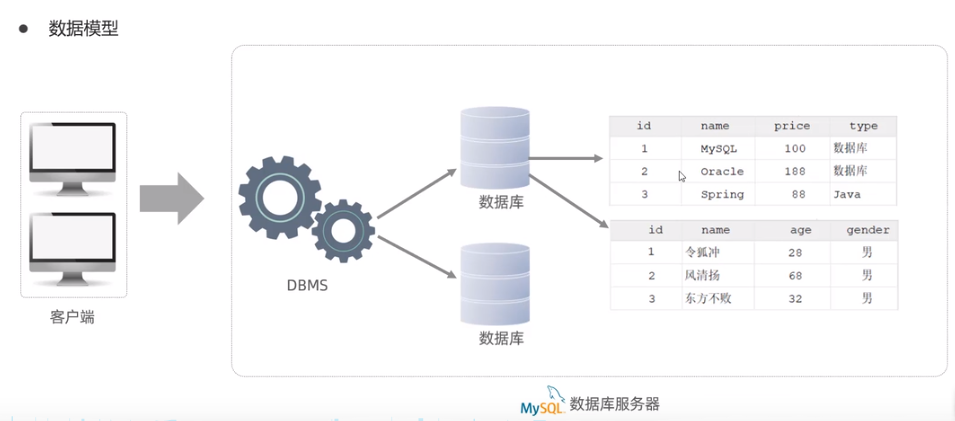

# Mysql

## 基础

### Mysql概述

#### **数据库相关概念**

| 名称      | 说明                              | 简称                               |
| :------ | ------------------------------- | -------------------------------- |
| 数据库     | 存储数据的仓库，数据是有组织的进行存储             | DataBase(DB)                     |
| 数据库管理系统 | 操纵和管理数据库的大型软件                   | DataBase Management System(DBMS) |
| SOL     | 操作关系型数据库的编程语言，定义了一套操作关系型数据库统一标准 | Structured Query Language (SQL)  |

**关系型数据库(RDBMS)**

概念:建立在关系模型基础上，由多张相互连接的二维表组成的数据库。

**特点:**

1. 使用表存储数据，格式统一，便于维护

2. 使用SQL语言操作，标准统一，使用方便




### SQL

**SQL (Structured Query Language)** 是具有数据操纵和数据定义等多种功能的数据库语言，这种语言具有交互性特点，能为用户提供极大的便利，数据库管理系统应充分利用SQL语言提高计算机应用系统的工作质量与效率

#### SQL通用语法

1. SQL语句可以单行或多行书写，以分号结尾。
2. SQL语句可以使用空格/缩进来增强语句的可读性
3. MySOL数据库的SQL语句不区分大小写，关键字建议使用大写。
4. 注释:
   单行注释: --注释内容 或#注释内容(MySQL特有)
   多行注释: /*注释内容 */

#### SQL分类

| 分类   | 全称                         | 说明                          |
| ---- | -------------------------- | --------------------------- |
| DDL  | Data Definition Langugge   | 数据定义语言，用来定义数据库对象(数据库，表，字段)  |
| DML  | Data Manipulation Language | 数据操作语言，用来对数据库表中的数据进行增删改     |
| DQL  | Data Query Language        | 数据查询语言，用来查询数据库中表的记录         |
| DCL  | Data Control Language      | 数据控制语言，用来创建数据库用户、控制数据库的访问权限 |

### DDL(Data Definition Language)  数据定义语言

**2.1 数据库操作**

**2.1.1 查询**

   查询所有数据库

```
SHOW DATABASES;
```

   查询当前数据库

```
 SELECT DATABASE();
```

**2.1.2 创建**

```
 CREATE DATABASE [IF NOT EXISTS]  数据库名 [DEFAULT CHARSET 字符集] [COLLATE  排序规则];
```

**2.1.3 删除**

```
DROP DATABASE [IF EXISTS] 数据库名;
```

**2.1.4 切换数据库**

```
 USE 数据库名;
```

**2.2 表操作-查询**

**2.2.1 查询当前数据库所有表**

```
SHOW TABLES;
```

**2.2.2 查询表结构**

```
  DESC 表名;
```

**2.2.3 查询指定表的创建表语句**

```
SHOW CREATE TABLE 表名;
```

**2.3表操作-创建**

```
CREATE TABLE 表名(
  字段1  字段1类型  [COMMENT 字段1注释]
  字段2  字段2类型  [COMMENT 字段2注释]
  ....
  字段n  字段n类型  [COMMENT 字段n注释]
)[COMMENT 表注释];
```

**2.4、表操作-修改**

**2.4.1 添加字段**

```
ALTER TABLE 表名  ADD  字段名称  类型(长度) [COMMENT 注释][约束];
```

**2.4.2 修改数据类型**

```
ALTER TABLE 表名  MODIFY 字段名称 新数据类型(长度)
```

**2.4.3 修改字段名和字段类型**

```
ALTER TABLE 表名  CHANGE  旧字段名  新字段名 类型(长度)[COMMENT 注释][约束];
```

**2.4.4 修改表名**

```
ALTER TABLE 表名 RENAME TO 新表名;
```

**2.5、表操作-删除**

**2.5.1 删除字段**

```
ALTER 表名  DROP 字段名称;
```

**2.5.2 删除表**

```
DROP TABLE [IF EXISTS] 表名;
```

**2.5.3 删除指定表，并重新创建表**

```
TRUNCATE TABLE 表名;
```

#### DML


#### DQL


#### DCL

### 函数


### 约束


### 多表查询


