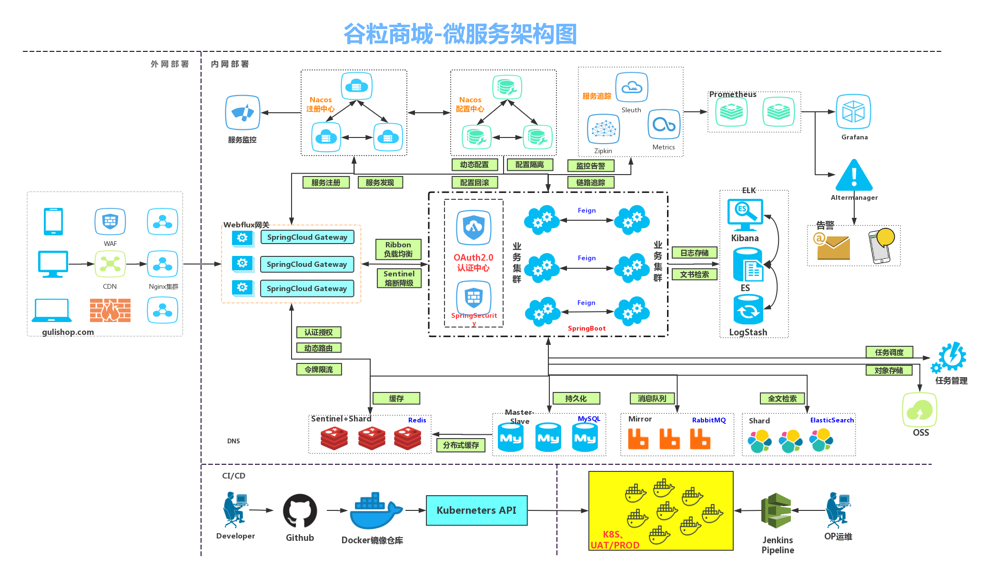
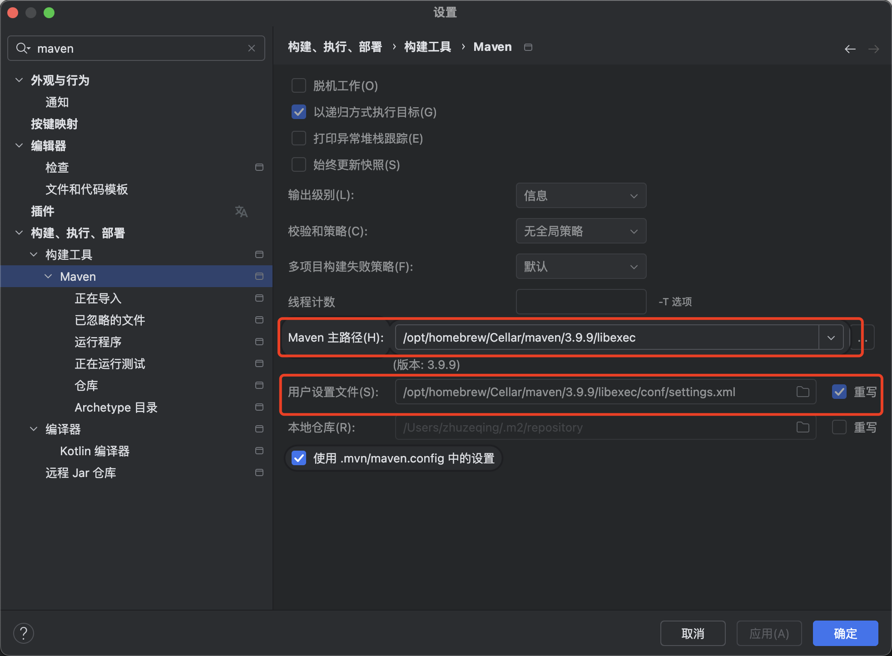
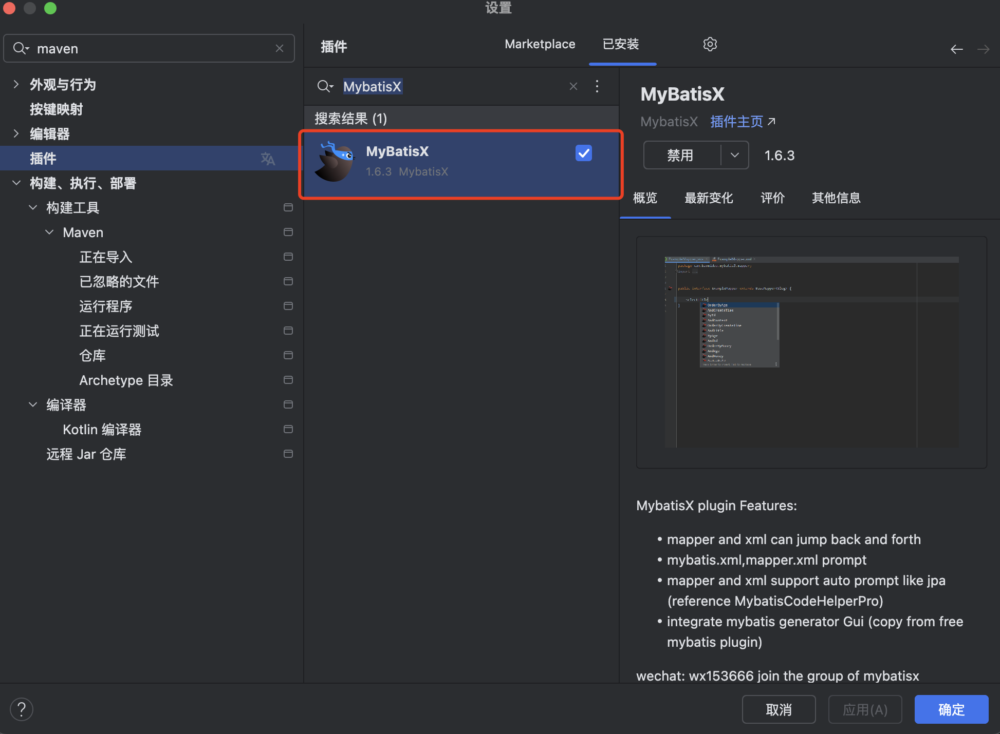
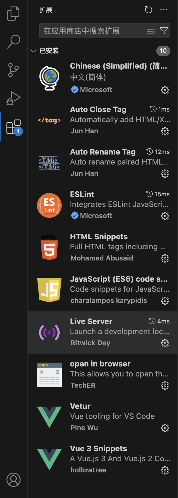

# 谷粒商城

## 一、微服务架构图



## 二、安装虚拟机

虚拟机安装

https://www.macxin.com/archives/9635.html

## 三、CentOS镜像下载

CentOS官网：[https://www.centos.org/](https://link.zhihu.com/?target=https%3A//www.centos.org/)

官网下载地址：[https://mirror.stream.centos.org](https://link.zhihu.com/?target=https%3A//mirror.stream.centos.org/9-stream/BaseOS/x86_64/iso/)

修改IP  

```bash
vi /etc/NetworkManager/system-connections/ens160.nmconnection
```

```
[connection]
id=ens160
uuid=4da69433-2c01-33b6-9fc4-380c9a84f647
type=ethernet
autoconnect-priority=-999
interface-name=ens160
timestamp=1729731029

[ethernet]

[ipv4]
address1=192.168.34.150
dns=192.168.34.2;
ignore-auto-dns=true
ignore-auto-routes=true
method=manual

[ipv6]
addr-gen-mode=eui64
method=auto

[proxy]
```

重启网卡

```
sudo systemctl restart NetworkManager
```

说明：

**`[connection]` 部分**

- **id=ens160**：连接的名称，通常与网络接口的名称一致。
- **uuid=4da69433-2c01-33b6-9fc4-380c9a84f647**：连接的唯一标识符，用于区分不同的网络连接。
- **type=ethernet**：连接类型，这里是以太网（`ethernet`）。
- **autoconnect-priority=-999**：自动连接优先级，负值表示较低的优先级（可能用于避免自动连接此网络）。
- **interface-name=ens160**：指定绑定的网络接口名称（`ens160`）。
- **timestamp=1729731029**：记录上次修改连接配置的时间戳。

`[ethernet]` 部分

此部分为空，表示使用默认的以太网设置。

**`[ipv4]` 部分**

- **address1=192.168.34.150**
- **dns=192.168.34.2;**：指定 DNS 服务器地址为 `192.168.34.2`。
- **ignore-auto-dns=true**：忽略自动获取的 DNS 设置，使用手动配置的 DNS。
- **ignore-auto-routes=true**：忽略自动获取的路由，使用手动设置的路由。
- **method=manual**：设置为手动配置 IP 地址（`manual`）。

**`[ipv6]` 部分**

- **addr-gen-mode=eui64**：IPv6 地址生成模式为 EUI-64（基于硬件地址生成）。
- **method=auto**：IPv6 使用自动配置（如 SLAAC）。

**`[proxy]` 部分**

这个部分与代理设置相关，文件中未设置具体的代理参数，因此保留为空白。可以通过添加相关配置项实现 HTTP 或 HTTPS 代理等功能。例如：

```
[proxy]
http-proxy=http://proxy.example.com:8080
https-proxy=https://proxy.example.com:8443
```

## 四、Docker安装

Docker 安装文档：https://docs.docker.com/install/linux/docker-ce/centos/

### 4.1、卸载系统之前的 docker

```
sudo dnf remove docker \
                  docker-client \
                  docker-client-latest \
                  docker-common \
                  docker-latest \
                  docker-latest-logrotate \
                  docker-logrotate \
                  docker-engine
```

### 4.2、安装 Docker-CE

#### 4.2.1 [设置存储库](https://docs.docker.com/engine/install/centos/#set-up-the-repository)

安装该`dnf-plugins-core`包（提供管理 DNF 存储库的命令）并设置存储库。

```
sudo dnf -y install dnf-plugins-core
sudo dnf config-manager --add-repo https://download.docker.com/linux/centos/docker-ce.repo
```

安装 docker，以及 docker-cli

```
sudo dnf install docker-ce docker-ce-cli containerd.io docker-buildx-plugin docker-compose-plugin
```

#### 4.2.2 启动 Docker 引擎

设置 docker 开机自启并且启动docker

```
sudo systemctl enable --now docker
```

这会将 Docker systemd 服务配置为在您启动系统时自动启动。如果您不想让 Docker 自动启动，请使用

```
sudo systemctl start docker
```

#### 4.2.3 测试 docker 常用命令

注意切换到 root 用户下

https://docs.docker.com/engine/reference/commandline/docker/

#### **4.2.4 配置 docker 镜像加速**

**1、安装／升级Docker客户端**

推荐安装1.10.0以上版本的Docker客户端，参考文档[docker-ce](https://yq.aliyun.com/articles/110806)

**2. 配置镜像加速器**

针对Docker客户端版本大于 1.10.0 的用户

您可以通过修改daemon配置文件/etc/docker/daemon.json来使用加速器

```
sudo mkdir -p /etc/docker
sudo tee /etc/docker/daemon.json <<-'EOF'
{
  "registry-mirrors": ["https://jgwmu601.mirror.aliyuncs.com"]
}
EOF
sudo systemctl daemon-reload
sudo systemctl restart docker
```

## 五、docker安装mysql

### 5.1、下载镜像文件

```
sudo docker pull mysql:8.0
```

### 5.2、创建示例并启动

#### 5.2.**1、创建目录**

```
mkdir -p /mydata/mysql/conf
mkdir -p /mydata/mysql/log
mkdir -p /mydata/mysql/data
```

#### 5.2.**2、my.cnf配置**

vi  /mydata/mysql/conf/my.cnf

```
[client]
default-character-set=utf8

[mysql]
default-character-set=utf8

[mysqld]
init_connect='SET collation_connection = utf8_unicode_ci; SET NAMES utf8'
character-set-server=utf8
collation-server=utf8_unicode_ci
skip-character-set-client-handshake
skip-name-resolve

```

**`[client]` 部分**

```
[client]
default-character-set=utf8
```

- `default-character-set=utf8`：
  - 这个选项设置 MySQL 客户端（例如 `mysql` 命令行工具）默认使用 `UTF-8` 字符集进行连接。
  - 如果你在终端中使用 `mysql` 命令连接数据库，`default-character-set=utf8` 会确保客户端发送和接收的数据使用 UTF-8 编码。

**`[mysql]` 部分**

```
[mysql]
default-character-set=utf8
```

- `default-character-set=utf8`：
  - 这个选项设置 MySQL 命令行客户端（`mysql`）的默认字符集为 `UTF-8`。
  - 这个部分和 `[client]` 部分的设置相似，主要是影响 `mysql` 客户端工具的行为，确保在执行 SQL 查询时使用 UTF-8 编码。

`[mysqld]` 部分

```
[mysqld]
init_connect='SET collation_connection = utf8_unicode_ci; SET NAMES utf8'
character-set-server=utf8
collation-server=utf8_unicode_ci
skip-character-set-client-handshake
skip-name-resolve
```

**`init_connect`**

```
init_connect='SET collation_connection = utf8_unicode_ci; SET NAMES utf8'
```

- `init_connect`：
  - 这个选项用于在每次客户端连接 MySQL 时，自动执行指定的 SQL 命令。
  - 这里设置的是两个命令：
    - `SET collation_connection = utf8_unicode_ci`：设置连接的排序规则为 `utf8_unicode_ci`，即使用 Unicode 编码进行排序。
    - `SET NAMES utf8`：设置连接字符集为 UTF-8。这样确保客户端和服务器之间的数据交换都使用 UTF-8 编码。
  - 这两个设置确保每次连接时，MySQL 会使用 UTF-8 编码和排序规则，而不会依赖客户端的字符集设置。

**`character-set-server`**

```
character-set-server=utf8
```

- `character-set-server=utf8`：
  - 这个选项设置服务器的默认字符集为 `UTF-8`。
  - 服务器的字符集决定了数据库表、列和字符类型等在没有明确指定时的默认字符集。设置为 `utf8`，意味着数据库中默认使用 UTF-8 编码。

**`collation-server`**

```
collation-server=utf8_unicode_ci
```

- `collation-server=utf8_unicode_ci`：
  - 这个选项设置服务器的默认排序规则为 `utf8_unicode_ci`。
  - `utf8_unicode_ci` 是一种常用的 UTF-8 排序规则，遵循 Unicode 标准的字符排序，适用于多语言环境，支持包括英语、中文、阿拉伯语等多种字符集的排序。

**`skip-character-set-client-handshake`**

```
skip-character-set-client-handshake
```

- `skip-character-set-client-handshake`：
  - 这个选项告诉 MySQL 忽略客户端传入的字符集设置（即客户端请求的字符集），并强制使用服务器端的字符集设置。
  - 在没有此设置时，如果客户端指定了字符集（通过连接时的 `--default-character-set` 参数），MySQL 会根据客户端指定的字符集进行连接。但启用此选项后，无论客户端如何设置，都会强制使用服务器端的字符集（在本例中是 UTF-8）。
  - 这可以确保所有连接都使用一致的字符集配置，避免由于客户端字符集不一致导致的问题。

**`skip-name-resolve`**

```
skip-name-resolve
```

- `skip-name-resolve`：
  - 这个选项禁用 DNS 名称解析，仅通过 IP 地址进行连接。
  - 当启用此选项时，MySQL 将不再解析主机名，而是仅通过 IP 地址进行客户端和服务器之间的连接。这对于提高性能有帮助，特别是在 DNS 解析慢或者存在 DNS 配置问题的环境中。
  - 启用该选项后，如果需要通过主机名来进行权限设置（如 `GRANT` 语句中的主机名），必须使用 IP 地址代替主机名。

#### 5.2.**3、创建实例并启动**

```
docker run --name mysql \
  -e MYSQL_ROOT_PASSWORD=root \
  -p 3306:3306 \
  -v /mydata/mysql/data:/var/lib/mysql \
  -v /mydata/mysql/config:/etc/mysql/conf.d \
  -v /mydata/mysql/log:/var/log/mysql \
  -d mysql:8.0
```

参数说明：

- `-p 3306:3306`：将宿主机的 3306 端口映射到容器的 3306 端口，方便从外部访问 MySQL。
- `-v /mydata/mysql/data:/var/lib/mysql`：将宿主机的 /mydata/mysql/data` 目录映射到容器的 MySQL 数据目录 `/var/lib/mysql`，确保数据持久化。
- `-v /mydata/mysql/config:/etc/mysql/conf.d`：将宿主机的 `/mydata/mysql/config` 目录映射到容器的配置文件目录 `/etc/mysql/conf.d`，这样你可以自定义 MySQL 配置文件。
- `-v /mydata/mysql/log:/var/log/mysql`：将宿主机的 `/mydata/mysql/log` 目录映射到容器的日志目录 `/var/log/mysql`，方便查看和管理日志。

### 5.3、通过容器的mysql 命令行工具连接

```
docker exec -it mysql mysql -uroot -proot
```

### 5.4、**设置** **root** 远程访问

**登录 MySQL**

```
docker exec -it mysql-container mysql -u root -proot
```

**修改 `root` 用户的访问权限**

执行以下 SQL 命令，允许 `root` 用户从任何主机（`%`）进行访问

```
GRANT ALL PRIVILEGES ON *.* TO 'root'@'%' IDENTIFIED BY 'root' WITH GRANT OPTION;
FLUSH PRIVILEGES;
```

- `'root'@'%'`：表示允许 `root` 用户从任何主机（`%`）访问。
- `IDENTIFIED BY 'root'`：设置 `root` 用户的密码，替换为实际密码。
- `WITH GRANT OPTION`：允许 `root` 用户授予其他用户权限。

`FLUSH PRIVILEGES;` 命令刷新权限，使更改生效。

### 5.5、进入容器文件系统

```
docker exec -it mysql /bin/bash
```

## 六、**docker** **安装** redis

### 6.1、下载镜像

```
docker pull redis
```

### 6.2、创建目录

```
mkdir -p /mydata/redis/conf
mkdir -p /mydata/redis/data
```

### 6.3、编写配置文件

```
vim /mydata/redis/conf/redis.conf
```

```
appendonly yes
bind 0.0.0.0
protected-mode no
port 6379
```

**`appendonly yes`**：启用 AOF 持久化，确保数据安全性。

**`bind 0.0.0.0`**：允许来自任何 IP 地址的连接。

**`protected-mode no`**：禁用 Redis 的保护模式，允许外部连接，但也增加了安全风险。

**`port 6379`**：Redis 默认在端口 `6379` 上监听连接。

### 6.4、创建实例并启动

```
docker run -p 6379:6379 --name redis -v /mydata/redis/data:/data \
-v /mydata/redis/conf/redis.conf:/etc/redis/redis.conf \
-d redis redis-server /etc/redis/redis.conf
```

redis 自描述文件：

https://raw.githubusercontent.com/antirez/redis/4.0/redis.conf

#### **6.4.1 使用redis 镜像执行 redis-cli 命令连接**

```
docker exec -it redis redis-cli
```

## 七、maven配置

### 7.1、配置阿里云镜像

```
<mirrors>
<mirror>
<id>nexus-aliyun</id>
<mirrorOf>central</mirrorOf>
<name>Nexus aliyun</name>
<url>http://maven.aliyun.com/nexus/content/groups/public</url>
</mirror>
</mirrors>
```

### 7.2、配置 jdk1.8 编译项目

```
<profiles>
	<profile>
		<id>jdk-1.8</id>
		<activation>
				<activeByDefault>true</activeByDefault>
				<jdk>1.8</jdk>
		</activation>
	<properties>
		<maven.compiler.source>1.8</maven.compiler.source>
		<maven.compiler.target>1.8</maven.compiler.target>
		<maven.compiler.compilerVersion>1.8</maven.compiler.compilerVersion>
	</properties>
	</profile>
</profiles>
```

## 八、开发工具设置

### 8.1、IntelliJ IDEA

安装 lombok、mybatisx 等插件

maven配置



**mybatisx插件安装**



### 8.2、Vscode 安装开发必备插件

Vscode 安装开发必备插件

Vetur —— 语法高亮、智能感知、Emmet 等

EsLint —— 语法纠错

Auto Close Tag —— 自动闭合 HTML/XML 标签

Auto Rename Tag —— 自动完成另一侧标签的同步修改

JavaScript(ES6) code snippets — — ES6 语 法 智 能 提 示 以 及 快 速 输 入 ， 除 js 外 还 支

持.ts，.jsx，.tsx，.html，.vue，省去了配置其支持各种包含 js 代码文件的时间

HTML CSS Support —— 让 html 标签上写 class 智能提示当前项目所支持的样式

HTML Snippets —— html 快速自动补全

Open in browser —— 浏览器快速打开

Live Server —— 以内嵌服务器方式打开

Chinese (Simplified) Language Pack for Visual Studio Code —— 中文语言包



## 九、**安装配置** git

### 9.1 下载 git

### https://git-scm.com

### 9.2、配置 git

```
# 配置用户名
git config --global user.name "username" //（名字）
# 配置邮箱
git config --global user.email "username@email.com" //(注册账号时用的邮箱)
```

查询所有 Git 配置信息

```
git config --list：查看所有配置项。
git config --global --list：查看全局配置。
git config --system --list：查看系统配置。
git config --local --list：查看仓库级配置。
git config <key>：查询特定的配置项。
```

