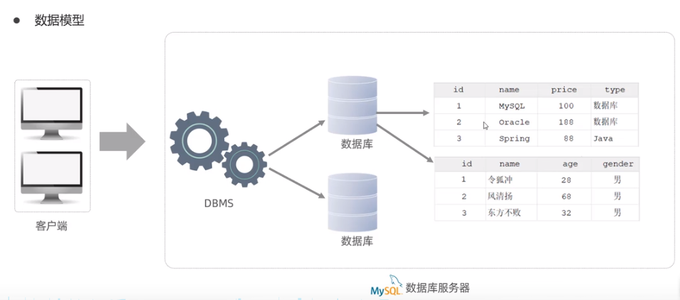

# Mysql

## 基础

### Mysql概述

#### **数据库相关概念**

| 名称      | 说明                              | 简称                               |
| :------ | ------------------------------- | -------------------------------- |
| 数据库     | 存储数据的仓库，数据是有组织的进行存储             | DataBase(DB)                     |
| 数据库管理系统 | 操纵和管理数据库的大型软件                   | DataBase Management System(DBMS) |
| SOL     | 操作关系型数据库的编程语言，定义了一套操作关系型数据库统一标准 | Structured Query Language (SQL)  |

**关系型数据库(RDBMS)**

概念:建立在关系模型基础上，由多张相互连接的二维表组成的数据库。

**特点:**

1. 使用表存储数据，格式统一，便于维护

2. 使用SQL语言操作，标准统一，使用方便




### SQL

**SQL (Structured Query Language)** 是具有数据操纵和数据定义等多种功能的数据库语言，这种语言具有交互性特点，能为用户提供极大的便利，数据库管理系统应充分利用SQL语言提高计算机应用系统的工作质量与效率

#### SQL通用语法

1. SQL语句可以单行或多行书写，以分号结尾。
2. SQL语句可以使用空格/缩进来增强语句的可读性
3. MySOL数据库的SQL语句不区分大小写，关键字建议使用大写。
4. 注释:
   单行注释: --注释内容 或#注释内容(MySQL特有)
   多行注释: /*注释内容 */

#### SQL分类

| 分类   | 全称                         | 说明                          |
| ---- | -------------------------- | --------------------------- |
| DDL  | Data Definition Langugge   | 数据定义语言，用来定义数据库对象(数据库，表，字段)  |
| DML  | Data Manipulation Language | 数据操作语言，用来对数据库表中的数据进行增删改     |
| DQL  | Data Query Language        | 数据查询语言，用来查询数据库中表的记录         |
| DCL  | Data Control Language      | 数据控制语言，用来创建数据库用户、控制数据库的访问权限 |

#### DDL(Data Definition Language)  数据定义语言

**数据库操作**

**查询**

   查询所有数据库

```
SHOW DATABASES;
```

   查询当前数据库

```
 SELECT DATABASE();
```

**创建**

```
 CREATE DATABASE [IF NOT EXISTS]  数据库名 [DEFAULT CHARSET 字符集] [COLLATE  排序规则];
```

**删除**

```
DROP DATABASE [IF EXISTS] 数据库名;
```

**切换数据库**

```
 USE 数据库名;
```

**表操作-查询**

**查询当前数据库所有表**

```
SHOW TABLES;
```

**查询表结构**

```
  DESC 表名;
```

**查询指定表的创建表语句**

```
SHOW CREATE TABLE 表名;
```

**表操作-创建**

```
CREATE TABLE 表名(
  字段1  字段1类型  [COMMENT 字段1注释]
  字段2  字段2类型  [COMMENT 字段2注释]
  ....
  字段n  字段n类型  [COMMENT 字段n注释]
)[COMMENT 表注释];
```

**表操作-修改**

**添加字段**

```
ALTER TABLE 表名  ADD  字段名称  类型(长度) [COMMENT 注释][约束];
```

**修改数据类型**

```
ALTER TABLE 表名  MODIFY 字段名称 新数据类型(长度)
```

**修改字段名和字段类型**

```
ALTER TABLE 表名  CHANGE  旧字段名  新字段名 类型(长度)[COMMENT 注释][约束];
```

**修改表名**

```
ALTER TABLE 表名 RENAME TO 新表名;
```

**表操作-删除**

**删除字段**

```
ALTER 表名  DROP 字段名称;
```

**删除表**

```
DROP TABLE [IF EXISTS] 表名;
```

**删除指定表，并重新创建表**

```
TRUNCATE TABLE 表名;
```

#### DML(Data Manipulation Language) 数据操作语言

**添加数据**

**给指定字段添加数据**

```
INSERT INTO  表名（字段1,字段2,....）VALUES(值1，值2,....);
```

**给全部字段添加数据**

```
INSERT INTO 表名 VALUES(值1，值2,...);
```

**批量加数据**

```
INSERT INTO  表名 VALUES(值1，值2,....),(值1，值2,....);
```

**修改数据**

```
UPDATE 表名  SET 字段名1=值1, 字段名2=值2,... [WHERE 条件];
```

**删除数据**

```
DELETE FROM 表名 [WHERE 条件];
```

#### DQL(Data Query Language)数据查询语言

**查询语法**

```
SELECT 
   字段列表
FROM 
   表名列表
WHERE
   条件列表
GREOUP BY
   分组字段列表
HAVING
   分组后条件列表
ORDER BY
   排序字段列表
LIMIT
   分页参数
```

 **查询多个字段**

```
 SELECT 字段1，字段2,.... FROM 表名;
 SELCET * FROM 表名;
```

 **设置别名**

```
SELECT 字段1[AS 别名1]，字段2[AS 别名2],.... FROM 表名;
```

 **去除重复记录**

```
 SELECT DISTINCT 字段列表  FROM 表名;
```

 **条件查询**

```
SELECT 字段列表 FROM 表名  WHERE 条件列表;
```

| **比较运算符**      | **功能**                                |
| ------------------- | --------------------------------------- |
| >                   | 大于                                    |
| >=                  | 大于等于                                |
| <                   | 小于                                    |
| <=                  | 小于等于                                |
| =                   | 等于                                    |
| <>或!=              | 不等于                                  |
| BETWEEN .... AND... | 在某个范围之内(含最小值，含最大值)      |
| INT(...)            | 在in之后的列表中的值，多选一            |
| LIKE 占位符         | 模糊匹配( 匹配单个字符,%匹配任意个字符) |
| IS NULL             | 是NULL                                  |
| AND 或 &&           | 并且(多个条件同时成立)                  |
| OR 或 \|\|          | 或者(多个条件任意一个成立)              |
| NOT 或!             | 非，不是                                |

**聚合函数**

将一列数据作为一个整体，进行纵向计算

```
SELECT 聚合参数(字段列表) FROM 表名;
```

| **函数** | **功能** |
| -------- | -------- |
| count    | 统计数量 |
| max      | 最大值   |
| min      | 最小值   |
| avg      | 平均值   |
| sum      | 求和     |

**分组查询**

```
SELECT 字段列表 FROM 表名[WHERE 条件]GROUP BY 分组字段名 [HAVING 分组后过滤条件];
```

where与having区别

执行时机不同:where是分组之前进行过滤，不满足where条件，不参与分组;而having是分组之后对结果进行过滤。

判断条件不同:where不能对聚合函数进行判断，而having可以。

注意:

执行顺序: where >聚合函数>having  

分组之后，查询的字段一般为聚合函数和分组字段，查询其他字段无任何意义

**排序查询**

```
SELECT 字段列表 FROM 表名 ORDER BY 字段1 排序方式1,字段2 排序方式2;
```

排序方式

ASC:升序(默认值)

DESC:降序

注意:

如果是多字段排序，当第一个字段值相同时，才会根据第二个字段进行排序

**分页查询**

```
SELECT 字段列表 FROM 表名 LIMIT 起始索引, 查询记录数;
```

起始索引从0开始，起始索引=K查询页码-1)*每页显示记录数
分页查询是数据库的方言，不同的数据库有不同的实现，MySQL中是LIMIT

如果查询的是第一页数据，起始索引可以省略，直接简写为limit 10

**查询DQL执行顺序**


#### **DCL**(Data Control Language) 数据控制语言

| **权限**            | **说明**           |
| ------------------- | ------------------ |
| ALL, ALL PRIVILEGES | 所有权限           |
| SELECT              | 查询权限           |
| INSERT              | 插入权限           |
| UPDATE              | 修改权限           |
| DELETE              | 删除权限           |
| ALTER               | 修改表             |
| DROP                | 删除数据库/表/视图 |
| CREATE              | 创建数据库/表      |

**DCL-管理用户**

**查询用户**

```
USE mysql;
SELECT * FROM user;
```

**创建用户**

```
CREATE USER '用户名'@'主机名' IDENTIFIED  BY '密码';
```

**修改用户密码**

```
ALTER USER '用户名'@'主机名' IDENTIFIED  WITH mysql_native_password BY '新密码';
```

**删除用户**

```
DROP USER '用户名'@'主机名'
```

**DCL-权限控制**

**查询权限**

```
SHOW GRANTS FOR'用户名'@'主机名':
```

**授予权限**

```
GRANT 权限列表 ON 数据库名.表名 TO '用户名'@'主机名';
```

**撤销权限**

```
REVOKE 权限列表 ON 数据库名.表名 FROM'用户名'@'主机名';
```

多个权限之间，使用逗号分隔

授权时，数据库名和表名可以使用*进行通配，代表所有

### 数据类型

**数字类型**

****

**字符类型**

**

**日期类型**


### 函数

MySQL函数，是一种控制流程函数，属于数据库用语言，包含CASE WHEN THEN 函数、IF 函数、 IFNULL 函数等。

#### 字符串函数

| **函数**                 | **功能**                                                  |
| ------------------------ | --------------------------------------------------------- |
| CONCAT(S1,S2,....Sn)     | 字符串拼接，将S1，S2，….Sn拼接成一个字符串                |
| LOWER(str)               | 将字符串str全部转为小写                                   |
| UPPER(str)               | 将字符串str全部转为大写                                   |
| LPAD(str,n,pad)          | 左填充，用字符串pad对str的左边进行填充，达到n个字符串长度 |
| RPAD(str,n,pad)          | 右填充，用字符串pad对str的右边进行填充，达到n个字符串长度 |
| TRIM(str)                | 去掉字符串头部和尾部的空格                                |
| SUBSTRING(str,start,len) | 返回从字符串str从start位置起的len个长度的字符串           |

**CONCAT**

```
SELECT CONCAT('Hello' 'World');
```

结果： HelloWorld

**LOWER**

```
SELECT LOWER('HELLO')
```

结果： hello

**UPPER**

```
SELECT UPPER('hello')
```

结果： HELLO

**LPAD**

```
SELECT LPAD('1',5,'0')
```

结果： 00001

**RPAD**

```
SELECT RPAD('1',5,'0')
```

结果： 10000

**TRIM**

```
SELECT TRIM(' Hello  World ')
```

结果： Hello World

**SUBSTRING**

```
SELECT SUBSTRING('helloworld',1,5)
```

结果：hello

#### 数值安函数

| **函数**   | **功能**                           |
| ---------- | ---------------------------------- |
| CEIL(x)    | 向上取整                           |
| FLOOR(x)   | 向下取整                           |
| MOD(x,y)   | 返回x/y的模                        |
| RAND()     | 返回0~1内的随机数                  |
| ROUND(x,y) | 求参数x的四舍五入的值，保留y位小数 |

**CEIL**

```
SELECT CEIL(1.9)
```

结果： 2

**FLOOR**

```
SELECT FLOOR(1.9)
```

结果： 1

**MOD**

```
SELECT MOD(5,4)
```

结果： 1

**RAND**

```
SELECT RAND()
```

结果： 0.1341812388358463

**ROUND**

```
SELECT ROUND(3.446,2)
```

结果： 3.45

#### 日期函数

| **函数**                          | **功能**                                          |
| --------------------------------- | ------------------------------------------------- |
| CURDATE()                         | 返回当前日期                                      |
| CURTIME()                         | 返回当前时间                                      |
| NOW()                             | 返回当前日期和时间                                |
| YEAR(date)                        | 获取指定date的年份                                |
| MONTH(date)                       | 获取指定date的月份                                |
| DAY(date)                         | 获取指定date的日期                                |
| DATE ADD(date,INTERVAL expr type) | 返回一个日期/时间值加上一个时间间隔expr后的时间值 |
| DATEDIFF(date1,date2)             | 返回起始时间date1 和 结束时间date2之间的天数      |

**CURDATE**

```
SELECT CURDATE()
```

结果：2024-05-15

**CURTIME**

```
SELECT CURTIME()
```

结果：22:27:18

**NOW**

```
SELECT NOW()
```

结果：2024-05-15 22:27:29

**YEAR**

```
SELECT YEAR(CURDATE())
```

结果：2024

**MONTH**

```
SELECT MONTH(CURDATE())
```

结果：5

**DAY**

```
SELECT DAY(CURDATE())
```

结果：15

**DATE_ADD**

```
SELECT DATE_ADD(CURDATE(),INTERVAL 10 YEAR)
```

结果：2034-05-15

**DATEDIFF**

```
SELECT DATEDIFF(CURDATE(),CURDATE())
```

结果：0

#### 流程函数

| **函数**                                                  | **功能**                                               |
| --------------------------------------------------------- | ------------------------------------------------------ |
| IF(value ,t,f)                                            | 如果value为true，则返回t，否则返回f                    |
| IFNULL(value1 ,value2)                                    | 如果value1不为空，返回value1，否则返回value2           |
| CASE WHEN [val1 ] THEN [res1]... ELSE [default] END       | 如果val1为true，返回res1，…否则返回default默认值       |
| CASE「expr]WHEN [val1 ] THEN [res1] ... ELSE[ default]END | 如果expr的值等于val1，返回res1，…否则返回default默认值 |

 **IF**

```
SELECT IF(TRUE,'ok','no')
```

结果：ok

**IFNULL**

```
SELECT IFNULL(NULL,'ok')
```

结果：ok

**CASE WHEN [val1 ] THEN [res1]... ELSE [DEFAULT] END**

```
SELECT CASE WHEN 1=1 THEN 'true' ELSE 'false' END
```

结果：true

**CASE「expr]WHEN [val1 ] THEN [res1] ... ELSE[ DEFAULT]END**


### 约束

约束是作用于表中字段上的规则，用于限制存储在表中的数据。

目的：保证数据库中数据的正确、有效性和完整性。

| **约束**                 | **描述**                                                 | **关键字**  |
| ------------------------ | -------------------------------------------------------- | ----------- |
| 非空约束                 | 限制该字段的数据不能为null                               | NOT NULL    |
| 唯一约束                 | 保证该字段的所有数据都是唯一、不重复的                   | UNIQUE      |
| 主键约束                 | 主键是一行数据的唯一标识，要求非空且唯一                 | PRIMARY KEY |
| 默认约束                 | 保存数据时，如果未指定该字段的值，则采用默认值           | DEFAULT     |
| 检查约束(8.0.16版本之后) | 保证字段值满足某一个条件                                 | CHECK       |
| 外键约束                 | 用来让两张表的数据之间建立连接，保证数据的一致性和完整性 | FOREIGN KEY |

**示例**

****

```sql
create table user(
id int primary key auto_increment comment '主键',
name varchar(10) not null unique comment '姓名',
age int check(age>0 && age<= 120)comment '年龄',
status char(1) default '1' comment '状态',
gender char(1) comment '性别'
)comment '用户表'
```

**外键约束语法**

**创建表操作**

```
CREATE TABLE 表名(
字段名 数据类型,
....
[CONSTRAINT][外键名称]FOREIGN KEY(外键字段名)REFERENCES 主表(主表列名)
);
```

**创建表之后创建约束**

```
ALTER TABLE 表名 ADD CONSTRAINT 外键名称 FOREIGN KEY(外键字段名)REFERENCES 主表(主表列名):
```

**删除外键**

```
ALTER TABLE 表备 DROP FOREIGN KEY 外键名称;
```

 **删除/更新行为**

| 行为        | 说明                                                         |
| ----------- | ------------------------------------------------------------ |
| NO ACTION   | 当在父表中删除/更新对应记录时，首先检查该记录是否有对应外键，如果有则不允许删除/更新。(与RESTRICT 一致) |
| RESTRICT    | 当在父表中删除/更新对应记录时，首先检查该记录是否有对应外键，如果有则不允许删除/更新。(与NO ACTION一致) |
| CASCADE     | 当在父表中删除/更新对应记录时，首先检查该记录是否有对应外键，如果有，则也删除/更新外键在子表中的记录。 |
| SET NULL    | 当在父表中删除对应记录时，首先检查该记录是否有对应外键，如果有则设置子表中该外键值为nul(这就要求该外键允许取null)。 |
| SET DEFAULT | 父表有变更时，子表将外键列设置成一个默认的值(Innodb不支持)   |

语法

```sql
ALTER TABLE 表名 ADD CONSTRAINT 外键名称 FOREIGNKEY(外键字段)REFERENCES 主表名(主表字段名)ON UPDATE CASCADE ON DELETE CASCADE;
```

### 多表查询

#### 一对一

示例：用户基本信息表中的用户对应用户教育表中的一条数据。


#### 一对多

多个员工在一个部门


#### 多对多

学生可以选择多门课程，课程也可以被多个学生选择。

多对多一般需要借助第三张表做关联关系。


#### 查询语法


**多表关系**

**一对多**:在多的一方设置外键，关联一的一方的主键

**多对多**:建立中间表，中间表包含两个外键，关联两张表的主键

**一对一**:用于表结构拆分，在其中任何一方设置外键(UNIOUE)，关联另一方的主键


**多表查询**

**内连接**

**隐式**SELECT... FROM 表A,表B WHERE 条件.

**显式**SELECT.. FROM 表A INNER JOIN 表B ON 条件.

**外连接**

**左外** SELECT.. FROM 表A LEFT JOIN 表B ON 条件

**右外**SELECT.. FROM 表A RIGHT JOIN 表B ON 条件

**自连接**:SELECT.. FROM 表A 别名1,表A 别名2 WHERE 条件

**子查询**:标量子查询、列子查询、行子查询、表子查询

### 事务

**事务** 是一组操作的集合，它是一个不可分割的工作单位，事务会把所有的操作作为一个整体一起向系统提交或撤销操作请求，即这些操作要么同时成功，要么同时失败。

示例：张三给李四转账，转账操作要么成功要么失败，不能张三账号扣除金额了，而李四账号确没有收到张三转账的金额。

第一步，开启事务

第二步，查询账号账户是否有充足的余额。

第三步，账号账户扣除需要转账的金额。

第四步，李四账号加上张三转账的金额。

第五步，提交事务

说明：要是在事务中有异常，需要回滚事务。


#### 事务操作


说明：默认MySQL的事务是自动提交的，也就是说，当执行一条DML语句，MySQL会立即隐式的提交事务。

#### 四大特性

**原子性**(Atomicity):事务是不可分割的最小操作单元，要么全部成功，要么全部失败。

**一致性**(Consistency):事务完成时，必须使所有的数据都保持一致状态。

**隔离性**(lsolation):数据库系统提供的隔离机制，保证事务在不受外部并发操作影响的独立环境下运行。

**持久性**(Durability):事务一旦提交或回滚，它对数据库中的数据的改变就是永久的。

#### 隔离级别


查看全局隔离级别

```
SELECT @@global.tx_isolation;
```

查看当前会话的隔离级别

```
SELECT @@session.tx_isolation;
```


设置当前会话的隔离级别：

```
SET SESSION TRANSACTION ISOLATION LEVEL READ COMMITTED;
```

设置全局隔离级别：

```
SET GLOBAL TRANSACTION ISOLATION LEVEL READ COMMITTED;
```


设置事务隔离语法

```
SET [SESSION GLOBAL] TRANSACTION ISOLATION LEVEL { READ UNCOMMITTED | READ COMIMITTED | REPEATABLE READ | SERIALIZABLE }
```


```
SELECT @@autocommit;  -- 1事务自动提交  0事务手动提交
SET @@autocommit= 1; -- 设置事务隔离级别
```

**MySQL** 默认事务隔离级别：REPEATABLE READ

**Oracle** 默认事务隔离级别：READ COMMITTED

**SQL Server** 默认事务隔离级别：READ COMMITTED

#### 并发问题


说明：需要验证事务并发问题可以开启两个操作数据库的客户端开启各自事务测试。

## 进阶

### 存储引擎

存储引擎是数据库管理系统 (DBMS) 中的一种组件，负责管理数据库的物理存储、数据的读写操作以及相关的存储管理。不同的存储引擎在数据处理、性能优化和功能支持上有所不同，因此可以根据具体应用需求选择合适的存储引擎

#### **存储引擎作用**

- **数据存储**：定义如何将数据物理存储在磁盘上，包括数据文件的格式和存储位置。
- **数据读写**：处理对数据库的读写操作，包括插入、更新、删除和查询等。
- **事务处理**：支持或不支持事务处理（事务是一组数据库操作的集合，要么全部执行，要么全部不执行），例如 InnoDB 支持事务而 MyISAM 不支持。
- **锁机制**：管理并发访问时的数据锁定机制，以防止数据不一致或竞争条件。行级锁定和表级锁定是两种常见的锁机制。
- **索引管理**：支持创建和管理索引以加速查询操作，不同存储引擎支持不同类型的索引。
- **数据完整性**：保证数据的准确性和一致性，包括支持外键约束等。
- **崩溃恢复**：提供数据恢复机制，以在系统崩溃后恢复数据。

#### 存储引擎

1. **InnoDB**：默认存储引擎，支持事务、行级锁定和外键约束，适合高并发和需要数据完整性的应用。在 MySQL 5.5之后，InnoDB是默认的 MySQL 存储引擎。
2. **MyISAM**：不支持事务和外键，表级锁定，适合读密集型操作。
3. **MEMORY**：数据存储在内存中，速度快，但不适合持久存储，适用于临时数据。
4. **CSV**：数据存储在 CSV 文件中，便于数据交换，但不支持索引和复杂查询。
5. **ARCHIVE**：用于存储大量的历史数据，压缩存储，适合需要较小存储空间的日志数据。
6. **NDB (Cluster)**：用于 MySQL Cluster，支持高可用性和高可扩展性。
7. **FEDERATED**：允许访问远程 MySQL 服务器上的表，适合分布式数据库系统。

#### **体系结构**


最上层是一些客户端和链接服务，主要完成一些类似于连接处理、授权认证、及相关的安全方案。服务器也会为安全接入的每个客户端验证它所具有的操作权限。

**服务层**

第二层架构主要完成大多数的核心服务功能，如SQL接口，并完成缓存的查询，SQL的分析和优化，部分内置函数的执行。所有跨存储引擎的功能也在这一层实现，如过程、函数等。

**引擎层**

存储引擎真正的负责了MySOL中数据的存储和提取，服务器通过API和存储引擎进行通信。不同的存储引擎具有不同的功能，这样我们可以根据自己的需要，来选取合适的存储引擎。

**存储层**

主要是将数据存储在文件系统之上，并完成与存储引擎的交互。

在创建表时，指定存储引擎

```sql
CREATE TABLE 表名(
字段1字段1类型「COMMENT 字段1注释]
字段n 字段n类型[COMMENT 字段n注释])ENGINE=INNODB[COMMENT 表注释];
```

查看当前数据库支持的存储引擎

```sql
SHOW ENGINES ;
```

#### 存储引擎比较

| **特点**     | **InnoDB**        | **MyISAM** | **Memory** |
| ------------ | ----------------- | ---------- | ---------- |
| 存储限制     | 64TB              | 有         | 有         |
| 事务安全     | **支持**          | -          | -          |
| 锁机制       | **行锁**          | 表锁       | 表锁       |
| B+tree索引   | 支持              | 支持       | 支持       |
| Hash 索引    | -                 | -          | 支持       |
| 全文索引     | 支持（5.6版本后） | 支持       | -          |
| 空间使用     | 高                | 低         | N/A        |
| 内存使用     | 高                | 低         | 高         |
| 批量插入速度 | 低                | 高         | 高         |
| 支持外键     | **支持**          | -          | -          |

#### InnoDB 表空间文件说明

InnoDB 支持两种表空间管理模式：共享表空间 (Shared Tablespace) 和 独立表空间 (File-Per-Table Tablespace)。默认情况下，从 MySQL 5.6 版本开始，InnoDB 使用的是独立表空间模式。


**共享表空间 (Shared Tablespace)**

- 在共享表空间模式下，所有 InnoDB 表的数据和索引都存储在一个或多个共享表空间文件中。默认的共享表空间文件名为 ibdata1。这个文件通常位于 MySQL 数据目录下。

  **特点**：

- 所有表的数据和索引都存储在同一个或多个共享文件中。

- 管理简单，不需要为每个表单独管理文件。

- 随着数据量的增加，文件会变得很大，难以单独管理某个表的数据。

- 删除表后，空间不能立即回收。

**独立表空间 (File-Per-Table Tablespace)**

- 在独立表空间模式下，每个 InnoDB 表的数据和索引存储在一个独立的 .ibd 文件中。这个文件存储在对应数据库目录下。

  **特点**：

- 每个表的数据和索引存储在独立的 .ibd 文件中。

- 便于管理单个表的数据和空间，可以单独转移或备份表的数据文件。

- 删除表后，对应的 .ibd 文件也会被删除，从而回收磁盘空间。

- 文件数量增多，文件系统管理较为复杂。

**配置独立表空间**

独立表空间是 MySQL 5.6 及更高版本的默认设置。可以通过以下方式检查和设置独立表空间的使用情况：


**查看当前设置**：

```sql
SHOW VARIABLES LIKE 'innodb_file_per_table';
```

**启用独立表空间**：

```sql
SET GLOBAL innodb_file_per_table = 1;
```

**在 MySQL 配置文件 `my.cnf` 中设置**：

```sql
[mysqld]
innodb_file_per_table=1
```

**禁用独立表空间**（切换回共享表空间模式）：

```sql
SET GLOBAL innodb_file_per_table = 0;
```

#### InnoDB 逻辑存储结构


**共享表空间 (Shared Tablespace)：**

默认情况下，所有 InnoDB 表的数据和索引都存储在一个或多个共享的表空间文件中。这些文件通常命名为 ibdata1、ibdata2 等，位于 MySQL 的数据目录中。

共享表空间包含了数据字典、数据和索引等的基本结构，是 InnoDB 存储引擎的核心。


**独立表空间 (File-Per-Table Tablespace)：**

在启用独立表空间模式时，每个 InnoDB 表都会有一个独立的 .ibd 文件，该文件包含该表的数据和索引。

独立表空间模式更灵活，允许单独管理每个表的数据文件，进行单表备份和恢复，以及更精确地控制存储空间的使用。


**段 (Segments)**

InnoDB 将数据和索引组织成段 (Segments)。每个段由一个或多个连续的数据页组成。主要的段类型包括数据段、索引段和回滚段等。每个表都有自己的数据段和至少一个索引段。

数据段 (Data Segment)：存储表的数据。

索引段 (Index Segment)：存储表的索引。

回滚段 (Rollback Segment)：用于支持事务的回滚操作。


**区 (Areas)**

在 InnoDB 存储引擎中，数据和索引管理是基于不同的区域 (Areas) 进行的。每个区域负责管理特定类型的数据页或数据段。主要的区域包括：

缓冲池 (Buffer Pool)：用于缓存常用的数据和索引页，提高查询性能。

日志缓冲 (Log Buffer)：用于存储事务提交前的修改操作，以提高事务处理速度。

重做日志文件组 (Redo Log Files Group)：记录每个事务的操作，用于在数据库崩溃时进行恢复。


**页 (Pages)**

InnoDB 将数据和索引组织成固定大小的数据页，默认大小为 16KB（可以通过配置进行修改）。每个数据页是 InnoDB 存储引擎的基本存储单元。InnoDB 的数据和索引都存储在这些页中，而不是像 MyISAM 引擎那样存储在固定大小的块中。


InnoDB 存储引擎通过逻辑存储结构（表空间、页、段和区）有效地管理数据和索引。这种结构提供了高效的数据访问、事务管理和崩溃恢复能力，使得 InnoDB 成为广泛使用的关系型数据库管理系统的首选存储引擎之一。

### 索引

索引概述

索引(indax)是帮助MySQL高效获取数据的数据结构(有序)。在数据之外，数据库系统还维护着满足特定查找算法的数据结构，这些数据结构以某种方式引用(指向)数据， 这样就可以在这些数据结构上实现高级查找算法，这种数据结构就是索引。

**优势**  

提高数据检索的效率，降低数据库的IO成本。

通过索引列对数据进行排序，降低数据排序的成本，降低CPU的消耗。

**劣势**

索引列也是会占用空间的。

索引大大提高了查询效率，同时却也降低更新表的速度，如对表进行INSERT、UPDATE、DELETE时，效率降低。

#### 索引结构

MySQL的索引是在存储引擎层实现的，不同的存储引擎有不同的结构，主要包含以下几种:

| **索引结构**        | **描述**                                                     |
| ------------------- | ------------------------------------------------------------ |
| B+Tree索引          | 最常见的索引类型，大部分引擎都支持 B+ 树索引                 |
| Hash索引            | 底层数据结构是用哈希表实现的,只有精确匹配索引列的查询才有效,不支持范围查询 |
| R-tree(空间索引)    | 空间索引是MyISAM引擎的一个特殊索引类型，主要用于地理空间数据类型，通常使用较少 |
| Full-text(全文索引) | 是一种通过建立倒排索引,快速匹配文档的方式。类似于Lucene,Solr,ES |

**存储引擎对数据结构的支持**


**二叉树（Binary Tree）**是一种树形数据结构，其中每个节点最多有两个子节点，通常称为左子节点和右子节点。二叉树广泛应用于计算机科学领域，尤其是在搜索算法、排序算法、表达式解析和其他数据结构中。


**基本概念**

**节点（Node）**：二叉树中的每一个元素称为节点。

**根节点（Root Node）**：二叉树的顶端节点，没有父节点。

**子节点（Child Node）**：一个节点的直接后继节点。二叉树中每个节点最多有两个子节点。

**父节点（Parent Node）**：具有子节点的节点。

**叶节点（Leaf Node）**：没有子节点的节点。

**内部节点（Internal Node）**：至少有一个子节点的节点。

**深度（Depth）**：节点到根节点的边数。

**高度（Height）**：从节点到叶节点的最长路径上的边数。

**层（Level）**：节点的深度加1。


**B树（B-Tree）**是一种自平衡的树数据结构，广泛应用于数据库和文件系统中，用于高效地进行排序、搜索、插入和删除操作。B树的特点是节点可以有多个子节点，且在节点中存储了多个键值。以下是关于B树的详细介绍及Java实现示例


**B树的基本概念**

**节点（Node）**：B树中的每个节点可以有多个子节点和多个键。

**阶（Order）**：B树的阶（通常用t表示）决定了每个节点的最小和最大子节点数。每个节点最多可以有2t - 1个键和2t个子节点，至少有t-1个键和t个子节点。

**根节点（Root Node）**：B树的顶端节点。

**内部节点（Internal Node）**：具有子节点的节点。

**叶****节点（Leaf Node）**：没有子节点的节点。


**B树的性质**

每个节点最多有2t - 1个键。

每个节点最少有t - 1个键（除了根节点，根节点可以只有一个键）。

每个内部节点至少有t个子节点。

所有叶节点都在同一层。


**B+树（B+ Tree）**是B树的变种，广泛应用于数据库和文件系统中。与B树不同，B+树的所有数据都存储在叶子节点，内部节点只存储索引，这使得B+树的查询效率更高，特别是范围查询。


**B+树的基本概念**

**节点（Node）**：B+树中的每个节点可以有多个子节点和多个键。

**阶（Order）**：B+树的阶（通常用t表示）决定了每个节点的最小和最大子节点数。

**根节点（Root Node）**：B+树的顶端节点。

**内部节点（Internal Node）**：仅存储索引的节点。

**叶节点（Leaf Node）**：存储所有数据并按顺序链接的节点。


**B+树的性质**

每个节点最多有2t - 1个键。

每个节点最少有t - 1个键（除了根节点，根节点可以只有一个键）。

所有叶节点都在同一层，且通过链表相连，便于范围查询。


**Hash索引特点**

Hash索引只能用于对等比较(=，in)，不支持范围查询(between，>，<，....)

无法利用索引完成排序操作

查询效率高，通常只需要一次检索就可以了，效率通常要高于B+tree索引


**存储引擎支持**

在MySQL中，支持hash索引的是Memory引擎，而innoDB中具有自适应hash功能，hash索引是存储引擎根据B+Tree索引在指定条件下自动构建的。


**为什么InnoDB存储引擎选择使用B+tree索引结构?**

相对于二叉树，层级更少，搜索效率高;

对于B-tree，无论是叶子节点还是非叶子节点，都会保存数据，这样导致一页中存储的键值减少，指针跟着减少，要同样保存大量数据，只能增加树的高度，导致性能降低;

相对Hash索引，B+tree支持范围匹配及排序操作;


算法演示 ： https://www.cs.usfca.edu/~galles/visualization/Algorithms.html

#### 索引分类

| **分类** | **含义**                                             | **特点**                 | **关键字** |
| -------- | ---------------------------------------------------- | ------------------------ | ---------- |
| 主键索引 | 针对于表中主键创建的索引                             | 默认自动创建，只能有一个 | PRIMARY    |
| 唯一索引 | 避免同一个表中某数据列中的值重复                     | 可以有多个               | UNIQUE     |
| 常规索引 | 快速定位特定数据                                     | 可以有多个               |            |
| 全文索引 | 全文索引查找的是文本中的关键词，而不是比较索引中的值 | 可以有多个               | FULLTEXT   |

在InnoDB存储引擎中，根据索引的存储形式，又可以分为以下两种:

| **分类**                  | **含义**                                                   | **特点**            |
| ------------------------- | ---------------------------------------------------------- | ------------------- |
| 聚集索引(Clustered Index) | 将数据存储与索引放到了一块，索引结构的叶子节点保存了行数据 | 必须有,而且只有一个 |
| 二级索引(Secondary Index) | 将数据与索引分开存储，索引结构的叶子节点关联的是对应的主键 | 可以存在多个        |

**聚集索引选取规则:**

如果存在主键，主键索引就是聚集索引。

如果不存在主键，将使用第一个唯一(UNIQUE)索引作为聚集索引。

如果表没有主键，或没有合适的唯一索引，则nnoDB会自动生成一个rowid作为隐藏的聚集索引。

#### 索引语法

**创建索引**

```
CREATE [UNIOUE|FULLTEXT] INDEX index name ON table name (index col name....);
```

**查看索引**

```
SHOW INDEX FROM table_name;
```

**删除索引**

```
DROP INDEX index_name ON table_name;
```

#### SQL性能分析

**SOL执行频率**

MySQL客户端连接成功后，通过 show[session | global] status命令可以提供服务器状态信息。通过如下指令，可以查看当前数据库的INSERT、UPDATE、DELETE、SELECT的访问频次:

```
SHOW GLOBAL STATUS LIKE 'com_______'
```

**慢查询日志**

慢查询日志记录了所有执行时间超过指定参数(long_query_time，单位:秒，默认10秒)的所有SQL语句的日志。MySOL的慢查询日志默认没有开启，需要在MySQL的配置文件(/etc/my.cnf)中配置如下信息:

```
# 开启MySOL慢日志查询开关
slow query log=1
# 设置慢日志的时间为2秒，SOL语句执行时间超过2秒，就会视为慢查询，记录慢查询日志
long query time=2
```

配置完毕之后，通过以下指令重新启动MySQL服务器进行测试，查看慢日志文件中记录的信息/var/lib/mysql/localhost-slow.log。

**profile 性能分析**


show profiles 能够在做SQL优化时帮助我们了解时间都耗费到哪里去了。通过have_profiling参数，能够看到当前MySQL是否支持profile操作:

```
SELECT @@have_profiling;
```

默认profiling是关闭的，可以通过set语句在session/glqpal级别开启profiling:

```
SET profiling=1;
```

执行一系列的业务SOL的操作，然后通过如下指令查看指令的执行耗时:

```
#查看每一条SQL的耗时基本情况show profiles;
#查看指定query id的5QL语句各个阶段的耗时情况
show profile for query query_id:
#查看指定query id的5QL语句CPU的使用情况
show profile cpu for query query_id;
```

**explain执行计划**

EXPLAIN 执行计划各字段含义:

**ld**

select查询的序列号，表示查询中执行select子句或者是操作表的顺序(id相同，执行顺序从上到下;id不同，值越大，越先执行)。

**select_type**

表示 SELECT 的类型，常见的取值有 SIMPLE(简单表，即不使用表连接或者子查询)、PRIMARY(主查询，即外层的查询)UNION(UNION 中的第二个或者后面的查询语句)、SUBOUERY(SELECT/WHERE之后包含了子查询)等

**type**

表示连接类型，性能由好到差的连接类型为NULL、system、const、eg_ref、ref、range、index、all

**possible_key**

显示可能应用在这张表上的索引，一个或多个

**Key**

实际使用的索引，如果为NULL，则没有使用索引。

**Key_len**

表示索引中使用的字节数，该值为索引字段最大可能长度，并非实际使用长度，在不损失精确性的前提下，长度越短越好。

**rows**

MySQL认为必须要执行查询的行数，在innodb引擎的表中，是一个估计值，可能并不总是准确的。

**filtered**

表示返回结果的行数占需读取行数的百分比，filtered 的值越大越好，

#### 索引使用

**最左前缀法则**

如果索引了多列(联合索引)，要遵守最左前缀法则。最左前缀法则指的是査询从索引的最左列开始，并且不跳过索引中的列。如果跳跃某一列，索引将部分失效(后面的字段索引失效)

```
示例  组合索引字段(profession,age,status)
explain select * from tb_user where profession ='软件工程" and age = 31 and status = '0'; --走索引
explain select * from tb_user where profession="软件工程' and age =31; --走索引
explain select * from tb_user where profession='软件工程';--走索引
explain select * from tb_user where age = 3l and status= '0';--索引失效
explain select * from tb_user where status='0'; --索引失效
```

**范围查询**

联合索引中，出现范围查询(>，<)，范围查询右侧的列索引失效

```
explain select * from tb_user where profession='软件工程' and age > 30 and status ='0';--status失效
explain select * from tb_user where profession ='软件工程' and age >= 30 and status='0';--全部生效
```

**索引失效情况**


索引列运算：不要在索引列上进行运算操作，索引将失效

字符串不加引号：字符串类型字段使用时，不加引号，索引将失效

模糊查询：如果仅仅是尾部模糊匹配，索引不会失效。如果是头部模糊匹配，索引失效。

示例 索引字段profession

```
explain select *from tb_user  where profession like "软件%' --走索引
explain select *from tb_user  where profession like '%工程' --失效
explain select * from tb_user  where profession like '%工%  --失效
```

**or连接的条件**


用or分割开的条件，如果or前的条件中的列有索引，而后面的列中没有索引，那么涉及的索引都不会被用到。

-- id主键是索引，age不是索引

```
explain select * from tb_user where id= 10 or age = 23; -- 不走索引
-- phone，age 索引
explain select * from tb_user  where phone='17799990017' or age = 23; -- 走索引
```

**数据分布影响** ：如果MySQL评估使用索引比全表更慢，则不使用索引。


**SQL提示**

SQL提示，是优化数据库的一个重要手段，简单来说，就是在SQL语句中加入一些人为的提示来达到优化操作的目的。

例如一个字段创建多个索引，认为指定走那个索引。


**use index** -- 指定索引

```
explain select * from tb_user use index(idx_user_pro) where profession='软件工程';
```

**ignore index** -- 忽略索引

```
explain select * from tb_user ignore index(idx_user_pro) where profession=软件工程';
```

**force index** --强制索引

```
explain select * from tb_user force index(idx_user_pro) where profession=软件工程’
```

**覆盖索引**

尽量使用覆盖索引(查询使用了索引，并且需要返回的列，在该索引中已经全部能够找到)，减少select*。

--组合索引字段(profession,age,status)

```
explain select id, profession from tb_user where profession ='软件工程' and age = 31 and status = '0'; -- 走索引
explain select id,profession,age, status from tb_user where profession= '软件工程' and age= 31 and status = '0';-- 走索引
explain select id,profession,age, status, name from tb_user where profession ="软件工程' and age= 31 and status = '0'
explain select * from tb_user where profession='软件工程' and age =31 and status= '0';
```

说明

using index condition:查找使用了索引，但是需要回表查询数据

using where;using index:查找使用了索引，但是需要的数据都在索引列中能找到，所以不需要回表查询数据

**前缀索引**

当字段类型为字符串(varchar，text等)时，有时候需要索引很长的字符串，这会让索引变得很大，查询时，浪费大量的磁盘I0，影响查询效率。此时可以只将字符串的一部分前缀，建立索引，这样可以大大节约索引空间，从而提高索引效率。

语法

```
create index idx_xxxx on table name(column(n));
```

前缀长度

可以根据索引的选择性来决定，而选择性是指不重复的索引值(基数)和数据表的记录总数的比值，索引选择性越高则查询效率越高,唯一索引的选择性是1，这是最好的索引选择性，性能也是最好的。

示例

```
select count (distinct email)/count(*) from tb_user
select count (distinct substring(email,1,5))/ count(*) from tb_user
```

**单列索引与联合索引**

单列索引:即一个索引只包含单个列。

联合索引:即一个索引包含了多个列。

在业务场景中，如果存在多个查询条件，考虑针对于查询字段建立索引时，建议建立联合索引，而非单列索引。

单列索引情况:

```
explain select id, phone, name from tb_user where phone= '17799990010' and name = "韩信';
```


多条件联合查询时，MySQL优化器会评估哪个字段的索引效率更高，会选择该索引完成本次查询。

#### **索引设计原则**

针对于数据量较大，且查询比较频繁的表建立索引。

针对于常作为查询条件(where)、排序(orderby)、分组(group by)操作的字段建立索引。

尽量选择区分度高的列作为索引，尽量建立唯一索引，区分度越高，使用索引的效率越高。

如果是字符串类型的字段，字段的长度较长，可以针对于字段的特点，建立前缀索引。

尽量使用联合索引，减少单列索引，查询时，联合索引很多时候可以覆盖索引，节省存储空间，避免回表，提高查询效率。

要控制索引的数量，索引并不是多多益善，索引越多，维护索引结构的代价也就越大，会影响增删改的效率。

如果索引列不能存储NULL值，请在创建表时使用NOT NULL约束它。当优化器知道每列是否包含NULL值时，它可以更好地确定哪个索引最有效地用于查询。

### 索引优化

#### 插入数据优化

插入数据多条可以使用批量插入。

如果一次性需要插入大批量数据，使用insert语句插入性能较低，此时可以使用MySQL数据库提供的load指令进行插入。操作如下。

\#客户端连接服务端时，加上参数--local-infile

```
mysql --local-infile -u root -p
```

\#设置全局参数local_infile为1，开启从本地加载文件导入数据的开关 set global local infile=1;

\#执行load指令将准备好的数据，加载到表结构中

```
load data local infile '/root/sall.log' into table 'tb_user fields terminated by ',’ lines terminated by '\n' ;
```

说明：/root/sall.log需要导入数据文件路径 ,  tb_user表名  文件的数据格式为（数据之间以，分割，一行是一条数据）

查看是否支持

```
SELECT @@local_infile
```

#### 主键优化

满足业务需求的情况下，尽量降低主键的长度，

插入数据时，尽量选择顺序插入，

选择使用AUTOINCREMENT自增主键尽量不要使用UUID做主键或者是其他自然主键，如身份证号。


**页分裂**（Page Splitting）是B树（或B+树）索引在插入数据时，遇到某个页已经满了，无法再插入新记录时，所采取的一种处理机制。页分裂的具体过程如下：

1 找到目标页：首先，找到需要插入新记录的页。

2 检查页的空间：检查该页是否有足够的空间来插入新记录。如果没有空间，就需要进行页分裂。

3 创建新页：在原页旁边创建一个新的页。

4 重新分配记录：将原页中的一部分记录移动到新页中。一般是将大约一半的记录移动到新页，以保持平衡。

5 更新指针：更新树结构中的指针，以反映页分裂后的新结构。


页分裂的主要目的是保持树的平衡，确保查询操作的效率。页分裂会导致数据库的写操作性能下降，因为它涉及到大量的I/O操作和树结构的调整。


**页合并**（Page Merging）是与页分裂相对应的一种操作。当B树（或B+树）索引中某些页的记录太少，低于一定的阈值时，数据库会将这些记录合并到相邻的页中，以提高空间利用率和查询性能。页合并通常在删除大量记录之后发生

页合并的过程

1 找到目标页：首先，找到记录数量低于阈值的页。

2 检查相邻页：检查相邻的页，看看是否有足够的空间来容纳目标页中的记录。

3 移动记录：将目标页中的记录移动到相邻页中。

4 释放目标页：将目标页释放或标记为可用空间。

5 更新指针：更新树结构中的指针，以反映页合并后的新结构。


MERGE_THRESHOLD:合并页的阈体，可以自己设置，在创建表或者创建索引时指定。

```
innodb_page_merge_threshold = 50
```

这里的 50 表示当一个页中的记录数量低于 50% 时，InnoDB 会尝试进行页合并

#### order by 优化

**Using flesor**:通过表的索引或全表扫描，读取满足条件的数据行，然后在排序缓冲区sonbufter中完成排序操作，所有不是通过索引直接返回排序结果的排序都叫 FileSort 排序。

**Using index**:通过有序索引顺序扫描直接返回有序数据，这种情况即为using index，不需要额外排序，操作效率高。


根据排序字段建立合适的索引，多字段排序时，也遵循最左前缀法则。

尽量使用覆盖索引。

多字段排序,一个升序一个降序，此时需要注意联合索引在创建时的规则(ASC/DESC)。

如果不可避免的出现filesort，大数据量排序时，可以适当增大排序缓冲区大小sort_buffer_size(默认256k)。


示例

```
#没有创建索引时，根据age，phone进行排序
explain select id,age,phone from tb_user order by age , phone;
#创建索引
create index idx_user_age_phone_aa on tb_user(age,phone);
#创建索引后，根据age,phone进行升序排序
explain select id,age,phone from tb_user order by age , phone;
#创建索引后，根据age,phone进行降序排序
explain select id,age,phone from tb_user order by age desc , phone desc

#根据age,phone进行降序一个升序，一个降序
explain select id,age,phone from tb_user order by age asc , phone desc;
#创建索引create, index_idx_user_age_phone_ad on tb_user(age asc ,phone desc);
#根据age,phone进行降序一个升序，一个降序
explain select id,age,phone from tb user order by age asc , phone desc;
```

#### group by优化

在分组操作时，可以通过索引来提高效率，

分组操作时，索引的使用也是满足最左前缀法则的。

示例

```
#执行分组操作，根据profession字段分组
explain select profession ,count(*) from tb_user group by profession ;
#创建索引
Create index_idx_user_pro_age_sta on tb_user(profession , age , status);
#执行分组操作，根据profession字段分组
explain select profession , count(*) from tb_user group by profession;
#执行分组操作，根据profession字段分组
explain select profession ,count(") from tb_user group by profession, age;
```

#### limit 优化

一般分页查询时，通过创建覆盖索引 能够比较好地提高性能，可以通过覆盖索引加子查询形式进行优化。

```
explain select * from tb_sku t , (select id from tb_sku order by id limit 2000000,10) a where t.id = a.id;
```

#### count 优化

**count(主键)**

InnoD8 引擎会遍历整张表，把每一行的 主键id 值都取出来，返回给服务层。服务层拿到主键后，直接按行进行累加(主键不可能为nul)。

**count(字段)**

没有not null约束:InnoD8 引擎会遍历整张表把每一行的字段值都取出来，返回给服务层，服务层判断是否为null，不为nul，计数累加。

有not nuul约束:InnoD8 引擎会遍历整张表把每一行的字段值都取出来，返回给服务层，直接按行进行累加。

**count(1)**

InnoDB 引擎遍历整张表，但不取值。服务层对于返回的每一行，放一个数字“1”进去，直接按行进行累加。

**count(\*)**

InnoDB引擎并不会把全部字段取出来，而是专门做了优，不取值，服务层直接按行进行累加

**按照效率排序的话，count(字段)<count(主键id)<count(1)≈ count(*)，所以尽量使用 count(*)。**

update 优化

InnoDB的行锁是针对索引加的锁，不是针对记录加的锁,并且该索引不能失效，否则会从行锁升级为表锁。

尽量根据主键或者索引字段进行数据更新

示例

建议

```
update student set no='2000100100'where id = 1;
```

不建议

```
update student set no='2000100105'where name ='韦一笑',
```

### 视图

#### 简介 

视图(View)是一种虚拟存在的表。视图中的数据并不在数据库中实际存在，行和列数据来自定义视图的查询中使用的表，并且是在使用视图时动态生成的。

通俗的讲，视图只保存了查询的SQL逻辑，不保存查询结果。所以我们在创建视图的时候，主要的工作就落在创建这条SQL查询语句上。

#### 创建视图语法

```
CREATE [OR REPLACE] VIEW 视图名称[(列名列表)] AS SELECT 语句[WITH[CASCADED|LOCAL] CHECK OPTION]
```

#### 查询视图

查看创建视图语句:SHOW CREATE VIEW 视图名称;

查看视图数据:SELECT * FROM 视图名称 ...;

#### 修改视图

**方式一:**

```
CREATE [OR REPLACE] VIEW 视图名称[(列名列表)] AS SELECT语句[WITH[EASCADED|LOCAL] CHECK OPTION]
```

**方式二:**

```
ALTER VIEW 视图名称[(列名列表)]AS SELECT语句[WITH[CASCADED|LOCAL] CHECK OPTION]
```

#### 删除视图

```
DROP VIEW [IF EXISTS]视图名称[,视图名称] ...
```

#### 视图的检查选项

当使用WITH CHECK OPTION子句创建视图时，MySOL会通过视图检查正在更改的每个行，例如 插入，更新，删除，以使其符合视图的定义。MySOL允许基于另一个视图创建视图，它还会检查依赖视图中的规则以保持一致性。

为了确定检查的范围，mysq!提供了两个选项CASCADED和 LOCAL，默认值为 CASCADED。

**CASCADED：**

默认选项。

如果视图的定义包含其他视图，则 CASCADED 会检查所有涉及的视图的权限，确保用户对所有基础表和视图都有适当的权限。

**LOCAL：**

只检查视图本身的权限，而不检查视图引用的其他视图或表的权限。

使用此选项可以避免级联检查权限，适用于您只关心顶层视图权限的情况


示例

假设有两个表 employees 和 departments，并且已经创建了一个视图 emp_dept_view 来联结这两个表：

```
CREATE TABLE employees (
    emp_id INT,
    emp_name VARCHAR(100),
    dept_id INT
);

CREATE TABLE departments (
    dept_id INT,
    dept_name VARCHAR(100)
);

CREATE VIEW emp_dept_view AS
SELECT e.emp_id, e.emp_name, d.dept_name
FROM employees e
JOIN departments d ON e.dept_id = d.dept_id;
```

现在，我们将创建一个新的视图 dept_summary 来引用 emp_dept_view：

**使用 CASCADED（默认）：**

```
CREATE VIEW dept_summary AS
SELECT dept_name, COUNT(emp_id) AS num_employees
FROM emp_dept_view
GROUP BY dept_name
WITH CASCADED CHECK OPTION;
```

这将确保在创建 dept_summary 视图时，用户对 emp_dept_view 以及 employees 和 departments 表都有足够的权限。

**使用 LOCAL：**

```
CREATE VIEW dept_summary AS
SELECT dept_name, COUNT(emp_id) AS num_employees
FROM emp_dept_view
GROUP BY dept_name
WITH LOCAL CHECK OPTION;
```

这只会检查用户对 dept_summary 视图本身的权限，而不检查 emp_dept_view 或其引用的表的权限。

### 存储过程

#### 简介

MySQL存储过程（Stored Procedure）是一种在数据库中保存并可以重复执行的SQL代码块。存储过程的主要作用是提高操作的效率，减少网络通信量，并确保业务逻辑的一致性和可重用性。

下面是一个基本的MySQL存储过程示例，以及如何创建、调用和删除存储过程的步骤。

**创建存储过程**

```
DELIMITER $$

CREATE PROCEDURE ProcedureName(IN parameter1 INT, OUT parameter2 INT)
BEGIN
    -- 这里写你的SQL逻辑
    SET parameter2 = parameter1 * 2;
END$$

DELIMITER ;
```

在这个例子中：

ProcedureName 是存储过程的名称。

IN parameter1 INT 是输入参数。

OUT parameter2 INT 是输出参数。

DELIMITER $$ 用来改变MySQL语句结束符，防止在定义过程中出现问题。

**调用存储过程**

```
CALL ProcedureName(5, @output);
SELECT @output;
```

在这个例子中：

CALL ProcedureName(5, @output); 调用存储过程并传递参数。

SELECT @output; 用来获取输出参数的值。

**删除存储过程**

```
DROP PROCEDURE IF EXISTS ProcedureName;
```

#### 基本语法

**创建存储过程**的基本语法如下：

```
DELIMITER $$

CREATE PROCEDURE procedure_name([parameter_mode parameter_name data_type[, ...]])
BEGIN
    -- SQL语句
END$$

DELIMITER ;
```

procedure_name 是存储过程的名称。

parameter_mode 是参数模式，可以是 IN、OUT 或 INOUT。

IN：输入参数，调用存储过程时传递的值。

OUT：输出参数，存储过程执行后返回的值。

INOUT：既是输入参数又是输出参数。

parameter_name 是参数的名称。

data_type 是参数的数据类型。

BEGIN ... END 包含存储过程的SQL语句块。

**删除存储过程**

```
DROP PROCEDURE IF EXISTS procedure_name;
```

**调用存储过程**

```
CALL procedure_name([parameter[, ...]]);
```

**查看存储过程的状态**

```
SHOW PROCEDURE STATUS LIKE '存储过程名称';
```

**查看存储过程的创建语句**

```
SHOW CREATE PROCEDURE 存储过程名称;
```

#### 系统变量

**系统变量** 是MySQL服务器提供，不是用户定义的，属于服务器层面。分为**全局变量**(GLOBAL)、**会话变量**(SESSION)

查看系统变量

```
SHOW [SESSION|GLOBAL] VARIABLES;   查看所有系统变量
SHOW [SESSION|GLOBAL] VARIABLES LIKE '....';   可以通过UKE模糊匹配方式查找变量
SELECT @@[SESSION|GLOBAL] 系统变量名;   查看指定变量的值
```

设置系统变量

```
SET  [SESSION|GLOBAL] 系统变量名=值;
SET  @@[SESSION|GLOBAL] 系统变量名=值;
```

如果没有指定SESSION/GLOBAL，默认是SESSION，

mysql服务重新启动之后，所设置的全局参数会失效，

要想不失效，可以在 /etc/my.cnf 中配置

**用户定义变量**

用户定义变量 是用户根据需要自己定义的变量，用户变量不用提前声明，在用的时候直接用"@变量名"使用就可以。其作用域为当前连接。

赋值

```
SET @var_name = expr [, @var_name = expr] ...;
SET @var_name :=expr [, @var_name := expr] ...;
```

使用

```
SELECT @var_name := expr [, @var_name := expr] ... ;
SELECT 字段名 INTO @var_name FROM 表名 ;
```

用户定义的变量无需对其进行声明或初始化，只不过获取到的值为NULL。

#### 局部变量

是根据需要定义的在局部生效的变量，访问之前，需要DECLARE声明。可用作存储过程内的局部变量和输入参数，局部变量

的范围是在其内声明的BEGIN..END块。

**声明**

```
DECLARE 变量名 变量类型 [DEFAULT ..];
```

变量类型就是数据库字段类型:INT、BIGINT、CHAR、VARCHAR、DATE、TIME等

**赋值**

```
SET 变量名=值;
SET 变量名:= 值;
SELECT 字段名 INTO 变量名 FROM 表名;
```

#### IF使用

两种主要形式

单一条件的 IF 语句

多条件的 IF ... ELSEIF ... ELSE 语句

**单一条件的 IF 语句**

```
IF condition THEN
    -- SQL 语句
END IF;
```

condition：这是一个布尔表达式。如果表达式为真，则执行 THEN 部分的SQL语句。

**示例**

```
DELIMITER $$

CREATE PROCEDURE checkStock(IN productID INT)
BEGIN
    DECLARE stock INT;

    SELECT quantity INTO stock FROM products WHERE id = productID;

    IF stock > 0 THEN
        SELECT 'In Stock';
    END IF;
END$$

DELIMITER ;
```

**多条件的 IF ... ELSEIF ... ELSE 语句**

```
IF condition1 THEN
    -- SQL 语句
ELSEIF condition2 THEN
    -- SQL 语句
ELSE
    -- SQL 语句
END IF;
```

condition1：第一个布尔表达式。如果为真，则执行其后的SQL语句。

condition2：第二个布尔表达式，如果 condition1 为假且 condition2 为真，则执行其后的SQL语句。

ELSE 部分是可选的，如果所有条件都不满足，则执行 ELSE 部分的SQL语句。

**示例**

```
DELIMITER $$

CREATE PROCEDURE checkStockLevel(IN productID INT)
BEGIN
    DECLARE stock INT;

    SELECT quantity INTO stock FROM products WHERE id = productID;

    IF stock > 100 THEN
        SELECT 'Stock Level: High';
    ELSEIF stock BETWEEN 50 AND 100 THEN
        SELECT 'Stock Level: Medium';
    ELSEIF stock BETWEEN 1 AND 49 THEN
        SELECT 'Stock Level: Low';
    ELSE
        SELECT 'Out of Stock';
    END IF;
END$$

DELIMITER ;
```

#### 参数类型 

参数分为三种类型：IN 参数、OUT 参数和 INOUT 参数。

**IN 参数：**

用于向存储过程传递数据。

在存储过程中可以读取，但不能修改。

默认参数类型，如果不指定参数类型，MySQL将其视为 IN 参数。

**OUT 参数：**

用于从存储过程返回数据。

在存储过程中可以修改，但在存储过程外部无法读取其初始值。

**INOUT 参数：**

既可以向存储过程传递数据，也可以从存储过程返回数据。

在存储过程中可以读取和修改。

**基本语法**

```
CREATE PROCEDURE procedure_name([IN|OUT|INOUT] parameter_name data_type, ...)
BEGIN
    -- SQL语句
END;
```

**示例：使用 IN 参数**

```
DELIMITER $$

CREATE PROCEDURE getUserInfo(IN userId INT)
BEGIN
    SELECT name, email FROM users WHERE id = userId;
END$$

DELIMITER ;
```

**示例：使用 OUT 参数**

```
DELIMITER $$

CREATE PROCEDURE getUserCount(OUT count INT)
BEGIN
    SELECT COUNT(*) INTO count FROM users;
END$$

DELIMITER ;
```

**示例：使用 INOUT 参数**

```
DELIMITER $$

CREATE PROCEDURE updateUserName(INOUT userId INT, IN newUserName VARCHAR(100))
BEGIN
    UPDATE users SET name = newUserName WHERE id = userId;
    SELECT ROW_COUNT() INTO userId;  -- 返回受影响的行数
END$$

DELIMITER ;
```

**使用 `IN`、`OUT` 和 `INOUT` 参数**

```
DELIMITER $$

CREATE PROCEDURE manageUser(IN userId INT, IN newEmail VARCHAR(100), OUT userExists BOOLEAN, INOUT userName VARCHAR(100))
BEGIN
    DECLARE userCount INT;

    -- 检查用户是否存在
    SELECT COUNT(*) INTO userCount FROM users WHERE id = userId;
    SET userExists = (userCount > 0);

    IF userExists THEN
        -- 更新用户的邮箱
        UPDATE users SET email = newEmail WHERE id = userId;
        -- 返回用户的名字
        SELECT name INTO userName FROM users WHERE id = userId;
    ELSE
        -- 如果用户不存在，将userName设为空
        SET userName = NULL;
    END IF;
END$$

DELIMITER ;
```

**小结**

- IN 参数：用于传递数据给存储过程，只能读取，不能修改。
- OUT 参数：用于从存储过程返回数据，可以修改，但在存储过程外部无法读取其初始值。
- INOUT 参数：用于传递和返回数据，可以读取和修改

#### CASE使用

CASE 语句有两种主要形式：

1、简单 CASE 语句：用于比较单个表达式的多个值。

2、搜索 CASE 语句：用于基于多个条件表达式的判断。

**简单 `CASE` 语句**

```
CASE expression
    WHEN value1 THEN result1
    WHEN value2 THEN result2
    ...
    ELSE resultN
END
```

expression 是要比较的表达式。

value1, value2, ... 是要与 expression 进行比较的值。

result1, result2, ... 是在 expression 与相应的 value 匹配时返回的结果。

ELSE 是可选的，指定当没有匹配的值时返回的结果。

**示例**

```
SELECT 
    product_id,
    CASE category_id
        WHEN 1 THEN 'Electronics'
        WHEN 2 THEN 'Clothing'
        WHEN 3 THEN 'Books'
        ELSE 'Other'
    END AS category_name
FROM products;
```

**搜索 CASE 语句**

```
CASE
    WHEN condition1 THEN result1
    WHEN condition2 THEN result2
    ...
    ELSE resultN
END
```

condition1, condition2, ... 是要判断的条件。

result1, result2, ... 是在相应的条件为真时返回的结果。

ELSE 是可选的，指定当所有条件都不为真时返回的结果。

**示例**

```
SELECT 
    order_id,
    total_amount,
    CASE
        WHEN total_amount > 1000 THEN 'High'
        WHEN total_amount BETWEEN 500 AND 1000 THEN 'Medium'
        ELSE 'Low'
    END AS order_priority
FROM orders;
```

**在存储过程中使用CASE**

在存储过程中，你也可以使用CASE语句来实现条件控制。

**示例**

```
DELIMITER $$

CREATE PROCEDURE determineGrade(IN score INT, OUT grade CHAR(1))
BEGIN
    CASE
        WHEN score >= 90 THEN SET grade = 'A';
        WHEN score >= 80 THEN SET grade = 'B';
        WHEN score >= 70 THEN SET grade = 'C';
        WHEN score >= 60 THEN SET grade = 'D';
        ELSE SET grade = 'F';
    END CASE;
END$$

DELIMITER ;
```

在 UPDATE 语句中使用 CASE

你可以在 UPDATE 语句中使用 CASE 来有条件地更新表中的数据。

**示例**

```
UPDATE employees
SET salary = CASE
    WHEN job_title = 'Manager' THEN salary * 1.10
    WHEN job_title = 'Engineer' THEN salary * 1.05
    ELSE salary * 1.03
END;
```

**小结**

- CASE 语句可以在 SELECT, UPDATE, DELETE 等SQL语句中使用，用于条件判断。
- CASE 语句有两种形式：简单 CASE 语句和搜索 CASE 语句。
- 可以在存储过程中使用 CASE 语句实现复杂的逻辑判断。

#### WHILE使用

WHILE 语句允许你在存储过程中实现循环操作，直到指定的条件为假时才退出循环。

**基本语法**

```
WHILE condition DO
    -- SQL语句
END WHILE;
```

condition：这是一个布尔表达式。在每次循环开始时计算，如果为真，则执行循环体内的SQL语句，否则退出循环。

DO ... END WHILE：包含循环体内要执行的SQL语句。

**示例**

```
DELIMITER $$

CREATE PROCEDURE printNumbers()
BEGIN
    DECLARE i INT DEFAULT 1;

    WHILE i <= 10 DO
        SELECT i;
        SET i = i + 1;
    END WHILE;
END$$

DELIMITER ;
```

**小结**

- 变量声明和初始化：在使用 WHILE 循环之前，确保所有循环控制变量已声明和正确初始化。
- 条件控制：确保循环条件能够在适当的时间变为假，以防止死循环。
- 使用 LEAVE 语句：可以在特定条件下使用 LEAVE 语句提前退出循环

#### REPEAT 

REPEAT 语句用于在满足某个条件之前反复执行一组SQL语句。与 WHILE 语句不同的是，REPEAT 语句会先执行循环体内的SQL语句，然后再检查条件。

**基本语法**

```
REPEAT
    -- SQL语句
UNTIL condition
END REPEAT;
```

UNTIL condition：这是一个布尔表达式。在每次循环结束时计算，如果为真，则退出循环；如果为假，则继续执行循环。

**示例** ：打印从1到10的数字。

```
DELIMITER $$

CREATE PROCEDURE printNumbers()
BEGIN
    DECLARE i INT DEFAULT 1;

    REPEAT
        SELECT i;
        SET i = i + 1;
    UNTIL i > 10
    END REPEAT;
END$$

DELIMITER ;
```

#### LOOP使用

与 WHILE 和 REPEAT 语句不同的是，LOOP 语句没有内置的条件检查机制，通常需要结合 LEAVE 语句和条件控制来终止循环

**基本语法**

```
label: LOOP
    -- SQL语句
END LOOP label;
```


label 是循环的标签，用于标识并在需要时退出该循环。

LOOP 语句内的SQL语句会被反复执行，直到执行 LEAVE label; 语句。

**示例** ：一个简单的示例，在存储过程中使用LOOP语句打印从1到10的数字。

```
DELIMITER $$

CREATE PROCEDURE printNumbers()
BEGIN
    DECLARE i INT DEFAULT 1;

    loop_label: LOOP
        IF i > 10 THEN
            LEAVE loop_label;
        END IF;
        SELECT i;
        SET i = i + 1;
    END LOOP loop_label;
END$$

DELIMITER ;
```

#### 游标

游标（Cursor）用于遍历查询结果集，逐行处理数据。游标主要用于需要对查询结果集进行逐行处理的情况，例如批量更新或复杂计算。使用游标可以实现对每一行数据进行详细处理。

使用游标通常包括以下几个步骤：

1. 声明游标。
2. 打开游标。
3. 获取数据（逐行）。
4. 关闭游标。

**基本语法**

```
DECLARE cursor_name CURSOR FOR select_statement;

OPEN cursor_name;

FETCH cursor_name INTO variable1, variable2, ...;

CLOSE cursor_name;
```

**示例**，使用游标遍历 employees 表，并输出每个员工的 id 和 name。

```
DELIMITER $$

CREATE PROCEDURE listEmployees()
BEGIN
    DECLARE done INT DEFAULT 0;
    DECLARE emp_id INT;
    DECLARE emp_name VARCHAR(100);

    DECLARE emp_cursor CURSOR FOR SELECT id, name FROM employees;

    DECLARE CONTINUE HANDLER FOR NOT FOUND SET done = 1;

    OPEN emp_cursor;

    read_loop: LOOP
        FETCH emp_cursor INTO emp_id, emp_name;
        IF done THEN
            LEAVE read_loop;
        END IF;

        SELECT emp_id, emp_name;
    END LOOP read_loop;

    CLOSE emp_cursor;
END$$

DELIMITER ;
```

**示例**使用游标遍历 employees 表，并将每个员工的工资增加10%。

```
DELIMITER $$

CREATE PROCEDURE updateEmployeeSalaries()
BEGIN
    DECLARE done INT DEFAULT 0;
    DECLARE emp_id INT;

    DECLARE emp_cursor CURSOR FOR SELECT id FROM employees;

    DECLARE CONTINUE HANDLER FOR NOT FOUND SET done = 1;

    OPEN emp_cursor;

    read_loop: LOOP
        FETCH emp_cursor INTO emp_id;
        IF done THEN
            LEAVE read_loop;
        END IF;

        UPDATE employees SET salary = salary * 1.10 WHERE id = emp_id;
    END LOOP read_loop;

    CLOSE emp_cursor;
END$$

DELIMITER ;
```

游标的声明：游标必须在存储过程的声明部分（即 BEGIN 之后，第一条 SQL 语句之前）声明。

错误处理：使用 DECLARE CONTINUE HANDLER 处理 NOT FOUND 情况，以便在游标到达结果集末尾时退出循环。

关闭游标：在存储过程结束前关闭游标以释放资源

**小结**

1. 游标用于遍历查询结果集，逐行处理数据。
2. 使用游标的步骤包括：声明、打开、获取数据、关闭。
3. 结合其他控制结构可以实现更复杂的数据处理逻辑。
4. 确保正确处理游标的结束情况并释放资源。

#### Handler（条件处理程序）

条件处理程序（Handler）用于处理在执行SQL语句时可能发生的异常情况。通过使用条件处理程序，你可以捕获并处理错误和其他特定条件，从而提高存储过程的健壮性和可靠性。

**基本语法**

```
DECLARE handler_type HANDLER FOR condition_type [condition_value] statement;
```

handler_type：可以是 CONTINUE 或 EXIT。CONTINUE 表示在处理程序执行后继续执行后续语句，而 EXIT 表示在处理程序执行后退出当前块。

condition_type：可以是 SQLSTATE、SQLWARNING、NOT FOUND 或 SQLEXCEPTION。

condition_value：在使用 SQLSTATE 时指定特定的SQL状态代码。

statement：当触发条件时要执行的语句。


**示例**：处理未找到的记录

以下示例演示了如何使用条件处理程序来处理 NOT FOUND 条件，即当游标到达结果集的末尾时触发

```
DELIMITER $$

CREATE PROCEDURE listEmployees()
BEGIN
    DECLARE done INT DEFAULT 0;
    DECLARE emp_id INT;
    DECLARE emp_name VARCHAR(100);

    DECLARE emp_cursor CURSOR FOR SELECT id, name FROM employees;
    DECLARE CONTINUE HANDLER FOR NOT FOUND SET done = 1;

    OPEN emp_cursor;

    read_loop: LOOP
        FETCH emp_cursor INTO emp_id, emp_name;
        IF done THEN
            LEAVE read_loop;
        END IF;

        SELECT emp_id, emp_name;
    END LOOP read_loop;

    CLOSE emp_cursor;
END$$

DELIMITER ;
```

**示例**：处理SQL异常

以下示例演示了如何使用条件处理程序来处理SQL异常（SQLEXCEPTION）。

```
DELIMITER $$

CREATE PROCEDURE safeInsertEmployee(IN emp_name VARCHAR(100), IN emp_salary DECIMAL(10,2))
BEGIN
    DECLARE EXIT HANDLER FOR SQLEXCEPTION
    BEGIN
        -- 异常处理逻辑，例如记录错误日志或回滚事务
        ROLLBACK;
        SELECT 'Error occurred, rolling back changes' AS error_message;
    END;

    START TRANSACTION;

    -- 假设这里可能会抛出异常
    INSERT INTO employees (name, salary) VALUES (emp_name, emp_salary);

    COMMIT;
END$$

DELIMITER ;
```

**示例**：处理特定SQLSTATE

以下示例演示了如何使用条件处理程序来处理特定的SQL状态代码（SQLSTATE）。

```
DELIMITER $$

CREATE PROCEDURE handleDuplicateKey()
BEGIN
    DECLARE EXIT HANDLER FOR SQLSTATE '23000'
    BEGIN
        -- 处理重复键错误
        SELECT 'Duplicate key error occurred' AS error_message;
    END;

    -- 可能引发重复键错误的操作
    INSERT INTO employees (id, name) VALUES (1, 'John Doe');
END$$

DELIMITER ;
```

**小结**

1. DECLARE ... HANDLER：用于声明条件处理程序。
2. CONTINUE 和 EXIT：指定在处理程序执行后是否继续执行后续语句或退出当前块。
3. 条件类型：包括 NOT FOUND、SQLWARNING、SQLEXCEPTION 和特定的 SQLSTATE 代码。
4. 使用场景：处理游标结束、SQL异常、特定错误等。

### 触发器

#### 简介

MySQL 触发器（trigger）是数据库中用于在某些事件发生时自动执行的特殊存储过程。这些事件通常是指对表的INSERT、UPDATE或DELETE操作。触发器可以帮助实现一些复杂的业务逻辑，并确保数据的完整性和一致性。

#### 创建触发器

创建触发器的语法：

```
CREATE TRIGGER trigger_name
AFTER/BEFORE INSERT/UPDATE/DELETE
ON table_name
FOR EACH ROW
BEGIN
  -- 触发器逻辑
END;
```

**示例**：假设我们有一个表 employees 和一个日志表 employee_log，我们希望在每次向 employees 表插入新记录时，自动向 employee_log 表插入一条日志记录。

```
CREATE TABLE employees (
  id INT AUTO_INCREMENT PRIMARY KEY,
  name VARCHAR(100),
  position VARCHAR(100)
);

CREATE TABLE employee_log (
  log_id INT AUTO_INCREMENT PRIMARY KEY,
  employee_id INT,
  action VARCHAR(50),
  action_time TIMESTAMP DEFAULT CURRENT_TIMESTAMP
);

DELIMITER //

CREATE TRIGGER after_employee_insert
AFTER INSERT ON employees
FOR EACH ROW
BEGIN
  INSERT INTO employee_log (employee_id, action) VALUES (NEW.id, 'INSERT');
END;

//

DELIMITER ;
```

在这个示例中，触发器 after_employee_insert 会在每次向 employees 表插入新记录后，自动向 employee_log 表插入一条日志记录。

#### 使用触发器的注意事项

1. **触发器的类型：**

   BEFORE 触发器：在执行 INSERT、UPDATE 或 DELETE 操作之前触发。

   AFTER 触发器：在执行 INSERT、UPDATE 或 DELETE 操作之后触发。

   每张表最多可以有 6 个触发器：

   每种操作类型（INSERT、UPDATE、DELETE）分别可以有 BEFORE 和 AFTER 两个触发器。

2. **触发器的作用范围：**

   触发器在表级别上定义，并且不能跨表操作。每个触发器仅影响它所在的表。

3. **性能影响：**

   由于触发器会在指定的操作发生时自动执行，因此过多的复杂触发器可能会影响数据库的性能。

4. **事务控制：**

   触发器的操作是在同一个事务内执行的。如果触发器中的操作失败，整个事务会被回滚。

#### 删除触发器

要删除一个触发器，可以使用 DROP TRIGGER 语句：

```
DROP TRIGGER trigger_name;
```

**示例**

```
DROP TRIGGER after_employee_insert;
```

### 锁

#### 简介 

在MySQL中，锁机制是为了保证数据的一致性和完整性，防止多个事务同时操作同一数据时出现冲突。

#### **全局锁**

全局锁就是对整个数据库实例加锁，加锁后整个实例就处于只读状态，后续的DML的写语句，DDL语句，已经更新操作的事务提交语句都将被阻塞。

其典型的使用场景是做全库的逻辑备份，对所有的表进行锁定，从而获取一致性视图，保证数据的完整性。

**示例**

加锁

```
FLUSH TABLES WITH READ LOCK;
```

使用mysqldump工具备份

```
mysqldump --all-databases > all_databases.sql
```

解锁

```
UNLOCK TABLES;
```

以上示例存在问题

如果在主库上备份，那么在备份期间都不能执行更新，业务基本上就得停摆。

如果在从库上备份，那么在备份期间从库不能执行主库同步过来的二进制日志(binlog)，会导致主从延迟。

在InnoDB引擎中，我们可以在备份时加上参数--single-transaction 参数来完成不加锁的一致性数据备份。

演示


**single-transaction 的作用**

**一致性备份**

在启动备份时，--single-transaction 会启动一个新的事务（START TRANSACTION）。

事务内的所有查询会基于事务开始时的数据库状态，这样可以确保备份期间数据的一致性。

**不锁定表：**

与 FLUSH TABLES WITH READ LOCK 不同，--single-transaction 不会锁定表，从而允许其他事务继续对数据库进行读写操作。这样可以减少对数据库正常操作的影响。

**避免长时间锁定：**

对于大数据库，备份可能需要较长时间。使用 --single-transaction 可以避免长时间的表锁定，减少对应用程序的影响。

使用 mysqldump 工具进行备份时，可以使用 --single-transaction 参数：

```
mysqldump --single-transaction -u username -p database_name > backup.sql
```

****

**事务支持：**

--single-transaction 适用于支持事务的存储引擎（如InnoDB）。如果数据库中有使用非事务存储引擎的表（如MyISAM），这些表的数据在备份过程中可能会发生变化，从而无法保证完全一致的备份。

**长时间查询：**

在备份过程中，如果有长时间运行的查询，可能会导致备份文件的大小增加，因为 mysqldump 会保留备份期间修改的数据版本，直到备份完成。

**备份视图：**

使用 --single-transaction 进行备份时，如果数据库中包含视图，可能会出现视图定义和数据不一致的情况。为了避免这种情况，可以结合使用 --lock-tables=false 参数。

**结合其他参数**

可以结合其他参数使用，以优化备份过程：

--quick：快速备份大表，逐行从服务器读取数据。

--lock-tables=false：明确禁用表锁定。

```
mysqldump --single-transaction --quick --lock-tables=false -u username -p database_name > backup.sql
```

#### 表级锁

每次操作锁住整张表。锁定粒度大，发生锁冲突的概率最高，并发度最低。应用在MyISAM、InnoD8、BDB等存储引擎中。

表级锁，主要分为以下三类：

**表锁**：使用LOCK TABLES ... READ/WRITE命令来锁定表。读取锁（READ LOCK）允许其他事务读取数据，但不允许修改。写入锁（WRITE LOCK）则完全阻止其他事务的读写操作。

**元数据锁（MDL）**：当执行DDL操作（如ALTER TABLE）时，会自动获取元数据锁，以防止表结构在操作过程中被其他事务改变。

**意向锁**：意向锁是一种特殊的表级锁，用于表示事务打算在表的某些行上加锁。主要有以下两种：

意向共享锁（IS锁）：表示事务打算在某些行上加共享锁。

意向排他锁（IX锁）：表示事务打算在某些行上加排他锁。


**表锁分为两类:**

**表共享读锁(read lock)**：

**多个事务可以同时获取共享读锁**：多个事务可以并发读取数据，而不相互阻塞。

**阻止写操作**：当一个事务持有共享读锁时，其他事务无法获取排它写锁进行写操作。


**排它写锁(write lock)**：

**独占访问权**：当一个事务获取了排它写锁时，其他任何事务都无法获取任何类型的锁（包括共享读锁和其他排它写锁）。

**阻止读写操作**：排它写锁不仅阻止其他事务的写操作，也阻止其他事务的读操作，确保对数据的独占访问。

演示 表共享读锁


演示 排它写锁


**元数据锁(meta data lock，MDL)**

MySQL中的元数据锁（Metadata Lock, MDL）是用于保护数据库对象（如表、视图、存储过程等）的元数据的锁。这种锁机制是在MySQL 5.5引入的，用于确保对元数据的并发访问时的一致性和完整性。

**元数据锁的特性**

自动管理：元数据锁由MySQL自动管理，不需要用户显式地进行控制。

保护元数据：确保当一个事务在访问或修改一个数据库对象的元数据时，其他事务不会同时修改该对象的元数据。

类型：元数据锁可以是读锁或写锁。

**元数据锁的使用场景**

读取元数据：当一个事务正在读取一个表的元数据时，其他事务不能对该表的元数据进行修改。

修改元数据：当一个事务正在修改一个表的元数据时，其他事务不能读取或修改该表的元数据。

**元数据锁的常见操作**

以下是一些常见的会触发元数据锁的操作：

DDL操作：如CREATE TABLE、DROP TABLE、ALTER TABLE等，这些操作会获取写锁。

DML操作：如SELECT、INSERT、UPDATE、DELETE等，这些操作会获取读锁。

演示 当一个事务正在读取一个表的元数据时，其他事务不能对该表的元数据进行修改


要查看当前的元数据锁，可以查询 performance_schema.metadata_locks 表。下面是如何查看元数据锁的详细示例。

启用 Performance Schema

首先，确保 performance_schema 是启用的。你可以在 MySQL 配置文件（my.cnf）中添加或确认以下配置：

```
[mysqld]
performance_schema = ON
```

如果 performance_schema 没有启用，可以通过以下命令在运行时启用（仅在 MySQL 8.0 及以上版本）：

```
SET GLOBAL performance_schema = ON;
```

**查询元数据锁：**

```
SELECT * FROM performance_schema.metadata_locks;
```

OBJECT_TYPE：对象类型（如 TABLE）

OBJECT_SCHEMA：对象所属的数据库

OBJECT_NAME：对象名称（如表名）

LOCK_TYPE：锁类型（如 SHARED_READ, SHARED_WRITE, EXCLUSIVE）

LOCK_DURATION：锁持续时间（如 TRANSACTION, STATEMENT, EXPLICIT）

LOCK_STATUS：锁状态（如 GRANTED, PENDING）

OWNER_THREAD_ID：持有锁的线程ID

OWNER_EVENT_ID：持有锁的事件ID


**意向锁（Intention Lock）**

是表级锁的一种，用于提高多粒度锁定的效率和避免死锁。意向锁本身并不阻止具体的行级操作，但它们帮助InnoDB存储引擎了解事务对表的锁定意图，从而避免在获取行级锁时发生冲突。

**为什么需要意向锁**

意向锁的主要目的是为了协调行级锁和表级锁的使用，使得InnoDB能够在不必检查每一行锁的情况下，实现高效的锁冲突检测和管理。

**工作原理**

当一个事务请求行级锁时，InnoDB会首先请求相应的意向锁。意向锁的存在告诉其他事务，该表中的某些行可能已经被锁定，这样可以避免整个表的锁定冲突。例如：

当一个事务请求对某行加共享锁（S锁）时，InnoDB会首先请求该表的意向共享锁（IS锁）。

当一个事务请求对某行加排他锁（X锁）时，InnoDB会首先请求该表的意向排他锁（IX锁）。

意向共享锁(I5):由语句select..........lock in share mode添加。

意向排他锁(IX):由insert、update、delete、select..for update 添加。


意向共享锁(IS):与表锁共享锁(read)兼容，与表锁排它锁(write)互斥。

意向排他锁(IX):与表锁共享锁(read)及排它锁(write)都互斥。意向锁之间不会互斥。

查看意向锁情况

```
SELECT object_schema,object_name, index_name, lock_type, lock_mode,lock_data FROM performance_schema.data_locks;
```

演示 窗口2堵塞状态


窗口2堵塞状态


#### 行级锁

MySQL 中的行级锁（row-level locking）是指对单行记录加锁，以实现更高的并发性和数据的一致性。行级锁允许多个事务同时读写不同的行，从而提高数据库的性能和吞吐量。

**共享锁（S 锁，Share Lock）：**

允许多个事务同时读取一行记录，但不允许修改。

通过命令 SELECT ... LOCK IN SHARE MODE 获得。

创建表和初始化数据

```
-- 创建一个示例表
CREATE TABLE example (
    id INT PRIMARY KEY,
    value VARCHAR(100)
) ENGINE=InnoDB;

-- 插入一些初始数据
INSERT INTO example (id, value) VALUES 
(1, 'Alice'), 
(2, 'Bob'), 
(3, 'Charlie'), 
(8, 'Eve'), 
(11, 'Frank');
```


```
-- 事务 1：对 id = 1 的行加共享锁
START TRANSACTION;
SELECT * FROM example WHERE id = 1 LOCK IN SHARE MODE;

-- 事务 2：尝试对 id = 1 的行加排他锁（会被阻塞）
START TRANSACTION;
UPDATE example SET value = 'Updated' WHERE id = 1;

-- 事务 1：提交事务，释放共享锁
COMMIT;

-- 事务 2：现在可以获得排他锁并完成更新
```

**排他锁（X 锁，Exclusive Lock）：**

允许一个事务读取和修改一行记录，其他事务不能访问。

通过命令 SELECT ... FOR UPDATE 或 UPDATE ... 获得。

此外，InnoDB 存储引擎在实现行级锁的过程中使用了其他一些重要的锁机制，这些机制虽然不是行级锁的直接类型，但在行级锁操作中会涉及到：

```
-- 事务 1：对 id = 1 的行加排他锁
START TRANSACTION;
SELECT * FROM example WHERE id = 1 FOR UPDATE;

-- 事务 2：尝试对 id = 1 的行加共享锁（会被阻塞）
START TRANSACTION;
SELECT * FROM example WHERE id = 1 LOCK IN SHARE MODE;

-- 事务 1：提交事务，释放排他锁
COMMIT;

-- 事务 2：现在可以获得共享锁并读取数据
```

**意向锁（Intention Lock）：**

表级锁，用于在行级锁之前设置，指示事务打算加锁的类型。

主要有意向共享锁（IS 锁）和意向排他锁（IX 锁）。

```
-- 意向锁无法直接操作，需要理解它的存在，以下是一个例子来说明其作用

-- 事务 1：对表加意向排他锁（内部操作）
START TRANSACTION;
UPDATE example SET value = 'Alice' WHERE id = 1;

-- 事务 2：尝试对表加意向共享锁（会被阻塞）
START TRANSACTION;
SELECT * FROM example LOCK IN SHARE MODE;

-- 事务 1：提交事务，释放锁
COMMIT;

-- 事务 2：现在可以获得意向共享锁并读取数据
```

**间隙锁（Gap Lock）：**

防止幻读，通过锁住索引记录之间的间隙，防止其他事务在间隙中插入新记录。

主要用于可重复读（REPEATABLE READ）隔离级别。

```
-- 事务 1：对 id = 3 到 id = 8 之间的间隙和记录加锁
BEGIN;
update example set value='kevin' where id=5;

-- 事务 2：尝试在锁定的间隙中插入记录（会被阻塞）
BEGIN;
INSERT INTO example (id, value) VALUES (7, 'David');

-- 事务 1：提交事务，释放锁
COMMIT;

-- 事务 2：现在可以插入记录
COMMIT;
```

**临键锁（Next-Key Lock）：**

行锁和间隙锁的组合，用于防止幻读，锁住一行记录和其前后的间隙。


**记录锁（Record Lock）：**

锁住单行记录，用于保证数据一致性。

```
-- 事务 1：对 id = 1 的记录加排他锁
START TRANSACTION;
UPDATE example SET value = 'Charlie' WHERE id = 1;

-- 事务 2：尝试读取 id = 1 的记录（会被阻塞）
START TRANSACTION;
SELECT * FROM example WHERE id = 1 LOCK IN SHARE MODE;

-- 事务 1：提交事务，释放锁
COMMIT;

-- 事务 2：现在可以读取记录
COMMIT;
```

